# Tokyo Tatemono (8804 JP): leverage, not value, explains the discount

## Executive summary

We rate Tokyo Tatemono **HOLD** with a **12-month target price of ¥3,400**, equal to our **probability-weighted scenario value of ¥3,400** (bear ¥2,300 at 25%, base ¥3,450 at 50%, bull ¥4,400 at 25%). Our **reference price is ¥3,211, the TSE close on 2 October 2026** (report date 4 October 2026), so the target implies +5.9% price upside and roughly +10% total return once about ¥130 of dividends over the next twelve months is included. The equity looks cheap: **10.3x FY2026 guided EPS, 1.10x book, 0.65x NAV and a 3.9% yield**, against a listed-developer median of 13.35x forward P/E. On enterprise value, though, the stock is fairly priced. It sits almost exactly on the peer EV/Sales–EBIT-margin regression line (actual 4.47x vs fitted 4.50x), and its EV/EBITDA of about 17.7x on the June balance sheet is above its own five-year range (15.1–16.2x at year-ends; 15.6x on the December 2025 balance sheet). The reason is debt: net debt reached **¥1.44tn (12.0x EBITDA) after a ¥191bn debt build in 1H FY2026** ([1H FY2026 results via logmi](https://finance.logmi.jp/articles/385621)). Execution is strong. FY2025 operating profit was a record ¥95.8bn ([FY2025 tanshin](https://pdf.irpocket.com/C8804/YpwX/Bm8F/l2Ip.pdf)), guidance has been raised for two years running (FY2025 in November 2025, FY2026 in August 2026, now OP ¥105.5bn, NI ¥65.0bn, DPS ¥126) and the 2025–27 plan's targets are expected a year early ([Nikkei, Aug 2026](https://www.nikkei.com/article/DGXZQOUB067LD0W6A800C2000000/)). But growth is now driven by property-sale gains and borrowed money. Meanwhile the Bank of Japan has raised its policy rate to 1.25% ([NHK](https://news.web.nhk/newsweb/na/nd-20260918de50968)) and the 10-year JGB is near 3%. About 54% of the operating-profit increase between FY2024 and FY2026E is absorbed by rising non-operating costs below the operating line. We therefore model EPS of **¥315 / ¥323 / ¥330 for FY2026E–FY2028E**, which means growth slows to 2–3% a year after FY2026. We would become buyers below about ¥3,000, or on evidence that second-half sales close and year-end debt falls back.

### Recommendation and key valuation statistics

| Item | Value |
|---|---|
| Rating | **HOLD** |
| 12-month target price | **¥3,400** (+5.9% vs reference price) |
| Probability-weighted value | **¥3,400**: bear ¥2,300 (25%), base ¥3,450 (50%), bull ¥4,400 (25%) |
| Reference share price and date | **¥3,211, TSE close on Friday 2 Oct 2026** |
| Expected 12-month total return | ≈ +10%: +5.9% price, plus ≈4.0% dividends (FY2026 year-end ¥65 and FY2027 interim ≈¥64) |
| Market capitalisation / enterprise value | ¥668bn / ¥2,123bn. Net debt ¥1,442bn at 30 Jun 2026; non-controlling interests ≈¥12bn |
| Shares | 207,978,574 issued; 839,526 in treasury (31 Dec 2025) |
| NAV per share | ≈¥4,937: BPS ¥2,930 (30 Jun 2026) + after-tax unrealised gain on rental property of ¥2,007; P/NAV 0.65x |
| Trading range | All-time high ¥4,374 (27 Feb 2026); 2026 low ¥3,083 (28 May 2026) |
| Sell-side consensus | Average target ¥3,985. Ratings: 3 Strong Buy, 1 Buy, 6 Neutral, 0 Sell ([Minkabu](https://minkabu.jp/stock/8804/analyst_consensus)) |

| Metric | Tokyo Tatemono at ¥3,211 | Peer median (8 listed developers) | Own range at FY2021–FY2025 year-ends |
|---|---|---|---|
| Forward P/E (FY2026 guidance) | 10.3x | 13.35x | 7.8–12.5x (trailing) |
| P/B | 1.10x | 1.25x | 0.75–1.25x |
| P/NAV (after-tax) | 0.65x | ≈0.47–0.64x (big three) | 0.41–0.73x |
| EV/Sales (FY2025) | 4.47x | 4.52x | 3.53–4.09x |
| EV/EBITDA (FY2025) | 17.7x | 17.0x | 15.1–16.2x |
| EV/EBIT (FY2025) | 22.2x | 22.0x | 19.4–21.3x |
| Net debt / EBITDA | 12.0x | 9.2x | 9.9–11.5x |
| Dividend yield | 3.9% | 3.25% | 2.96–4.07% |
| ROE | 10.5% (FY2025) | 9.1% | 8.4–12.8% |

How the tables were built:

- Peer medians are from our listed-peer dataset (Section 10).
- Own-history figures are derived from year-end prices, coordinator balance-sheet data and reported earnings.
- Tokyo Tatemono's EV uses the 30 Jun 2026 balance sheet, its seasonal debt peak. On the 31 Dec 2025 balance sheet, EV/EBITDA would be 15.6x.

### Why now

The stock is at a decision point rather than an entry point.

**The de-rating.** The shares have fallen 26.6% from the February 2026 all-time high, while earnings guidance went up. The fall was a sector de-rating driven by interest rates, not a company-specific problem: Mitsubishi Estate, Mitsui Fudosan and Sumitomo Realty fell 34–42% from their peaks ([kabu.tagu-blog](https://kabu.tagu-blog.com/real-estate-stocks-7-rates-2026/)).

**Three near-term tests.**

1. **Second-half delivery.** 62% of FY2026 operating-profit guidance falls in the second half. It depends on what management calls property sales "among the largest seen in Tokyo Tatemono's history", focused on hotels ([FY2025 presentation](https://pdf.irpocket.com/C8804/doF3/FpJe/bqVe.pdf)). The Q3 release (expected mid-November 2026) and the FY2026 results (expected mid-February 2027) will show whether those sales closed.
2. **Rates.** The BOJ raised rates to 1.25% on 18 September. The shares then broke the rising-low pattern they had held since May.
3. **Capital policy.** The FY2025–27 plan's targets have already been met. The February 2027 results are therefore the natural moment for a new capital policy, which could include buybacks and an ROE target above 10%.

That is a catalyst worth owning only at a lower price or with better visibility. Hence **Hold**, with explicit upgrade triggers.

### What has to go right

- **Second-half FY2026 operating profit of about ¥65.7bn**, which revised guidance implies. That is +6.4% on 2H FY2025 and requires the record hotel-led sale programme to close at margin.
- **A stable bid for property.** The 10-year JGB needs to stay below roughly 3% and prime cap rates near 3.2%, so that J-REIT and private-capital buyers keep bidding. The current spread over government bonds is the thinnest in decades.
- **Continued office rent growth.** Central-5-ward vacancy is 1.87% and rents are up 12.5% year on year ([Miki Shoji](https://www.e-miki.com/rent/tokyo.html)). Tokyo Tatemono needs rent reversion to keep outrunning refinancing costs.
- **A condo recovery in 2H FY2026.** Only 270 units were handed over in 1H, against 969 a year earlier.
- **Debt back towards the guide.** Interest-bearing debt/equity was about 2.53x at June. It needs to return towards the ≈2.4x guide by December as sale proceeds arrive.

### Scenario summary

| Scenario | Probability | FY2027E EPS | Valuation basis | Value | vs ¥3,211 |
|---|---|---|---|---|---|
| Bear: exit channel stalls, cap rates +50bp | 25% | ¥280 | 8.0x EPS; 0.5x stressed NAV | ¥2,300 | −28% |
| Base: guidance met, sale gains normalise, financing costs rise | 50% | ¥323 | 10.5x EPS; 0.65x roll-forward NAV; 1.10x roll-forward book | ¥3,450 | +7% |
| Bull: rent reversion plus sustained sale gains, discount narrows | 25% | ¥347 | 12.5x EPS; 0.85x NAV | ¥4,400 | +37% |
| **Probability-weighted** | | | | **¥3,400** | **+5.9%** |

### Investment-committee checklist

| Topic | Verdict | Key evidence |
|---|---|---|
| Value-trap test | Not a classic trap; the discount is structural | EPS compounded 14% a year (FY2021–25) and book value per share about 9% a year, but the NAV discount is a sector-wide, leverage-linked discount |
| DuPont/ROE | ROE of about 10.5% depends on leverage | Net margin 12.4% × asset turnover 0.22x × leverage 3.9x; ROIC on book capital only 3.7% |
| Activism / take-private | Activism: moderate risk. Whole-company bid: low probability | No blocking holder (Fuyo-group insurers hold about 4.3%). But equity of ¥0.9–1.0tn at a premium would be 3–5x the largest recent Japanese real-estate take-private (Leopalace21) |
| Takeout / LBO framework | Takeout ¥4,170–4,820 (30–50% premium) | 1.42–1.64x P/B; 0.85–0.98x P/NAV; 17.7–18.7x FY2026E EBITDA. LBO returns of 7–11% sit below private-equity hurdles |
| Macro risk | High sensitivity | BOJ 1.25%; JGB about 2.9–3.0%; construction costs +5.1%; condo initial contract rate 64.8% |
| Technicals | Negative | Price below the 50/100/200-day proxies; rising-low support broken; support at ¥3,135 / ¥3,083 |
| Balance sheet and capital allocation | Stretched, but rated A (JCR) | Debt/equity ≈2.5x; payout raised to 40%; buybacks small (¥3bn in 2025) |
| Catalysts | Q3 (mid-Nov 2026); FY2026 results and new capital policy (mid-Feb 2027); AGM (late Mar 2027) | Second-half sales, year-end debt, next medium-term plan |
| Key risks | Rates/cap rates, exit-channel closure, condo affordability, overseas losses | Detailed in Sections 18 and 21 |

> **Key takeaway:** Tokyo Tatemono is a well-run, inflation-exposed Tokyo landlord-developer that is executing ahead of plan. But its equity discount reflects the most levered balance sheet in its peer group, and its earnings growth increasingly depends on selling assets into a market where rates are rising. At ¥3,211 the risk/reward is balanced. We would buy around ¥3,000, or on proof of second-half execution.

## Methodology and data-quality note

**How the figures were obtained.** The research environment blocked direct downloads of almost every primary source. Blocked hosts included tatemono.com, the company's IR PDF host, TDnet, EDINET, the JCR/R&I rating agencies and the main Japanese quote sites. As a result, most company figures in this report come from search-engine extracts of the named primary documents (決算短信, the Yuho annual securities report, results presentations and integrated reports), not from reading the PDFs directly. Other inputs:

- a GitHub mirror of Toyo Keizai's 会社四季報 (Shikiho) pages, captured in March 2026;
- verbatim FY2020–FY2022 Yuho text mirrored on GitHub;
- EDINET filing indices for November 2022 to October 2026.

**How the figures were checked.** Headline P&L lines were cross-checked by matching each reported YoY percentage to the prior-year figure, and most reconcile exactly. The reference price of ¥3,211 comes from a secondary source but ties arithmetically to the reported −26.6% fall from the ¥4,374 high. The last close confirmed by two independent sources is ¥3,236 on 18 September 2026.

**Conventions.**

- All money is in JPY. "bn" is ¥ billion and "tn" is ¥ trillion.
- Figures are J-GAAP consolidated.
- Abbreviations: OP = operating profit (operating income, used as EBIT); NI = net income attributable to owners of the parent; DPS = dividend per share; business profit (事業利益) = the company's headline KPI (operating profit + equity-method income, plus fixed-asset sale gains from FY2025); NAV = book equity plus after-tax unrealised gains on rental property (30.6% tax).
- Tokyo Tatemono's fiscal year is the calendar year (FY2025 = January–December 2025). Most peers report to March, so peer "last fiscal year" figures are FY3/2026.

**What was not obtainable.** Items that could not be retrieved are flagged where they matter. They include:

- the debt maturity ladder and covenants;
- segment EBITDA and segment net income, which are not disclosed under J-GAAP;
- the company's own office vacancy;
- FY2027–FY2028 consensus;
- Q&A transcripts.

**Conflicting figures and how we resolved them:**

| Conflict across notes | Resolution used in this report |
|---|---|
| FY2025 business profit: ¥89.4bn vs a "record ¥102bn" headline | **¥89.4bn** is the FY2025 actual (two extracts agree; +12.7% on a restated ¥79.3bn). ¥102.0bn was the original FY2026 guidance, reportedly raised to ¥105.0bn in August (single source). One note's inference that FY2025 business profit exceeded operating profit by ¥6.2bn is therefore wrong. Business profit was *below* operating profit because of the −¥6.9bn equity-method loss |
| FY2024 Asset Service profit: ¥12.9bn vs ¥11.5bn | **¥11.5bn.** The FY2024 deck and the FY2025 YoY (−0.5%) agree; ¥12.9bn is the FY2023 figure |
| FY2025 "Other" segment: profit +¥4.2bn vs loss −¥2.5bn | Both are correct on different bases. Operating profit was +¥4.2bn. Business profit was −¥2.5bn after the overseas equity-method loss |
| Condo landbank: ≈7,300 vs ≈7,600 units | Different dates: ≈7,300 at the FY2025 results (Feb 2026), ≈7,600 at the 1H FY2026 briefing (Aug 2026) |
| TOFROM YAESU completion: 31 Jul 2025 vs Feb 2026 | 31 Jul 2025 was the earlier schedule. The tower was actually completed on 28 Feb 2026, and "THE FRONT" on 15 Jul 2026 |
| Market cap on 18 Sep 2026: ¥684.9bn (IFIS, at ¥3,236) vs ≈¥673bn | Market cap = price × 207.98m issued shares. This reproduces Kabutan's ¥683.4bn at ¥3,286 and Matsui's ¥712.7bn at ¥3,427. IFIS's figure implies about 211.7m shares and is treated as an outlier |
| FY2025 D&A: ¥23.0bn (Shikiho forecast) vs ¥24.3bn | **¥24.3bn** (later data), giving FY2025 EBITDA of **¥120.1bn**. Peer-table multiples built on ¥118.8bn differ by about 0.2x |
| FY2021–FY2023 DPS: estimated vs reported | Reported **¥51 / ¥65 / ¥73** are used. Five-year total shareholder return was recomputed accordingly |
| NTT Urban Development take-private: "2020, ¥1,400" vs "2018–19, ¥1,680" | **Tender offer announced Oct 2018 at ¥1,680 (+29.8%); delisted Jan 2019** (sourced). The 2020 date was a recollection error |
| Daibiru price: "≈¥1,700" vs ¥2,200 | **¥2,200** (sourced) |
| KKR / Mitsubishi Corp.-UBS Realty: "2024–25" vs 2022 | **Announced 17 Mar 2022**, ≈¥230bn (company release) |
| Leverage guide (debt/equity ≈2.4x; debt/EBITDA ≈12x) | Verbatim in the FY2020–24 plan. A search extract indicates the same guideposts were kept in the FY2025–27 plan |
| Interest-bearing debt: ¥1,360.5bn vs ¥1,343.9bn | Different dates: 30 Sep 2025 vs 31 Dec 2025. The figure at 30 Jun 2026 is ¥1,536.6bn |

## Layman's guide: what Tokyo Tatemono does and how it makes money

Tokyo Tatemono is Japan's oldest listed property developer. It was founded on 1 October 1896 ([company overview](https://tatemono.com/company/pdf/company_overview.pdf)), listed in 1949, and grew out of the Yasuda (later Fuyo) business group. Think of it as a mid-sized Tokyo landlord that also builds and sells flats and buildings. Its heart is a cluster of large office towers around Tokyo Station's Yaesu and Otemachi side. These include Otemachi Tower, Tokyo Square Garden and the new 250-metre TOFROM YAESU TOWER, completed in February 2026 ([company news](https://tatemono.com/news/20260302-2.html)).

The company makes money in four ways:

1. **It collects rent.** Rent comes from offices, shops, warehouses and a growing data-centre business. This income is steady.
2. **It sells buildings to investors.** Once a building is finished and filled with tenants, it sells it to investors such as the listed REIT it sponsors, Japan Prime Realty, or to private funds. It books the profit and recycles the cash into new projects. This is now the fastest-growing and most volatile profit source.
3. **It builds and sells condominiums** under the **Brillia** brand. Profit is booked when buyers receive their keys, so it swings from quarter to quarter.
4. **It earns fees.** Fees come from property brokerage, about 90,000 car-park spaces, golf courses and hot-spring baths, and from managing investors' money.

| Division (FY2025) | What it does | Revenue | Share of revenue | Segment operating profit | Share of segment profit | Margin |
|---|---|---|---|---|---|---|
| Building ("Commercial Properties") | Offices, retail, logistics and data centres: rent plus sales of buildings to investors | ¥220.2bn | 46% | ¥67.1bn | 62% | 30.5% |
| Residential | Brillia condos, rental flats, condo management | ¥165.1bn | 35% | ¥25.6bn | 24% | 15.5% |
| Asset Service | Brokerage, appraisal and consulting, property resales, Nippon Parking (NPC24H) | ¥63.5bn | 13% | ¥11.5bn | 11% | 18.1% |
| Other | Resorts and golf, asset management (JPR's manager), overseas, staffing and childcare | ≈¥25.8bn | 5% | ¥4.2bn (business-profit basis −¥2.5bn after overseas losses) | 4% | 16.2% |
| Group | After ≈−¥12.5bn of unallocated corporate costs | ¥474.6bn | 100% | ¥95.8bn | — | 20.2% |

Sources: [FY2025 tanshin](https://pdf.irpocket.com/C8804/YpwX/Bm8F/l2Ip.pdf); [japanir summary](https://japanir.jp/company/company-8804/ir/8804-20260212-01_wp_financial_summary/); [Gyokai Digest](https://www.gyokaidigest.com/companies/tokyo-tatemono/report/2025-FY). "Other" revenue is derived as the residual.

In plain terms:

- The **Building division is the profit engine**. In 1H FY2026 its operating profit (¥40.1bn) was larger than the whole group's (¥39.9bn).
- **Residential is the swing factor**, booming in FY2024 and dipping in 1H FY2026.
- **Fees and resorts are small but steady.**

The company borrows heavily, about ¥1.5tn, to fund its buildings. Rising Japanese interest rates are therefore the single biggest outside force on its profits and its share price.

## 1. Share-price catalysts: guidance beats drove the rallies, rates drove the sell-offs

### Five-year record

Tokyo Tatemono has been one of the better compounders in Japanese real estate. From the end of 2020 to the end of 2025 the share price rose **150.6%** (¥1,415 to ¥3,546). With reported dividends reinvested each year, **total shareholder return was +197%, or 24.3% a year**. For comparison, TOPIX gained roughly 89% on price over the same window; those TOPIX levels come from coordinator background data and were only partly verified.

Calendar-year price returns:

| Year | Price return |
|---|---|
| 2021 | +18.7% |
| 2022 | −4.8% |
| 2023 | +32.1% |
| 2024 | +23.4% |
| 2025 | +36.0% |
| 2026 to 2 Oct | −9.4% |

Source: [Nikkei 10-year price history](https://www.nikkei.com/nkd/company/history/yprice/?scode=8804).

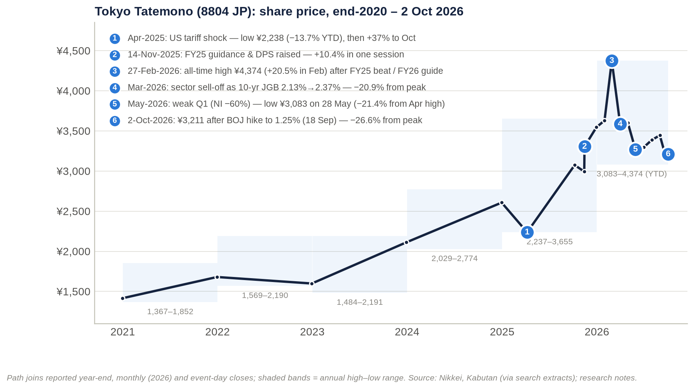

**Earnings drove most of the gain until 2024.** From FY2021 to FY2024, EPS rose 88.5% while the price rose 55.2%. The trailing P/E therefore fell from 10.0x to 8.3x.

**2025 was a re-rating year.** The shares rose 36% even though EPS fell 10%, lifting the year-end P/E to 12.5x.

**2026 has reversed part of that re-rating.**

### Every move of more than 10% since October 2021

| # | Window | Move | Catalyst | Type |
|---|---|---|---|---|
| 1 | 2022 high → 2023 low (exact dates not available) | ¥2,190 → ¥1,484 (−32%) | Not verified. The 2022 close was only 1.9% above the year's low, which fits a late-December slump around the BOJ's December 2022 yield-curve-control change (inference) | Macro (inferred) |
| 2 | 2023 low → 2023 high | ¥1,484 → ¥2,191 (+48%) | Not verified. FY2022 net income rose 23% and dividend per share rose from ¥51 to ¥65 | n/a |
| 3 | 2024 low → 2024 high | ¥2,029 → ¥2,774 (+37%) | Not verified. FY2024 was the record net-income year (+46%) | n/a |
| 4 | 6 Jan → 7 Apr 2025 | ¥2,594 → ¥2,237.5 (−13.7%) | The new 2025–27 medium-term plan (16 Jan 2025) was seen as "物足りない" (underwhelming) ([Nikkei](https://www.nikkei.com/article/DGXZQOFL171HB0X10C25A1000000/)), followed by the April global tariff sell-off | Mixed |
| 5 | 7 Apr → 7 Oct 2025 | +37.4% to ¥3,074 | Recovery from the tariff shock, supported by a ¥3.0bn buyback (13 Feb–31 Aug 2025) | Market plus buyback |
| 6 | 13 → 14 Nov 2025 | **+10.4% in one day** (¥2,994 → ¥3,305) | Q3 upgrade: FY2025 operating-profit guidance raised ¥6.5bn to ¥92.5bn, net income to ¥58.0bn, dividend +¥6 to ¥103; cancellation of treasury shares considered ([Nikkei](https://www.nikkei.com/article/DGXZQOUB132440T11C25A1000000/); [f-p.jp/Kabutan](https://f-p.jp/media/?p=21023)) | **Stock-specific** |
| 7 | 13 Nov → 26 Dec 2025 | +22.1% to ¥3,655 | Follow-through, even though the BOJ raised rates to 0.75% and the 10-year JGB touched 2.1% | Stock-specific, against the rates headwind |
| 8 | February 2026 | **+20.5%** to an all-time high of ¥4,374 (27 Feb) | FY2025 record operating profit; FY2026 net-income guidance of ¥63.0bn vs QUICK consensus of ¥61.25bn; dividend guidance ¥122 (+¥17, a 40% payout a year early) ([Nikkei/QUICK](https://www.nikkei.com/article/DGXZRST0554860Q6A210C2000000/)) | Stock-specific plus sector boom |
| 9 | 27 Feb → March low | **−20.9%** (to ¥3,462); March month −18.0% | 10-year JGB up from 2.13% to 2.37% on oil-driven inflation fears; sector-wide sell-off ([PayPay Securities](https://media.paypay-sec.co.jp/cat5/jisha260324)) | **Macro/sector** |
| 10 | March low → April high | +13.3% (¥3,922) | Relief rally; "double bottom" commentary | Sector |
| 11 | April high → 28 May 2026 | **−21.4%** (to the 2026 low of ¥3,083) | Weak Q1: net income −60%, condo handovers 235 vs 772 units ([Nikkei](https://www.nikkei.com/article/DGXZQOUB136Z90T10C26A5000000/)). TOPIX Real Estate hit a year-to-date low on 18 May ([Nikkei](https://www.nikkei.com/article/DGXZQOUB184UQ0Y6A510C2000000/)) | Mixed |
| 12 | 28 May → July high | +14.9% (¥3,542) | Rebound held through the BOJ's June hike to 1.00% | n/a |
| 13 | July high → 2 Oct 2026 | −9.3% (just below the threshold) | BOJ hike to 1.25% on 18 Sep ([NHK](https://news.web.nhk/newsweb/na/nd-20260918de50968)) | Macro |

Sources: [Kabutan monthly bars](https://s.kabutan.jp/stocks/8804/historical_prices/monthly/) and [Nikkei price history](https://www.nikkei.com/nkd/company/history/yprice/?scode=8804). Daily data were unavailable, so moves are measured between documented highs, lows and closes.

### What moved the stock

**Company-specific upgrades caused the clearest single moves.**

- The one verified single-day move above 10% was the +10.4% jump after the November 2025 guidance and dividend upgrade.
- The +20.5% February 2026 rally followed results and guidance that beat consensus.
- The January 2025 medium-term plan is a useful counter-example. It raised the payout target to 40% yet was received as underwhelming. A policy announcement without an earnings surprise has not been enough on its own.

**Interest rates caused the largest falls.** The −21% drawdowns in March and May 2026 were sector-wide. In May, a timing-driven weak Q1 added to the pressure.

**The shares held up better than the large peers in 2026.** From their highs to 2 October:

| Company | Fall from 2026 high |
|---|---|
| Tokyo Tatemono | −26.6% |
| Mitsubishi Estate | −34.1% |
| Mitsui Fudosan | −33.6% |
| Sumitomo Realty | −42.2% |

Source: [kabu.tagu-blog](https://kabu.tagu-blog.com/real-estate-stocks-7-rates-2026/). This fits Tokyo Tatemono's lower starting P/E (about 10x versus 18–24x for the majors) and its higher yield.

### Technical picture (as of 2 Oct 2026)

**Below every moving average.** At ¥3,211 the shares sit about 4.5% below our 50- and 100-day moving-average proxies (≈¥3,360–3,370) and about 9.7% below the 200-day proxy (≈¥3,550). The proxies are built from monthly bars because daily data were unavailable, so they carry roughly ±2–3% error. The short averages sitting below the long average is a death-cross-type set-up.

**The intermediate trend is down.** Monthly highs have fallen every month since February: ¥4,374 → ¥3,922 → ¥3,606 → ¥3,542 → ¥3,481. From May to September the stock traced a narrowing triangle with rising lows (¥3,083 → ¥3,135 → ¥3,223 → ¥3,245 → ¥3,236). The 2 October price is the first break below that rising-low line.

**Levels to watch.**

- Support: ¥3,135, then ¥3,083 (the 2026 low), then ¥3,000 / ¥2,994.
- Resistance: ¥3,223–3,245 (the broken floor), ¥3,475–3,481, ¥3,542–3,554, ¥3,606–3,655, ¥3,922, and ¥4,304–4,374.

**Signals and positioning.** Kabuyoho's trend signal reads 売り継続, "sell continuation" ([Kabuyoho](https://kabuyoho.jp/reportTrendSignal?bcode=8804)). Retail margin positioning is negligible (Section 14).

**The long-term uptrend is intact.** Annual lows keep rising: ¥1,484 (2023), ¥2,029 (2024), ¥2,237.5 (2025), ¥3,083 (2026).

> **Key takeaway:** Over five years the stock compounded at about 24% a year on earnings growth and a 2025 re-rating. Since February 2026, rates have overwhelmed a strong results season and the August 2026 guidance upgrade. The technical set-up stays negative until the stock holds ¥3,083 and reclaims the ¥3,245 floor.

## 2. Business model and key drivers: a develop-lease-sell-recycle machine concentrated on Tokyo Station

### The business model in simple terms

Tokyo Tatemono runs a capital-recycling loop:

1. **Assemble land.** It assembles land, often through Type-1 urban redevelopment, in which existing landowners swap their plots for floor space in the new building.
2. **Have it built.** It hires general contractors (Taisei, Obayashi, Kajima) to build.
3. **Lease it up.** In-house companies manage the building and run the car parks.
4. **Hold or sell.** It either keeps the building for rent or sells the stabilised asset to investors. The buyers are typically the J-REIT it sponsors, Japan Prime Realty (JPR), its private REIT or third-party funds. When it sells to its own vehicles, a subsidiary keeps earning asset-management fees.
5. **Recycle.** Sale proceeds are recycled into new land.

Alongside this loop:

- **Residential** develops Brillia condominiums. Profit is booked when units are handed over.
- **Asset Service** runs brokerage and Nippon Parking.
- **Other** holds resorts, asset management and overseas joint ventures.

The 2025–27 plan's stated policy is to "accelerate and expand asset-turnover businesses" with "disciplined balance-sheet control" ([MTP FY2025–27](https://tatemono.com/english/company/pdf/plan2027_250116_en.pdf)). The company has also redefined its headline KPI, business profit (事業利益), to include gains on sales of fixed assets ([Altvega](https://altvega.com/tatemono-bp-20250116/)).

### Key drivers

| Driver | How it moves earnings | Latest evidence | Direction |
|---|---|---|---|
| Office rents (price) | Rent rises on short leases at renewal; new buildings lease up | Central-5-ward asking rent ¥23,647/tsubo, +12.46% YoY; vacancy 1.87% (Aug 2026) ([Miki Shoji](https://www.e-miki.com/rent/tokyo.html)). Management cites "firm confidence" in inflation-driven rent growth ([logmi](https://finance.logmi.jp/articles/385621)) | Positive |
| Leasable floor (volume) | Completions add net operating income; sales remove it | TOFROM YAESU TOWER (≈225,000 m² GFA) completed Feb 2026; Kyobashi 3-chome East (≈166,800 m²) due FY2029 | Positive, lumpy |
| Investor-sale volume and margin (mix) | Gains flow through Building and Asset Service operating profit; fixed-asset gains now also count in business profit | 1H FY2026 Building operating profit +122.7%. FY2026 sales are hotel-focused and "among the largest" in the company's history, from a stock of more than ¥100bn of embedded gains ([FY2025 presentation](https://pdf.irpocket.com/C8804/doF3/FpJe/bqVe.pdf)) | Positive now; cyclical |
| Cap rates and buyer liquidity | Set sale prices and the NAV | Marunouchi/Otemachi cap rate 3.2%, unchanged for seven surveys ([JREI](https://www.reinet.or.jp/pdf/REIS/published-document_main_the-japanese-real-estate-investor-survey_202604.pdf)). TSE REIT index at year-to-date lows in Jun 2026 ([Nikkei](https://www.nikkei.com/article/DGKKZO96735190V00C26A6DTC000/)) | Neutral to negative |
| Condo volume, price and margin | Profit booked at handover | 1H FY2026: 270 units at ¥69.11m average and 27.8% gross margin, vs 969 units at 30.4% a year earlier; landbank ≈7,600 units ([logmi](https://finance.logmi.jp/articles/385621)) | Trough in 1H, recovery in 2H |
| Construction costs | Development margins and timing | MLIT construction deflator +5.1% YoY in Mar 2026 ([genba-media](https://www.genba-media.jp/articles/fkj7w5k9w0rv)) | Negative |
| Interest rates | Cost of ≈¥1.5tn of debt; cap rates; mortgage affordability | BOJ 1.25%; 10-year JGB 2.945% intraday in Aug 2026 ([Nikkei](https://www.nikkei.com/article/DGXZQOUB1747W0X10C26A8000000/)). Gap between operating and ordinary profit: ¥17.6bn in FY2025 → ¥22.0bn in FY2026 guidance | Negative |
| Regulation | Redevelopment approvals and floor-area bonuses; limits on condo resale and foreign buyers | TOFROM YAESU sits in a National Strategic Special Zone. Chiyoda Ward asked for resale restrictions in Jul 2025 ([Diamond Fudosan](https://diamond-fudosan.jp/articles/-/1112835)) | Mixed |
| Capex cycle | Redevelopment spending of ≈¥200bn over FY2025–27; FY2024 capex ¥125.7bn | Interest-bearing debt +¥191bn in 1H FY2026 | Negative for free cash flow |

### Key products, services and flagship assets

| Business line | Brands / flagship assets | Scale (latest) | How it earns |
|---|---|---|---|
| Offices and mixed use | Otemachi Tower (2014; ≈198,467 m² GFA; tenants include Mizuho Bank's HQ and Aman Tokyo); Tokyo Square Garden (2013; DBJ Green Building Platinum); TOFROM YAESU TOWER (51 floors above ground, ≈250 m) and THE FRONT; Nakano Central Park; Shibuya 2-chome West; Kyobashi 3-chome East (FY2029) | Offices are "the majority" of the rental portfolio ([CFO message](https://tatemono.com/english/ir/library/integrated/cfo.html)) | Rent plus sales to investors |
| Retail | TOFROM YAESU retail zone, opened 10 Sep 2026 with 55 of 68 stores ([Travel Watch](https://travel.watch.impress.co.jp/docs/news/2125315.html)) | n/a | Rent, partly turnover-based |
| Logistics | T-LOGI, launched 2019: Kuki (≈71,000 m²), Narashino (≈34,000 m²), Narashino II, Chiba-kita, Fukuoka, Kyoto, Aichi; Sendai completed Jun 2026 ([LOGI-TODAY](https://www.logi-today.com/650208)) | At least 5 buildings | Develop to sell or hold |
| Data centres | Zeus OSA1, Osaka, with SC Zeus Data Centers: 25MW phase 1 due 2028 ([DX Magazine](https://dxmagazine.jp/news/wgrf8qx/)) | 1 project | Develop and lease |
| Condominiums | Brillia; more than 20 redevelopment condos (e.g. SHIROKANE The SKY, Brillia Towers Meguro) | 1,054 units supplied in 2025, #19 nationally ([REEI](https://www.fudousankeizai.co.jp/share/mansion/663/mdn20260325.pdf)); landbank ≈7,600 units | Sale margin at handover |
| Rental housing and condo management | Kachidoki GROWTH TOWN; Tokyo Tatemono Amenity Support | n/a | Rent and fees |
| Brokerage and appraisal | Tokyo Tatemono Real Estate Sales (corporate real estate, resale portal) | n/a | Commissions; property resales |
| Parking | Nippon Parking (NPC24H) | 1,905 sites / 86,792 spaces (Dec 2024); ≈90,000 spaces (Dec 2025) ([recruit page](https://recruit.tatemono.com/recruit/shinsotsu/about/biz05.html)) | Hourly and monthly fees; management contracts |
| Leisure | Tokyo Tatemono Resort: Regina hotels, 13 golf facilities, 11 hot-spring baths ([TT Resort](https://www.tt-resort.co.jp/about.html)) | Oyama Golf Club added Apr 2025 | Operating income |
| Asset management | TRIM (100% owned) manages JPR, which holds 66 properties with total assets ≈¥534bn. Tokyo Tatemono Investment Advisors manages the private REIT (launched 2015 with ¥16bn) | n/a | Base, acquisition and disposition fees (schedule not retrieved) |
| Overseas | Thailand (15 projects with SC Asset), USA (8 projects in 5 states since 2023), Melbourne build-to-rent (499 units), London (125 Shaftesbury Avenue), Indonesia, China consulting | Small; mostly equity-method | Joint-venture profits (−¥6.9bn in FY2025) |

### Customers

**Office tenants.** The only named anchors found are Mizuho Bank (headquarters) and Aman Tokyo at Otemachi Tower ([Nikkenren](https://nikkenren.com/publication/ACe/ce/ace1702/pdf/ACe_1702_046-049.pdf)). At TOFROM YAESU, anchor users include:

- a Nippon Medical School medical facility ([Obayashi](https://www.obayashi.co.jp/news/detail/news20220214_3.html));
- a theatre and conference facility run by Pia and Congres;
- Bus Terminal Tokyo Yaesu, built by UR and operated by Keio Dentetsu Bus ([company news](https://tatemono.com/news/20260302-2.html)).

**Investors buying the company's properties.** The structurally important buyer is JPR:

- Tokyo Tatemono has been its sole sponsor since April 2023.
- In the period to December 2025, JPR bought ¥31.9bn of property funded by a public offering. It has about ¥62bn of remaining borrowing capacity and targets more than ¥600bn of assets ([JPR presentation](https://www.jpr-reit.co.jp/file/ir_library_term-10766bf9aaec67cf5817e8c9ef5bddaeed098081.pdf)).

Other buyers are the private REIT (pension funds and financial institutions), unnamed private investors, and APA Group, which bought an Akihabara hotel from the company.

**Condo buyers.** The 1H FY2026 average price of ¥69.11m is about half the 23-ward market average. That points to a suburban, family-oriented mix.

**Others.** Parking and leisure customers, overseas renters, and Chinese development-consulting clients (projects involving China Vanke).

**Concentration.** No tenant-concentration data are disclosed.

### Suppliers and partners

**General contractors.**

- **Taisei:** designed and built TOFROM YAESU block A, was in the joint venture that built block B, and partnered on Otemachi Tower.
- **Obayashi:** designed and led construction of TOFROM YAESU TOWER, and was co-specified agent with Tokyo Tatemono.
- **Kajima:** designed and built Nakano Central Park South.

**Land and approvals.** Redevelopment associations, the Tokyo Metropolitan Government (rights-conversion approvals) and UR.

**Sellers of buildings to the company.** Mizuho Bank (the Otemachi sites, via securitisation), Blackstone (a building near Hatchobori, 2026) and Yellow Hat (its former Iwamotocho head office) ([NRM](https://nrm.nikkei.co.jp/articles/-/24590); [NRM](https://nrm.nikkei.co.jp/articles/-/25153)).

**Capital providers.** Main banks Mizuho, SMBC and MUFG ([Shikiho](https://raw.githubusercontent.com/edamame384/stock_selection/HEAD/projects/shikiho_text_parser/data/raw/4Q-2/8804.txt)), bond investors, and joint-venture partners: SCX/SC Asset, Lendlease, Nippon Steel Kowa, SC Zeus Data Centers, PT Farpoint, the WHA–KW alliance, and Charter Hall/UBS.

**Others.** JCR rates the company; EY ShinNihon is the auditor.

### Competitors, markets and geographies

**Competitors.** The direct listed competitors are the Tokyo majors: Mitsui Fudosan (8801), Mitsubishi Estate (8802), Sumitomo Realty (8830), Tokyu Fudosan HD (3289) and Nomura Real Estate HD (3231). Hulic (3003) is the closest Fuyo-lineage peer, and smaller landlords include Heiwa Real Estate (8803) and Keihanshin Building (8818). The main unlisted competitors are Mori Building, Mori Trust and Nippon Steel Kowa Real Estate (full list in Section 10).

**Scale.** Tokyo Tatemono's FY2025 operating profit of ¥95.8bn is about 24% of Mitsui Fudosan's, 29% of Mitsubishi Estate's and 32% of Sumitomo's, and 57–69% of Tokyu's and Nomura's ([investalk](https://investalk.jp/8801/realestate5-2026-03-comparison/)).

**Geography.** The business is overwhelmingly Tokyo:

- **Core:** the Tokyo Station cluster (Otemachi, Yaesu, Nihonbashi, Kyobashi), with hubs in Ikebukuro, Shibuya and Nakano.
- **Elsewhere in Japan:** logistics extends to Saitama, Chiba, Sendai, Fukuoka, Kyoto and Aichi; there is a data centre in Osaka; parking is nationwide; leisure is concentrated around Lake Kawaguchi.
- **Overseas:** small and mostly accounted for under the equity method. No geographic segment split is published (Section 6).

### Contracts and payment terms

Company-specific terms are thinly disclosed. What is known:

- **TRIM–JPR agreement.** TRIM's agreement covers JPR's acquisitions and disposals, all leasing decisions, fund-raising and reporting ([JPR](https://jpr-reit.co.jp/en/about/asset.html)). The fee schedule was not retrieved.
- **Timing of revenue.**
  - Condo revenue is booked when the unit is handed over; deliveries cluster in Q1 and Q4.
  - Rents are booked monthly.
  - Investor sales are booked at closing, which makes them lumpy.
- **Hotels.** Hotel leases increasingly include commission-based (variable) rents ([Integrated Report 2025](https://tatemono.com/english/ir/library/pdf/integrated_2025_66.pdf)).
- **Deal structures.** Acquisitions and products use securitisation and trust-beneficiary-right structures: the Otemachi purchase, and a 2023 product with Mizuho Trust & Banking.
- **Not disclosed.** Office lease lengths, deposits and condo deposit schedules.

As a market convention rather than a company disclosure, Tokyo office leases are typically two-year renewable ordinary leases or three-to-five-year fixed-term leases. Revenue therefore reprices quickly in both directions.

> **Key takeaway:** Earnings rest on three engines. Rent is the stable base and is now accelerating with inflation. Sales to investors drive growth and are cyclical. Condos are timing-driven. The key external variables are Tokyo office rents, cap rates and buyer liquidity, and the cost of about ¥1.5tn of debt.

## 3. Macro and micro factors: a record-tight office market meets the highest BOJ policy rate since 1995

### Macro dashboard

| Indicator | Latest reading | Trend | What it means for Tokyo Tatemono |
|---|---|---|---|
| BOJ policy rate | 1.25% (18 Sep 2026, 7–2 vote; highest since 1995) ([DLRI](https://www.dlri.co.jp/report/macro/665928.html)) | 0.75% (Dec 2025) → 1.00% (Jun 2026) → 1.25% | Higher refinancing costs; pressure on cap rates and mortgage affordability |
| 10-year JGB | 2.945% intraday (Aug 2026); passed 2% in Dec 2025 ([NRI](https://www.nri.com/jp/media/column/kiuchi/20251222_2.html)) | Rising | Prime cap-rate spread over JGBs only ≈20–30bp |
| Tokyo central-5-ward offices | Vacancy 1.87%; rent +12.46% YoY (Aug 2026), vs 6.31% vacancy in Aug 2021 ([Nikkei 2021](https://www.nikkei.com/article/DGXZQOUC08D5H0Y1A900C2000000/)) | Tightening for 5–6 months running | Supports rent rises and TOFROM YAESU lease-up |
| Prime cap rate | Marunouchi/Otemachi 3.2%, unchanged for seven surveys (Apr 2026) | Stable | Supports sale margins and NAV marks |
| Greater Tokyo new condos | 2025: 21,962 units (−4.5%; lowest since 1973). 1H 2026: average ¥101.35m (+13.1%); initial contract rate 64.8%; unsold inventory 6,389 (+363) ([Nikkei/REEI](https://www.nikkei.com/article/DGXZRSP710131_R20C26A7000000/)) | Prices up, volumes down, take-up softening | Price support, but affordability strain at the top of the cycle |
| 23-ward condo prices | 2025 average ¥136.13m (+21.8%); 1H 2026 ¥142.49m (+9.1%) ([Nikkei/REEI](https://www.nikkei.com/article/DGXZRSP702228_W6A120C2000000/)) | Rising | Tokyo Tatemono's mix is cheaper (¥69m), so less exposed to luxury-condo policy |
| Construction costs | MLIT deflator 135.4 (Mar 2026), +5.1% YoY | Rising | Margin squeeze on new projects; locked-in projects gain relative value |
| Housing policy | Chiyoda Ward resale-restriction request (Jul 2025); foreigners bought 20–40% of new condos in Chiyoda, Minato and Shibuya; national measures being studied | Tightening | Limited direct impact |
| Governance reform | Japan Inc. sold a record ≈¥9tn of cross-shareholdings in FY2024 ([Nikkei](https://www.nikkei.com/article/DGXZQOTG0995C0Z00C25A7000000/)) | Supportive | Matches the company's ≥¥130bn programme of policy-share and fixed-asset sales |
| Sector earnings | All five majors reported record FY3/2026 profits; "Middle East procurement risk" flagged ([BigGo](https://finance.biggo.jp/news/8U8OIp4B6tLPsnrZmBwQ)) | Upcycle | Much of Tokyo Tatemono's growth is cyclical, not idiosyncratic |

**The central macro tension is spread compression.** Prime office cap rates of about 3.2% now sit only 20–30bp above a 10-year JGB of about 2.9–3.0%, the thinnest spread in decades. So far, rent growth of about 12% has offset higher rates in private-market pricing. If yields keep rising without matching rent growth, three things weaken at once:

- the margins on Tokyo Tatemono's investor sales;
- its unrealised gains;
- J-REIT buyers' ability to raise equity.

### Micro factors

**Leasing.** TOFROM YAESU TOWER was completed on 28 Feb 2026, THE FRONT on 15 Jul 2026, and retail opened on 10 Sep 2026. The total project cost was ≈¥210.4bn; Tokyo Tatemono and Obayashi are the specified agents ([Kenbiya](https://www.kenbiya.com/ar/ns/region/tokyo/8849.html)). Tokyo Tatemono's ownership share and the occupancy rate are not disclosed.

**Investor sales.** FY2026 sales are hotel-led. The company reports a stock of more than ¥100bn of embedded gains and targets at least ¥130bn of non-current-asset and cross-shareholding sales over FY2025–27.

**Condos.** Handovers trough in 1H FY2026 and recover in 2H. The landbank is ≈7,600 units. The 1H gross margin of 27.8% is down from 30.4%.

**Below the operating line.**

- The overseas equity-method result swung to −¥6.9bn in FY2025.
- In August 2026, guidance for overseas equity-method income was cut and corporate costs were raised ([Minkabu](https://minkabu.jp/news/4589327)).
- Interest-bearing debt rose ¥191bn in 1H FY2026 to ¥1,536.6bn.

**New pipeline.** Kyobashi 3-chome East (FY2029), the Osaka data centre (2028), Thai rental factories (from Sep 2026), and the Star Mica alliance in pre-owned condo renovation (May 2026).

### Tailwinds and headwinds

| Tailwinds | Headwinds |
|---|---|
| Record-tight Tokyo office market (1.87% vacancy, +12.5% rents) drives rent rises on short leases | BOJ at 1.25% with a hawkish minority; 10-year JGB near 3%; refinancing costs are repricing |
| Stable prime cap rates (3.2%) and deep private-capital demand, e.g. Blackstone's ≈¥400bn Tokyo Garden Terrace purchase in 2025 ([trafficnews](https://trafficnews.jp/post/494129)) | J-REIT index at year-to-date lows limits the sponsored exit channel (JPR) |
| Record condo prices and constrained supply | Affordability strain (64.8% contract rate, rising inventory); 1H gross margin down 2.6pt |
| New flagship (TOFROM YAESU) in an irreplaceable location | New Yaesu supply (Yaesu 2-chome Central district, Jan 2029) competes for the same tenants ([Kenbiya](https://www.kenbiya.com/ar/ns/region/tokyo/8252.html)) |
| Governance push: payout to 40%, cross-shareholding sales | Construction inflation (+5.1%) and contractor capacity constraints |
| Thai expansion with a strong partner (SC Asset) | Overseas losses (FY2025 −¥6.9bn); London office exposure |

> **Key takeaway:** Demand-side indicators (rents, vacancy, condo prices, cap rates) are at or near cycle highs, while financing and cost indicators are deteriorating. Tokyo Tatemono's earnings over the next 12–24 months depend on rent growth outrunning refinancing costs and on private buyers continuing to clear assets at a 3.2% cap rate.

## 4. Competitive position and moats: a narrow, location-specific moat around Tokyo Station

### How the products compare

**Condominiums.** Brillia scores near the top of the market on resale value. Mansion Review's 2026 Tokyo brand rating ([t23m-navi](https://t23m-navi.jp/magazine/news/mansionreview-brandmansion2026/)) measures average price appreciation on resale:

| Brand | Developer | Average resale price appreciation |
|---|---|---|
| The Parkhouse | Mitsubishi Jisho Residence | 95.6% |
| Brillia | Tokyo Tatemono | 93.1% |
| Proud | Nomura | 88.4% |
| Park Homes | Mitsui | 81.1% |

On awareness, Brillia sits mid-table: around #7 in aggregator "popular brand" lists ([Mynavi](https://news.mynavi.jp/real-estate-assessment/29103)). This reflects its smaller volume: Tokyo Tatemono supplied 1,054 units nationally in 2025, against Nomura's 2,273 in Greater Tokyo alone ([Nikkei/REEI](https://www.nikkei.com/article/DGXZRSP704888_V20C26A3000000/)). Brillia's selling points are design and "three-stage security"; the company also runs a dedicated resale portal.

**Offices.** The edge is location rather than branding:

- direct connection to Tokyo Station;
- a bus terminal and medical and theatre anchors at TOFROM YAESU;
- DBJ Green Building Platinum certification at Tokyo Square Garden;
- pre-fitted "set-up" office products.

**ESG.** Tokyo Tatemono holds SBT certification, joined RE100, and targets a 40% CO2 cut by 2030 and net zero by 2050 ([FY2022 Yuho](https://raw.githubusercontent.com/yuukimiyo/stdata-jp/HEAD/8/88040/2023/BusinessPolicyEtc)). It was included in the SOMPO Sustainability Index in 2024.

### Moat assessment

| Moat category | Rating | Evidence | Durability |
|---|---|---|---|
| Brand | Moderate | Brillia ranks #2 of four rated brands on resale appreciation, but mid-table on awareness. Corporate brand is 130 years old | Location matters more than brand in the current cycle |
| Hard assets | **Strong (local)** | Tokyo Station cluster: Otemachi Tower, Tokyo Square Garden, TOFROM YAESU (≈225,000 m²), Kyobashi 3-chome East (≈166,800 m²). Rental property fair value ¥1,658bn vs book ¥1,058bn ([IR Bank](https://irbank.net/E03859/value)) | Irreplaceable sites next to Japan's largest rail hub |
| Long-term contracts | Weak to moderate | Short leases by market convention; hotel rents partly variable. The JPR management contract is long-dated but small | Revenue reprices both ways: helpful now, harmful in a downturn |
| Network effect | Weak | Area-management and clustering benefits in Yaesu–Nihonbashi–Kyobashi; the REIT and fund platform deepens the buyer pool | Not a true network effect |
| Regulatory and switching costs | **Strong (regulatory)** / moderate (switching) | Type-1 redevelopment needs landowner consensus and Tokyo approval: rights conversion approved 2020, tower completed 2026 ([Nikkei](https://www.nikkei.com/article/DGXMZO60992230Q0A630C2L83000/)). Strategic Special Zone status. Tenant moves are costly, but leases are re-tendered | Six-plus-year lead times deter new entrants |
| Oligopolistic / monopolistic industry | Moderate | Prime CBD redevelopment is a territorial oligopoly (Mitsubishi Estate in Marunouchi, Mitsui in Nihonbashi, Mori in Toranomon, Tokyo Tatemono in Yaesu–Kyobashi). Condos are fragmented: Tokyo Tatemono has ≤5% share, and Open House is #1 nationally | Oligopoly only in core-CBD offices |
| Cash-flow predictability | Moderate to weak | Rental base is stable, but growth comes from sale gains. Operating cash flow ¥18.9–32.1bn vs operating profit ¥80–96bn in FY2024–25; FY2024 free cash flow −¥123bn; equity-method swing to −¥6.9bn | Lumpy and capital-intensive |
| Scalability | Weak to moderate | Growth needs balance sheet: interest-bearing debt rose from ¥977bn to ¥1,537bn in 4.5 years. Asset-management platform via JPR (≈¥534bn of assets) | Capped by leverage and the ≈2.4x debt/equity guide |
| Risk / history of government interference | Moderate | No adverse intervention found in company history. Risks are condo resale and foreign-buyer measures and BOJ normalisation; offset by supportive urban-renewal policy | Policy mixed |
| Bargaining power over other stakeholders | Mixed | Tenants: strong but cyclical (1.87% vacancy). Contractors: weak (+5.1% costs; Middle East procurement risk). Landowners: shared under rights conversion. Lenders: neutral to weakening (JCR A, rising rates). Buyers: favourable (3.2% cap rate; sponsor of JPR) | Cyclical |

**Verdict: a narrow, location-specific moat.**

- **Real:** control of redevelopment rights around Tokyo Station's Yaesu side. That position took a decade to assemble and cannot be replicated quickly.
- **Not wide:** most of the profit pool reprices with the cycle (rents, sale gains, condo prices).
- **Exposed:** construction costs and interest rates sit largely outside management's control.

> **Key takeaway:** Tokyo Tatemono's competitive advantage is real estate scarcity, not brand or contracts. It protects returns on the Yaesu cluster but does not insulate group earnings from the rate and capital-market cycle.

## 5. Supply chain: from landowners to J-REIT unitholders, with Tokyo Tatemono as orchestrator

Tokyo Tatemono sits in the middle of the real-estate value chain as an asset-light orchestrator of construction and a capital-heavy owner of land and buildings. The flow runs:

1. land and redevelopment rights;
2. public approvals;
3. outside contractors who design and build;
4. debt and joint-venture capital;
5. Tokyo Tatemono and its in-house operating companies;
6. third-party operators and anchors;
7. end users (tenants, condo buyers, parking and leisure users);
8. exit buyers (JPR, the private REIT, funds), whose purchases recycle cash back to step 1.

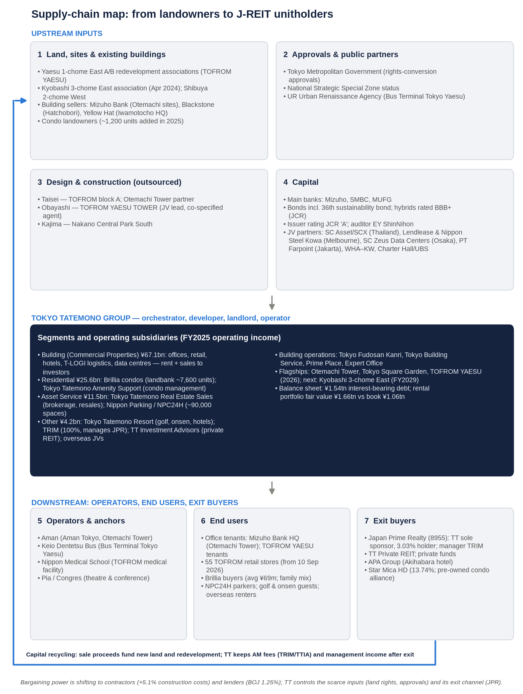

| Stage | Stakeholders | Named companies and bodies | Tokyo Tatemono's role |
|---|---|---|---|
| 1. Land, sites, existing buildings | Landowners, redevelopment associations, corporate and investor sellers | Yaesu 1-chome East A/B associations (TOFROM YAESU); Kyobashi 3-chome East association (Apr 2024); Shibuya 2-chome West; Shirokane 1-chome East North and Meguro Station-front (condos); Mizuho Bank (Otemachi sites, via securitisation); Blackstone (Hatchobori building); Yellow Hat (Iwamotocho building); unnamed condo land sellers (≈1,200 units added in 2025) | Buyer, redevelopment promoter, specified agent |
| 2. Approvals and public partners | Government and public bodies | Tokyo Metropolitan Government (rights-conversion approvals); National Strategic Special Zone; UR Urban Renaissance Agency (bus terminal) | Applicant and partner |
| 3. Design and construction | General contractors | Taisei; Obayashi; Kajima | Client: construction is outsourced |
| 4. Capital | Banks, bondholders, rating agency, trust banks, co-investors, auditor | Mizuho, SMBC, MUFG; retail buyers of the 36th unsecured sustainability bond (via Rakuten Securities) ([Rakuten](https://www.rakuten-sec.co.jp/web/bond/jbond/products/20250630/)); JCR (A); Mizuho Trust & Banking; JV partners SCX/SC Asset, Lendlease, Nippon Steel Kowa, SC Zeus Data Centers, PT Farpoint, WHA–KW alliance, Charter Hall/UBS; EY ShinNihon (auditor) | Borrower, issuer, JV partner |
| 5. Tokyo Tatemono and in-house operators | Parent and subsidiaries | Building management: Tokyo Fudosan Kanri, Shinjuku Center Building Kanri, Tokyo Building Service, Nishi-shin Service. Expert Office (serviced offices); Prime Place (retail operations); Tokyo Tatemono Amenity Support (condo management); Kachidoki GROWTH TOWN (rental); e-State Online (web promotion); Tokyo Tatemono Real Estate Sales (brokerage); Nippon Parking (NPC24H); Tokyo Tatemono Resort; Tokyo Tatemono Staffing; Tokyo Tatemono Kids; TRIM (JPR's manager); Tokyo Tatemono Investment Advisors (private REIT); Tokyo Tatemono Asia, Tokyo Tatemono (Thailand), a US subsidiary (Los Angeles) and a Shanghai consultancy ([FY2022 Yuho](https://raw.githubusercontent.com/yuukimiyo/stdata-jp/HEAD/8/88040/2023/DescriptionOfBusiness)) | Developer, landlord, operator |
| 6. Third-party operators and anchors | Hotel, transport, medical and culture operators | Aman (Aman Tokyo); Keio Dentetsu Bus (Bus Terminal Tokyo Yaesu); Nippon Medical School; Pia and Congres | Landlord |
| 7. End users | Tenants, condo buyers, parking and leisure users, overseas renters | Mizuho Bank HQ (Otemachi Tower); TOFROM YAESU retailers (55 stores); Brillia buyers; NPC24H customers; golf and spa guests; renters in Herndon (Virginia) and at 899 Collins Street (Melbourne); Thai logistics tenants; Chinese consulting clients (China Vanke-related projects) | Landlord, seller, operator |
| 8. Exit and recycling | Buyers of stabilised assets and resale partners | Japan Prime Realty (8955); Tokyo Tatemono Private REIT; private funds; APA Group (Akihabara hotel); Star Mica (pre-owned condo alliance; 13.74% stake) | Seller; sponsor; earns asset-management fees |

**Where value is captured.**

- Tokyo Tatemono takes the development margin and the rental net operating income.
- On exit, it keeps fee streams through TRIM and Tokyo Tatemono Investment Advisors, and building-management income through its subsidiaries.
- Contractors capture the construction margin, and they currently hold the pricing power.

**Two counterparty risks dominate:**

- **Construction:** concentration among a few large general contractors.
- **Exit:** dependence on JPR's and private buyers' access to capital for the sales that drive growth.

> **Key takeaway:** Tokyo Tatemono controls the scarce inputs (land rights and approvals) and the exit channel (its own REIT platform), but outsources construction and relies on external capital. Contractors and lenders are the stakeholders with rising bargaining power.

## 6. Five-year financials: operating profit compounded 13% a year as the profit mix swung between condos and sales

### Consolidated P&L, FY2021–FY2025 and 1H FY2026

| ¥bn | FY2021 | FY2022 | FY2023 | FY2024 | FY2025 | 1H FY2026 |
|---|---|---|---|---|---|---|
| Operating revenue | 340.5 | 349.9 | 375.9 | 463.7 | 474.6 | 194.4 |
| Revenue growth | +1.6% | +2.8% | +7.4% | +23.3% | +2.3% | −6.9% |
| D&A | 18.6 | 18.8 | 20.5 | 22.4 | 24.3 | n/a |
| EBITDA (OI + D&A) | 77.4 | 83.3 | 91.0 | 102.1 | 120.1 | n/a |
| EBITDA margin | 22.7% | 23.8% | 24.2% | 22.0% | 25.3% | n/a |
| Operating income (EBIT) | 58.8 | 64.5 | 70.5 | 79.7 | 95.8 | 39.9 |
| Operating margin | 17.3% | 18.4% | 18.8% | 17.2% | 20.2% | 20.5% |
| Equity-method income | n/a | ≈+1.8 (derived) | ≈+3.9 (derived) | +0.8 | −6.9 | ≈+1.5 (derived) |
| Business profit (company KPI) | n/a | ≈66.3 (old definition) | ≈74.4 (old definition) | 80.5 (old) / 79.3 (new) | 89.4 (new) | 41.3 (new) |
| Ordinary income | 46.3 | 63.5 | 69.5 | 71.7 | 78.2 | n/a |
| Net income attributable to owners | 35.0 | 43.1 | 45.1 | 65.9 | 58.9 | 23.4 |
| Net margin | 10.3% | 12.3% | 12.0% | 14.2% | 12.4% | 12.0% |
| EPS (¥) | 167.35 | 206.15 | 215.82 | 315.49 | 283.08 | ≈112 |
| DPS (¥) | 51 | 65 | 73 | 95 | 105 | 61 (interim) |

Sources and derivations:

- P&L: [FY2025 tanshin](https://pdf.irpocket.com/C8804/YpwX/Bm8F/l2Ip.pdf); [FY2024 tanshin](https://pdf.irpocket.com/C8804/usA8/o1dP/JnAj.pdf); [FY2023 tanshin](https://pdf.irpocket.com/C8804/KKjE/OJQc/fJiS.pdf); [Nikkei FY2021 data](https://www.nikkei.com/nkd/company/kessan/?scode=8804); [1H FY2026 highlights](https://pdf.irpocket.com/C8804/xoA3/ieAo/gkiS/BBY6.pdf).
- EPS: [Matsui](https://finance.matsui.co.jp/stock/8804/settlement/index).
- D&A: stockanalysis/finboard extracts; FY2024 is consistent with [Shikiho](https://raw.githubusercontent.com/edamame384/stock_selection/HEAD/projects/shikiho_text_parser/data/raw/4Q-2/8804.txt).
- Equity-method figures for FY2022, FY2023 and 1H FY2026 are derived as business profit minus operating income.
- Business profit was redefined in FY2025 to include gains on sale of fixed assets.

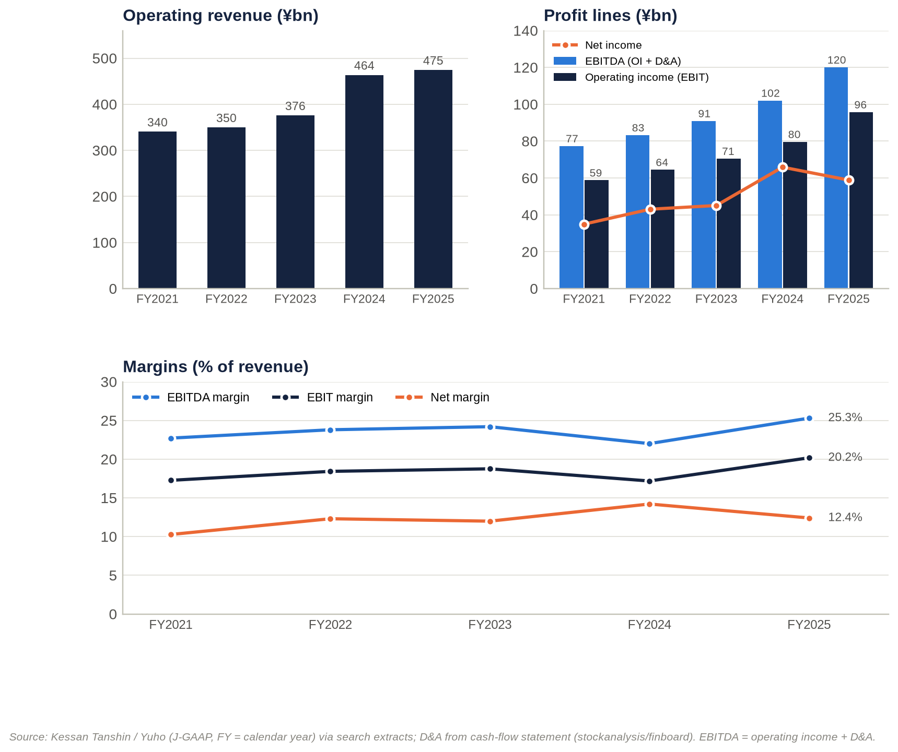

**Growth, FY2021–FY2025 (four-year CAGRs):**

| Measure | CAGR |
|---|---|
| Revenue | 8.7% |
| Operating income | 13.0% |
| Net income | 13.9% |
| EPS | 14.0% |

**The operating margin rose by about three points.** It went from 17.3% to 20.2%, and the EBITDA margin from 22.7% to 25.3%. Most of the improvement came in FY2025, when the profit mix moved away from lower-margin condo handovers towards rent and higher-margin sales to investors.

**Below the operating line, the trend has worked against shareholders.**

- **Ordinary income** lagged operating income in FY2021, when the non-operating gap was −¥12.5bn and the cause was not identified, and again in FY2024–FY2025.
- **FY2024 net income was flattered** by roughly ¥20–25bn of extraordinary gains, most plausibly from cross-shareholding sales. Net income was 91.9% of ordinary income that year, against 65–75% in other years. Two material-event reports were filed in December 2024 ([EDINET index](https://raw.githubusercontent.com/code4fukui/EDINET/HEAD/data/documents/2024-12-11.csv)).
- **FY2025 net income fell 10.6%**, even though operating income rose 20.2%:
  - The equity-method result swung by −¥7.7bn, to a ¥6.9bn loss, mostly from overseas businesses.
  - Other net non-operating cost, mainly interest, rose from about ¥8.8bn to ¥10.7bn.
  - Gains on securities sales fell (Shikiho: 「有証売却益減」).

Impairment losses have been immaterial: ¥0.3bn in FY2021, ¥0.5bn in FY2022, ¥0.2bn in FY2023 and ¥0.3bn in FY2024 ([the-shashi](https://the-shashi.com/tse/8804/financials/)).

### Segment revenue (product segments)

| Segment, ¥bn | FY2021 | FY2022 | FY2023 | FY2024 | FY2025 | 1H FY2026 |
|---|---|---|---|---|---|---|
| Building / Commercial Properties | ≈146 (low confidence) | n/a | 155.2 | 176.5 | 220.2 | ≈156.8 (Building + Residential combined) |
| Residential | ≈102 (low confidence) | n/a | 134.1 | 211.4 | 165.1 | (included above) |
| Asset Service | ≈48 (low confidence) | n/a | 63.8 | 54.7 | 63.5 | 26.8 |
| Other (incl. eliminations) | n/a (Overseas was then a separate segment) | n/a | ≈22.8 | ≈21.1 | ≈25.8 | 10.8 |
| **Consolidated** | **340.5** | **349.9** | **375.9** | **463.7** | **474.6** | **194.4** |

Sources: [FY2023 English presentation](https://pdf.irpocket.com/C8804/KNIO/nX4G/H18j.pdf); [FY2024 English presentation](https://pdf.irpocket.com/C8804/A7NF/cMwJ/WjaJ.pdf); [company overview](https://recruit.tatemono.com/english/company/pdf/company_overview.pdf); [FY2025 tanshin](https://pdf.irpocket.com/C8804/YpwX/Bm8F/l2Ip.pdf). The FY2021 split is a low-confidence extract. FY2022 segment revenue was not retrievable. "Other" is the residual after the three named segments.

### Segment profit and margins

| Segment, ¥bn | FY2022 | FY2023 | FY2024 | FY2025 operating profit | FY2025 business profit | 1H FY2026 operating profit |
|---|---|---|---|---|---|---|
| Building / Commercial Properties | ≈41.1 | 40.1 | 41.4 (restated) / 41.9 (old business profit) | 67.1 | 67.4 | 40.1 (+122.7%) |
| Residential | ≈23.3 | 27.1 | 38.2 (restated) / 37.6 (old business profit) | 25.6 | 25.6 | 2.9–3.0 (−83.2%) |
| Asset Service | ≈7.4 | 12.9 | 11.5 | 11.5 | 11.5 | n/a (revenue and profit up) |
| Other | n/a | 4.4 | ≈2.1 | 4.2 | −2.5 | n/a |
| Corporate and eliminations | n/a | ≈−10.1 | ≈−12.6 | −12.5 | −12.5 | ≈−3.2 (Other + Asset Service + corporate, residual) |
| **Group** | **Operating income 64.5** | **Operating income 70.5** | **Operating income 79.7** | **Operating income 95.8** | **Business profit 89.4** | **Operating income 39.9** |

How the segment figures were built:

- FY2022 is back-solved from the FY2023 year-on-year changes.
- FY2023 and old-definition FY2024 figures are on a business-profit basis.
- "Restated FY2024" is implied by the FY2025 year-on-year changes.

Sources: [FY2023 results materials](https://pdf.irpocket.com/C8804/KKjE/klDc/x9g3.pdf); [FY2024 English presentation](https://pdf.irpocket.com/C8804/A7NF/cMwJ/WjaJ.pdf); [japanir](https://japanir.jp/company/company-8804/ir/8804-20260212-01_wp_financial_summary/); [Shikiho](https://raw.githubusercontent.com/edamame384/stock_selection/HEAD/projects/shikiho_text_parser/data/raw/4Q-2/8804.txt); [BigGo](https://finance.biggo.com/news/JP_8804.T_2026-08-06).

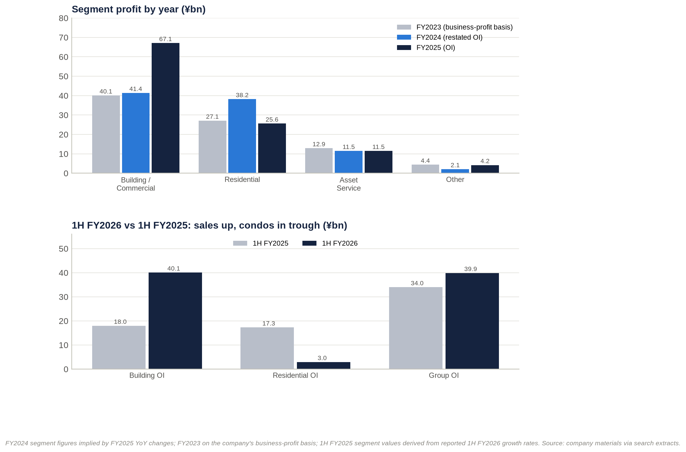

**Segment EBITDA and segment net income are not disclosed** under J-GAAP segment reporting. Group EBITDA and net income are shown in the consolidated table above.

| Segment margin (profit ÷ revenue) | FY2023 | FY2024 | FY2025 |
|---|---|---|---|
| Building / Commercial Properties | 25.8% | 23.5% | 30.5% |
| Residential | 20.2% | 18.0% | 15.5% |
| Asset Service | 20.2% | 21.0% | 18.1% |

**Building is now the profit engine.**

- Revenue rose from ¥155bn (FY2023) to ¥220bn (FY2025), and profit jumped 62% in FY2025.
- The margin widened from about 24% to 30.5%.
- Three things drove it: higher rents (including Yaesu), more property sales to investors, and better margins on those sales ([FY2025 highlights](https://pdf.irpocket.com/C8804/YpwX/GtIj/pQV9.pdf); [Nikkei](https://www.nikkei.com/article/DGXZQOUB132440T11C25A1000000/)).
- In 1H FY2026, Building operating profit (¥40.1bn) exceeded the whole group's.
- The rent/sale split inside the segment is not disclosed. This is the single most important missing disclosure.

**Residential is cyclical by design.**

- FY2024 was a peak handover year: revenue ¥211.4bn, helped by large deliveries including HARUMI FLAG.
- FY2025 profit fell 33% on fewer units and a lower average price.
- 1H FY2026 is a deeper trough: 270 units against 969, and gross margin of 27.8% against 30.4%. The company expects deliveries to rise from Q3 ([Nikkei](https://www.nikkei.com/article/DGXZQOUB136Z90T10C26A5000000/)).
- The steady fall in segment margin, from 20% to 15.5%, is consistent with construction-cost inflation and a lower-priced, suburban mix.

**Asset Service has been steady at about ¥11–13bn since FY2023.** It combines brokerage, property resales and parking. FY2025 revenue rose 15.9% on resales while profit was flat.

**Other carries the overseas equity-method losses.** Its FY2025 operating profit was +¥4.2bn, but business profit was −¥2.5bn. Corporate costs are rising; the 1H FY2026 residual was about −¥2bn worse year on year.

### Geographic segments

Tokyo Tatemono publishes **no geographic revenue split**. That is consistent with Japan exceeding 90% of revenue, though we could not verify it.

| Period | Overseas reporting status | Equity-method income (mainly overseas) | Comment |
|---|---|---|---|
| FY2021 | Overseas was a separate reportable segment ([FY2021 Yuho](https://raw.githubusercontent.com/yuukimiyo/stdata-jp/HEAD/8/88040/2022/DescriptionOfBusiness)) | n/a | China condo affiliates; Myanmar and Indonesian joint ventures |
| FY2022 | Folded into Other | ≈+1.8 (derived) | "Equity-method profit from overseas businesses" helped ([FY2022 presentation](https://pdf.irpocket.com/C8804/NvAy/MeeX/qjrg.pdf)) |
| FY2023 | Other | ≈+3.9 (derived) | n/a |
| FY2024 | Other | +0.8 | n/a |
| FY2025 | Other | **−6.9** | Drove the net-income fall; business profit was redefined partly to reflect "diversification of investment schemes in Overseas business" |
| 1H FY2026 | Other | ≈+1.5 (derived) | FY2026 overseas equity-method guidance was cut in August |

**Overseas profit is small and volatile; Japan is the whole story.** Revenue from consolidated overseas operations is immaterial, and the economics run through joint ventures. The exposure is shifting from Chinese and South-East Asian condos towards income-producing assets:

- US rental housing (8 projects in 5 states);
- Thai logistics and factories;
- a build-to-rent tower in Melbourne;
- a London office refurbishment.

### Returns: DuPont and ROIC check

| FY | Net margin | Asset turnover | Equity multiplier (average) | ROE | ROA | ROIC (NOPAT ÷ book invested capital) |
|---|---|---|---|---|---|---|
| FY2021 | 10.3% | 0.21x | 3.94x | ≈8.4% | 2.1% | 3.1% |
| FY2022 | 12.3% | 0.21x | 3.92x | 10.0% | 2.6% | 3.3% |
| FY2023 | 12.0% | 0.21x | 3.85x | 9.6% | 2.5% | 3.3% |
| FY2024 | 14.2% | 0.23x | 3.86x | **12.8%** (reported) | 3.3% | 3.4% |
| FY2025 | 12.4% | 0.22x | 3.87x | ≈10.5% | 2.7% | 3.7% |
| FY2026E | ≈12.5% | ≈0.22x | ≈3.9x | ≈10.7% | ≈2.7% | ≈3.8% |

Method:

- Derived from reported P&L figures and total assets/equity from coordinator balance-sheet data, with non-controlling interests of about ¥12bn.
- This method reproduces the reported FY2024 ROE (12.8%) and BPS (¥2,568 for FY2024, ¥2,846.85 for FY2025).
- NOPAT uses a 30.6% tax rate.

**ROE is about 10%, and almost four times leverage produces it.** The return on assets is only about 2.5–3.3%.

**ROIC on book capital has crept up from 3.1% to 3.7%**, which is only slightly above our rough estimate of the weighted cost of capital. On a market-value (NAV) basis it would be lower still.

**The real driver of FY2024's 12.8% ROE was the net margin, lifted by one-off gains.** Normalised, it would have been about 10–11%.

### Key operating KPIs

| KPI | Latest data point | Trend / comment |
|---|---|---|
| Condo handovers (≈ backlog conversion) | Q1 FY2025: 772 units; 1H FY2025: 969 units at 30.4% gross margin; Q1 FY2026: 235; 1H FY2026: 270 units at ¥69.11m average and 27.8% margin | Deep 1H trough; 2H recovery guided |
| Condo landbank (≈ order backlog) | ≈7,300 units (Feb 2026) → ≈7,600 (Aug 2026); ≈1,200 units added in 2025 | Growing; contract ratio for FY2026–27 deliveries not disclosed |
| Condo market share | 1,054 units supplied in 2025, #19 nationally | Mid-sized; ≤5% of Greater Tokyo |
| Office utilisation | Company vacancy not disclosed. Occupancy "has remained at a high level" ([Integrated Report 2025](https://tatemono.com/english/ir/library/pdf/integrated_2025_66.pdf)); market vacancy 1.87% | Very tight market |
| Rent / price-mix | Management cites inflation-driven rent increases, "mainly offices"; market rents +12.5% YoY | Accelerating |
| Unrealised gains on rental property (≈ installed-base value) | FY2021 ¥514.6bn → FY2022 ¥526.4bn → FY2023 ¥529.4bn → FY2025 ¥599.9bn ([FY2023 presentation](https://pdf.irpocket.com/C8804/KKjE/klDc/x9g3.pdf); [IR Bank](https://irbank.net/E03859/value)) | Only +3.9% CAGR: gains are harvested about as fast as they are created |
| Investor sales | FY2025 proceeds above plan; FY2026 hotel-led and "among the largest" in company history; >¥100bn stock of gains | Peak activity |
| Parking (installed base) | 75,618 spaces (Mar 2022) → 86,792 (Dec 2024) → ≈90,000 (Dec 2025) | Steady growth, about 5% a year |
| Asset-management platform | JPR: 66 properties, total assets ≈¥534bn; target >¥600bn | Exit channel capacity ≈¥62bn of debt headroom |
| Capex intensity | FY2024 capex ¥125.7bn = 27% of revenue = 5.6x D&A; ≈¥200bn of large-scale redevelopment planned for FY2025–27 | High |
| Cash conversion (operating cash flow ÷ operating income) | FY2021 112%; FY2022 −5%; FY2023 29%; FY2024 24%; FY2025 34% | Structurally low: land and for-sale property flow through operating cash flow |
| Leverage | Debt/EBITDA 12.6x (FY2021) → 11.2x (FY2025) → ≈12.1x (Jun 2026, LTM) | Back at the ≈12x guide ceiling |
| Employees | 5,076 consolidated; 840 at the parent (Sep 2025) | n/a |

> **Key takeaway:** Operating income compounded 13% a year and margins expanded. But growth has rotated from condos (FY2024) to investor sales (FY2025–26). The recurring rental base is not disclosed separately, net income is distorted by one-off gains and overseas losses, and cash conversion is poor. Together these explain why the market capitalises Tokyo Tatemono's earnings at a discount to peers.

## 7. Earnings calls and the latest result: tone has improved, but the quality of the upgrades has declined

### What management has focused on

Transcripts and Q&A summaries were not accessible. The table below draws on company headline materials and press coverage.

| Event (date) | Headline numbers | Management focus | Tone (−2 to +2) |
|---|---|---|---|
| New 2025–27 plan (16 Jan 2025) and FY2024 results (12 Feb 2025) | FY2024 record net income ¥65.9bn. FY2025 guidance: operating income ≈¥86.0bn, net income ≈¥55.0bn (≈−17%, derived) | Capital efficiency: payout to 40% by FY2027, ROE 10%, business profit ¥95bn, cross-shareholding cuts ([Nikkei](https://www.nikkei.com/article/DGXZQOUC169A00W5A110C2000000/)) | +0.5 |
| Q1 FY2025 (9 May 2025) | Revenue ¥126.7bn; operating income ¥23.7bn; net income ¥14.3bn; 772 condo units | Guidance held | 0 |
| 1H FY2025 (8 Aug 2025) | Operating income −33.6%; net income −35.2% | Guidance held; reliance on 2H | −0.5 |
| Q3 FY2025 (13 Nov 2025) | Operating-income guidance raised to ¥92.5bn; net income to ¥58.0bn; dividend to ¥103. Revenue guidance cut from ¥503bn to ¥470bn under a "partly revised sales policy" ([f-p.jp](https://f-p.jp/media/?p=21023)) | Rent increases including Yaesu; higher sale gains | +1 |
| FY2025 results (12 Feb 2026) | Record operating income ¥95.8bn; dividend ¥105 (12th straight increase). FY2026 guidance: operating income ¥100bn, net income ¥63bn (above the QUICK consensus of ¥61.25bn), dividend ¥122 (40.2% payout) | Investor property sales; plan targets "a year early" | +1.5 |
| Q1 FY2026 (13 May 2026) | Revenue −22.1%; operating income −46.7%; net income −60.2%; 235 condo units | Timing: deliveries rise from Jul–Sep; guidance and dividend held ([TipRanks](https://www.tipranks.com/news/company-announcements/tokyo-tatemono-q1-profit-slumps-but-full-year-outlook-and-dividend-plan-held)) | 0 |
| 1H FY2026 (6 Aug 2026; briefing 10 Aug) | Operating income +17.1%; business profit +20.0%; net income +13.7%. Guidance raised to operating income ¥105.5bn and net income ¥65.0bn; dividend ¥126 | "確かな手応え" (firm confidence) in inflation-driven rent growth; main plan targets one year early; offsets from a lower overseas equity-method outlook and higher corporate costs ([logmi](https://finance.logmi.jp/articles/385621)) | **+2** |

### How sentiment has shifted

**The tone score moved from +0.5 to −0.5 and then up to +2.**

| Period | Tone | What drove it |
|---|---|---|
| Mid-2025 | Cautious | Large year-on-year declines in 1H FY2025 after the FY2024 condo peak |
| Nov 2025 – Feb 2026 | Positive | Upgrades and records |
| Q1 FY2026 | Neutral | A timing-driven miss, with guidance held |
| 1H FY2026 | Most positive of the period | Guidance raised one quarter earlier than in FY2025 (at the half-year rather than Q3) |

**The themes have moved with the tone:**

1. capital policy (payout, ROE) in early 2025;
2. investor-sale gains and Yaesu rent increases in late 2025 and early 2026;
3. inflation-linked rent growth presented as a structural story in August 2026.

**The caveats have grown as the tone improved.**

- Residential timing has worsened.
- Overseas equity-method income has been cut.
- Corporate costs are rising.
- The non-operating gap has widened: from ¥17.6bn in FY2025 to ¥22.0bn implied by revised FY2026 guidance.

The upgrades therefore rest more on property-sale gains, which are cyclical and rate-sensitive, than on recurring income.

**The sell-side has followed the tone.** Nomura upgraded the stock from Neutral to Buy (target ¥4,450) in June 2026, about a month after the weak Q1 ([Yahoo/IFIS](https://finance.yahoo.co.jp/news/detail/bbe176c6f23e7dfbcc6c51b59ff2b0e01f358fa0)). It raised the target to ¥4,480 after 1H.

### Latest result: 1H FY2026 (released 6 August 2026)

| Metric | 1H FY2025 | 1H FY2026 | Change |
|---|---|---|---|
| Operating revenue | ¥208.8bn | ¥194.4bn | −6.9% |
| Operating income | ¥34.0bn | ¥39.9bn | +17.1% |
| Business profit | ≈¥34.4bn | ¥41.3bn | +20.0% |
| Net income | ¥20.5bn | ¥23.4bn | +13.7% |
| Operating margin | 16.3% | 20.5% | +4.2pt |
| Building operating profit | ≈¥18.0bn | ¥40.1bn | +122.7% |
| Residential operating profit | ≈¥17.3bn | ¥2.9–3.0bn | −83.2% |
| Condo units / gross margin | 969 / 30.4% | 270 / 27.8% | −72% / −2.6pt |
| Q2 standalone operating income | ¥10.3bn | ¥27.2bn | ×2.6 |
| Interest-bearing debt (vs 31 Dec 2025) | ¥1,343.9bn | ¥1,536.6bn | +¥191.1bn |
| Cash (vs 31 Dec 2025) | ¥152.3bn | ¥94.2bn | −¥58.1bn |
| Equity ratio (vs 31 Dec 2025) | 26.0% | 24.5% | −1.5pt |

Sources: [1H FY2026 highlights](https://pdf.irpocket.com/C8804/xoA3/ieAo/gkiS/BBY6.pdf); [BigGo](https://finance.biggo.jp/news/jpx_tdnet_140120260806512201); [logmi](https://finance.logmi.jp/articles/385621); [Nikkei](https://www.nikkei.com/article/DGXZQOUB067LD0W6A800C2000000/).

**Against expectations.** No first-half consensus was published, so a precise beat or miss cannot be measured. Two comparisons are possible:

- **Against the company's own pace.** First-half operating income was 37.7% of revised full-year guidance, against 35.5% at the same stage of FY2025. Net income was 35.9%, against 34.9%. That is ahead of the usual seasonal pattern.
- **Against full-year consensus.** The raised ordinary-income guidance of ¥83.5bn simply matched the pre-revision IFIS consensus of ¥83.4bn ([Yahoo/IFIS](https://finance.yahoo.co.jp/news/detail/bfb0b331c619a05517347a116f4050ab9e91ecb0)). Consensus has since moved about 1–2% above guidance: ordinary income ¥84.5bn and net income ¥66.5bn ([IFIS](https://kabuyoho.ifis.co.jp/index.php?action=tp1&sa=report_pbr&bcode=8804); [Minkabu](https://minkabu.jp/stock/8804/analyst_consensus)).

**Segment drivers.**

- **Building** doubled its operating profit on investor property sales, which were concentrated in Q2.
- **Residential** collapsed on handover timing.
- **Asset Service** rose on property resales.
- **Corporate costs** rose.

**Margins.** The group operating margin rose 4.2 points to 20.5% because of the mix shift.

- Q1 was 12.8%, against 18.7% a year earlier.
- Q2 was 28.4%, against 12.6% a year earlier.
- The Q1 gross margin was 24.3% ([Globe and Mail](https://www.theglobeandmail.com/investing/markets/stocks/TYTMF/pressreleases/1924014/tokyo-tatemono-posts-soft-q1-fy2026-results-but-keeps-full-year-outlook-intact/)).
- The 2.6-point fall in the condo gross margin is the clearest sign of cost pressure.

**Guidance and outlook.** Revised FY2026 guidance:

| Item | Original guidance | Revised guidance |
|---|---|---|
| Operating income | ¥100.0bn | ¥105.5bn |
| Ordinary income | ¥80.5bn | ¥83.5bn |
| Net income | ¥63.0bn | ¥65.0bn |
| Dividend per share | ¥122 | ¥126 (¥61 interim + ¥65 year-end) |

Revenue guidance appears unchanged at ¥524.0bn, although only one source confirms this. Management says the main plan targets will be reached a year early. The tone was the most confident of the period. The two offsets were the overseas equity-method review and higher corporate costs ([Minkabu](https://minkabu.jp/news/4589327)).

**Balance-sheet flags.**

- Interest-bearing debt jumped ¥191bn in six months, while cash fell ¥58bn.
- The equity ratio slipped to 24.5%. Interest-bearing debt/equity reached about 2.53x, above the ≈2.4x guide.
- Inventory and receivables lines were not retrievable.
- The debt build most likely reflects three things:
  - for-sale property bought or built ahead of second-half disposals;
  - acquisitions of existing buildings (from Blackstone and Yellow Hat);
  - the Star Mica stake.
- Year-end debt is therefore the key test of whether the sale programme converts to cash.

**Market reaction.** The shares rose for a third straight session on 7 August ([Minkabu](https://minkabu.jp/news/4589327)) and ended August only +1.7%.

- Broker targets went to ¥4,480 (Nomura, Buy), ¥3,700 (a US broker) and ¥3,680 (a Japanese broker, Neutral).
- The stock then fell 9.3% from its July high to ¥3,211 as the BOJ hiked.
- The muted reaction says the upgrade was largely priced in. Consensus had already sat above guidance, and the market discounts sale-driven upgrades.

**What is unusual compared with recent history:**

1. Guidance was raised at the half-year rather than at Q3.
2. Profit rose sharply while revenue fell.
3. Q2 operating income was 2.6 times the prior year's.
4. The residential trough is deeper than in prior years.
5. Debt expanded by ¥191bn in a single half.
6. Revenue progress was only 37% of the ¥524bn guidance, against 44% a year earlier. The second half needs about ¥330bn of revenue, against ¥266bn in 2H FY2025, so the revenue line looks at risk even if profit guidance holds.

> **Key takeaway:** The latest result was a clean profit beat against the company's own plan. But it was driven by sales and accompanied by balance-sheet expansion. Sentiment is at its most positive just as the drivers become more cyclical. The next proof points are the Q3 release (mid-November) and year-end debt.

## 8. EPS estimates FY2026E–FY2028E: ¥315, ¥323 and ¥330, with financing costs absorbing most of the operating growth

### Our build

| ¥bn | FY2025A | FY2026E | FY2027E | FY2028E |
|---|---|---|---|---|
| Building segment operating profit | 67.1 | 84.5 | 86.0 | 90.5 |
| of which: change in leasing and operations profit | — | +3.5 | +5.5 | +4.5 |
| of which: change in investor-sale profit | — | +14.0 | −4.0 | 0.0 |
| Residential segment operating profit | 25.6 | 22.0 | 27.0 | 28.0 |
| Asset Service + Other − corporate costs | 3.2 | 0.5 | 0.0 | −0.5 |
| **Operating income** | **95.8** | **107.0** | **113.0** | **118.0** |
| Net non-operating cost (interest, equity-method, other) | 17.6 | 22.0 | 24.0 | 26.5 |
| **Ordinary income** | **78.2** | **85.0** | **89.0** | **91.5** |
| Net extraordinary gains | 7.4 (implied) | 10.0 | 8.0 | 7.0 |
| Pre-tax income | 85.6 | 95.0 | 97.0 | 98.5 |
| **Net income** (30.6% tax; ¥0.5bn non-controlling interests) | **58.9** | **65.4** | **66.8** | **67.9** |
| Average shares (m) | 208.0 | 207.5 | 206.6 | 205.7 |
| **EPS (¥)** | **283** | **315** | **323** | **330** |
| EPS growth | −10.3% | +11.4% | +2.6% | +2.0% |
| DPS at 40% payout (¥) | 105 | 126 | 129 | 132 |

How the model works:

- **Anchors.** FY2025 actuals and the 1H FY2026 segment results.
- **Method.** Each segment is built from the FY2025 base plus explicit changes, so the model does not depend on the undisclosed rent/sale split.
- **FY2026E second half.** The build implies Building operating profit of ¥44.4bn and Residential of ¥19.1bn in 2H FY2026E, given the heavy Q3/Q4 handovers.
- **Reproducibility.** The model is kept in `tt_model.py` in the research notes.

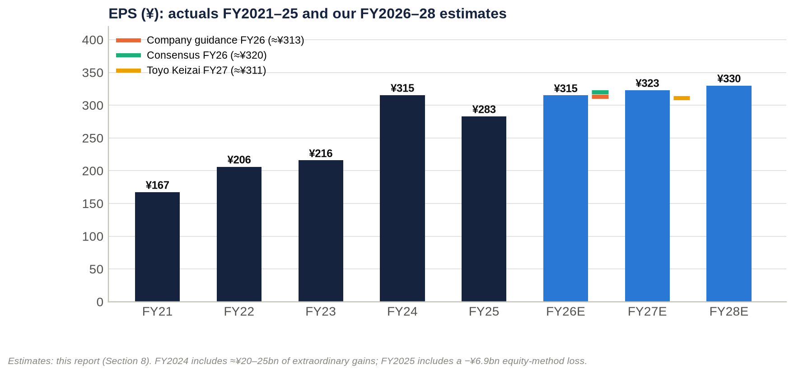

| | Company guidance | Consensus | Toyo Keizai estimate | Our estimate |
|---|---|---|---|---|
| FY2026 operating income | ¥105.5bn | n/a | — | ¥107.0bn (+1.4% vs guidance) |
| FY2026 ordinary income | ¥83.5bn | ¥84.5bn | — | ¥85.0bn |
| FY2026 net income / EPS | ¥65.0bn / ≈¥313 | ¥66.5bn / ≈¥320 | — | ¥65.4bn / ¥315 |
| FY2027 operating income / net income | Plan: business profit ¥95bn (already exceeded) | Not available | ¥105.0bn / ¥64.6bn | ¥113.0bn / ¥66.8bn |
| FY2027 EPS | — | Not available | ≈¥311 | ¥323 |

Sources: guidance from [Minkabu](https://minkabu.jp/news/4589327); consensus from [IFIS](https://kabuyoho.ifis.co.jp/index.php?action=tp1&sa=report_pbr&bcode=8804) and [Minkabu](https://minkabu.jp/stock/8804/analyst_consensus); Toyo Keizai's own estimate from [Shikiho](https://raw.githubusercontent.com/edamame384/stock_selection/HEAD/projects/shikiho_text_parser/data/raw/4Q-2/8804.txt). FY2027–FY2028 consensus could not be obtained.

### How each factor enters the estimate

**Industry growth.** Tokyo office rents are up 12.5% year on year and 23-ward condo prices 9–22%, and all five majors are guiding to records. We assume **like-for-like rent reversion of about 3% a year**, well below market asking-rent growth, because leases reprice only at renewal. This is the main source of recurring growth: +¥3.5bn, +¥5.5bn and +¥4.5bn of leasing profit in FY2026E–FY2028E, including TOFROM YAESU's first full year in FY2027.

**Market share.** We assume none is gained in condos, where Tokyo Tatemono supplies about 1,000–1,200 units a year and holds ≤5% share. Office "share" grows only through new floor space: TOFROM YAESU now, Kyobashi 3-chome East from FY2029.

**Price increases and mix.** Condo prices rise ("deliveries flat, prices up", per Shikiho), but we hold the gross margin at about 25–27%, against 30.4% in 1H FY2025, because construction costs are up 5% a year. Residential profit recovers to ¥27–28bn as the ≈7,600-unit landbank converts.

**Investor-sale normalisation.** FY2026E includes a +¥14.0bn sale-profit step-up, which more than fully explains the year's operating growth. We then assume −¥4.0bn in FY2027E as higher cap rates temper buyer demand, and flat in FY2028E. We deliberately do not extrapolate FY2026's record sale programme.

**Cost pressures.** Corporate costs are rising (about −¥2bn year on year in 1H). Wage and IT inflation and construction costs push "Asset Service + Other − corporate" from +¥3.2bn to −¥0.5bn.

**Operating leverage.** Leasing income has close to full drop-through. A 1% change in leasing revenue (on an assumed base of about ¥150bn) is worth about ¥5 of EPS.

**Financing costs.** Net non-operating cost rises from ¥17.6bn to ¥26.5bn by FY2028E. That reflects BOJ normalisation, refinancing of maturing fixed-rate debt and higher debt. The implied net funding cost was about 0.8% in FY2024–25. FY2026 guidance implies roughly 1.2–1.5%, depending on the equity-method assumption. **Higher financing costs and fading one-off gains absorb about two-thirds of FY2026E–FY2028E operating-income growth.** Operating income rises ¥11.0bn over the two years, but pre-tax profit rises only ¥3.5bn.

**Share count.** We assume buybacks of about ¥3bn a year, cutting average shares by about 1% to 205.7m by FY2028E. There is no dilution: the stock-compensation trust buys existing shares, and no convertibles were found.

**Extraordinary items.** Cross-shareholding and fixed-asset gains fade from ¥10bn to ¥7bn as the stock of holdings shrinks.

**Result: EPS CAGR of 5.2% from FY2025A to FY2028E, but only about 2–3% a year after FY2026.**

### Sensitivities (FY2027E, after tax)

| Change | EPS impact |
|---|---|
| ±¥5bn of investor-sale profit | ±¥17 |
| ±¥1bn of pre-tax profit | ±¥3.4 |
| +25bp on current debt of ¥1.54tn, if fully repriced | −¥13 |
| ±1pt of condo gross margin | ±¥5 |
| ±1% of leasing revenue | ±¥5 |
| ±¥2bn of extraordinary gains | ±¥7 |
| **Bull** scenario: sales +¥4bn, residential +¥2bn, interest −¥1bn | FY2027E EPS ≈¥347; FY2028E ≈¥354 |
| **Bear** scenario: sales −¥8bn, residential −¥3bn, interest +¥2bn | FY2027E EPS ≈¥280; FY2028E ≈¥286 |

> **Key takeaway:** We sit in line with company guidance for FY2026 (EPS ¥315 against ≈¥313 guided and ≈¥320 consensus). We are more cautious beyond it: EPS of ¥323 in FY2027E and ¥330 in FY2028E, because rising financing costs and normalising sale gains offset rent growth. Upside depends on rent reversion running faster than our ≈3%.

## 9. Capital structure: ¥1.54tn of mostly fixed-rate debt, leverage back at the guide ceiling

### Balance sheet and leverage history

| ¥bn (period-end) | FY2021 | FY2022 | FY2023 | FY2024 | FY2025 | 30 Jun 2026 |
|---|---|---|---|---|---|---|
| Total assets | 1,650.8 | 1,720.1 | 1,905.3 | 2,081.2 | 2,272.7 | 2,476.2 |
| Shareholders' equity (≈) | 415.7 | 444.8 | 496.0 | 535.5 | 590.8 | 606.7 |
| Interest-bearing debt | 976.9 | 989.8 | 1,089.0 | 1,191.6 | 1,343.9 | **1,536.6** |
| Cash and equivalents | 87.0 | 82.4 | 127.3 | 111.1 | 152.3 | 94.2 |
| Net debt | 889.9 | 907.4 | 961.7 | 1,080.4 | 1,191.6 | **1,442.4** |
| Debt / equity | 2.35x | 2.23x | 2.20x | 2.23x | 2.27x | **2.53x** |
| Equity ratio | ≈25.2% | ≈25.9% | ≈26.0% | 26.0% | 26.0% | 24.5% |
| Net debt / EBITDA | 11.5x | 10.9x | 10.6x | 10.6x | 9.9x | 12.0x (FY2025 EBITDA) / 11.4x (LTM) |
| Debt / EBITDA (company's guide ≈12x) | 12.6x | 11.9x | 12.0x | 11.7x | 11.2x | ≈12.1x (LTM) |

Sources:

- Interest-bearing debt at FY2025: [edinetdb](https://edinetdb.jp/company/E03859).
- 30 Jun 2026 balance sheet: 1H disclosures via [logmi](https://finance.logmi.jp/articles/385621).
- Earlier years: coordinator data from stockanalysis, Simply Wall St and edinetdb extracts.
- Shareholders' equity is total equity less about ¥12bn of non-controlling interests. This reproduces the reported BPS for FY2024 and FY2025.

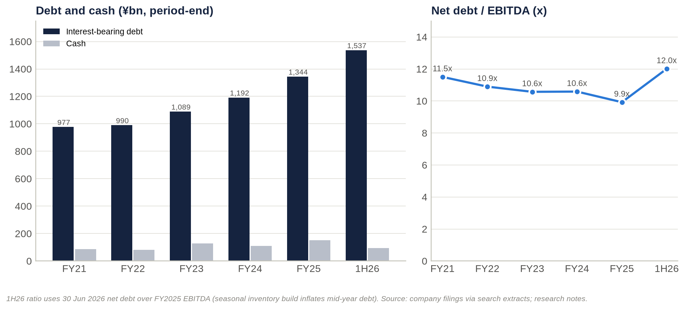

**The balance sheet grew 50% in four and a half years.** Total assets rose from ¥1.65tn to ¥2.48tn, and debt rose from ¥977bn to ¥1,537bn.

**Leverage drifted down until FY2025, then rose sharply.** Net debt/EBITDA fell from 11.5x to 9.9x as EBITDA grew 55%. It then jumped in 1H FY2026.

**The leverage guide is now binding.** The 2020–24 plan set debt/equity of "about 2.4x" and debt/EBITDA of "about 12x" (verbatim, [FY2022 Yuho](https://raw.githubusercontent.com/yuukimiyo/stdata-jp/HEAD/8/88040/2023/BusinessPolicyEtc)). A search extract indicates the 2025–27 plan keeps the same guideposts. At June 2026 the company was **above the debt/equity guide (2.53x)** and **at the debt/EBITDA ceiling**. Mid-year figures are seasonally inflated: inventory is built ahead of second-half disposals and condo handovers. The December 2026 balance sheet is therefore the real test.

### Debt mix, cost and maturities

**Funding policy.** Each Yuho repeats the same policy. Most debt is long-term, and "almost all long-term borrowings" carry fixed rates to minimise interest-rate exposure. The same section warns that rising rates could hurt both earnings and asset values ([FY2022 Yuho risk section](https://raw.githubusercontent.com/yuukimiyo/stdata-jp/HEAD/8/88040/2023/BusinessRisks)).

**Lenders and bonds.** Funding comes mainly from relationship banks: Mizuho, SMBC and MUFG. Bonds are issued under shelf registrations, with supplements in April 2024, May 2025, June 2025 and February 2026, and a fresh shelf registration on 17 August 2026 ([EDINET index](https://raw.githubusercontent.com/code4fukui/EDINET/HEAD/data/documents/2026-08-17.csv)). Recent issues include:

- the 36th unsecured bond, a Sustainability Bond rated A by JCR, sold to retail investors in June–July 2025 ([Rakuten Securities](https://www.rakuten-sec.co.jp/web/bond/jbond/products/20250630/));
- dated subordinated hybrid bonds, rated BBB+ by JCR on 30 May 2025. They have a 37-year maturity, are callable after 7 years, and can be redeemed early on tax or rating-agency equity-credit events ([matsunosuke](https://matsunosuke.jp/tokyo-tatemono-bond/)).

The hybrid amount and its equity credit were not retrievable. If the company quotes a hybrid-adjusted debt/equity ratio, reported leverage looks better than our table, which counts hybrids 100% as debt.

**Credit ratings.** JCR rates the issuer A, an upgrade from A− ([JCR](https://jcr.co.jp/download/10194f47b690f5b8ad8096559f9868ffb09165b80805048511/25d0289.pdf)); the upgrade date was not retrieved. The R&I rating was not retrieved.

**Interest cost.** The interest-expense line could not be retrieved, so we infer it.

- Net non-operating cost excluding equity-method results was about ¥8.8bn in FY2024 and ¥10.7bn in FY2025. That implies a net funding cost of about **0.8%** of average debt, after dividend income from cross-shareholdings.
- Revised FY2026 guidance implies a ¥22.0bn gap between operating and ordinary profit, i.e. about **1.2–1.5%**, depending on how much of it is overseas equity-method loss.
- The direction is unambiguous: maturing fixed-rate debt is being refinanced at rates set after the BOJ's successive hikes to 1.25%.

**Maturities and covenants: not retrieved.** The maturity ladder, average remaining tenor, fixed/floating split, commitment lines and covenants were not in the materials accessible to us. We found no evidence of covenant stress. The A rating, access to unsecured retail bond markets and relationship-bank funding all point to adequate headroom, but this needs verification in the FY2025 Yuho (EDINET S100XSKF).

**Liquidity.** Cash was ¥94.2bn at June 2026. Further liquidity comes from:

- the company's stated stock of more than ¥100bn of embedded gains on sale;
- a policy-shareholding portfolio (listed stakes worth about ¥56–61bn at recent prices; Section 16);
- the ≥¥130bn programme of asset and cross-shareholding sales.

The liquidity risk is not insolvency. It is being forced to sell into a weak market if the exit channel closes.

### Interest-rate sensitivity (+100bp on current debt of ¥1,536.6bn)

| Share of debt repriced | Pre-tax cost | After-tax cost | Share of FY2026E net income | EPS impact |
|---|---|---|---|---|
| 30% (near-term floating and maturing) | ¥4.6bn | ¥3.2bn | 4.9% | −¥15 |
| 50% | ¥7.7bn | ¥5.3bn | 8.2% | −¥26 |
| 100% (fully repriced over the refinancing cycle) | ¥15.4bn | ¥10.7bn | 16.3% | −¥51 |

> **Key takeaway:** The capital structure is conservative in form (long-dated, fixed-rate, A-rated, relationship banks) but aggressive in quantity: debt is about 2.5 times equity and about 12 times EBITDA. Repricing is gradual but relentless. Every 100bp, once fully repriced, removes about 16% of net income.

## 10. Valuation: cheap on equity multiples, fair on enterprise value, full against its own history

### Competitor universe: public and private

| Company | Ticker | Listed? | Relevance to Tokyo Tatemono |
|---|---|---|---|
| Mitsui Fudosan | 8801 | Yes, TSE Prime | #1 integrated developer; neighbour in Nihonbashi/Yaesu |
| Mitsubishi Estate | 8802 | Yes, TSE Prime | Marunouchi landlord; surrounds the Otemachi/Tokyo Station core |
| Sumitomo Realty & Development | 8830 | Yes, TSE Prime | Tokyo offices and condos; highest margin among the majors; Elliott holds 3.5% |
| Tokyu Fudosan HD | 3289 | Yes, TSE Prime (Tokyu Corp holds 15.9%) | Similar scale; condos and brokerage |
| Nomura Real Estate HD | 3231 | Yes, TSE Prime (Nomura HD holds 35.2%) | Closest comparable on condo mix and size; Proud brand |
| Hulic | 3003 | Yes, TSE Prime | Central-Tokyo landlord; Fuyo/Yasuda-lineage register; cross-holding with Tokyo Tatemono |
| Heiwa Real Estate | 8803 | Yes, TSE Prime (Taisei holds 17.3%) | Small office landlord (Kabutocho) |
| Keihanshin Building | 8818 | Yes, TSE Prime | Small Osaka landlord |
| Sekisui House / Daito Trust / Open House | 1928 / 1878 / 3288 | Yes, TSE Prime | Housing comparables; Open House is the #1 condo supplier |
| Japan Prime Realty / Mori Hills REIT / NTT UD REIT | 8955 / 3234 / 8956 | Yes, J-REITs | Sponsor vehicles; excluded from EV/Sales comparisons |
| Star Mica HD | 2975 | Yes, TSE Prime | Pre-owned condo renovation; Tokyo Tatemono holds 13.74% |
| Mori Building | — | No (sponsors Mori Hills REIT, 19.3%) | Roppongi, Toranomon and Azabudai mega-projects |
| Mori Trust | — | No | Offices and hotels |
| Nippon Steel Kowa Real Estate | — | No | Office developer; Tokyo Tatemono's partner in Melbourne |
| NTT Urban Development | — | No (delisted Jan 2019 after NTT's tender offer) | Offices and condos |
| Condo arms of the majors: Mitsubishi Jisho Residence, Mitsui Fudosan Residential, Sumitomo Fudosan Hanbai, Tokyu Land, Nomura RE Development | — | No (subsidiaries) | Direct condo competitors (The Parkhouse, Park Homes, City House, Branz, Proud) |

Sources: [Shikiho mirror pages for each company](https://raw.githubusercontent.com/edamame384/stock_selection/HEAD/projects/shikiho_text_parser/data/raw/4Q-2/8804.txt); [NTT UD delisting](https://maonline.jp/db/tob/2018/42).

### Current multiples vs listed peers

Valuation multiples:

| Company | Price (date, 2026) | Market cap ¥bn | EV ¥bn | EV/Sales | EV/EBITDA | EV/EBIT | Forward P/E |
|---|---|---|---|---|---|---|---|
| **Tokyo Tatemono** | **3,211 (2 Oct)** | **667.8** | **2,122.5** | **4.47x** | **17.7x** | **22.2x** | **10.3x** |
| Mitsui Fudosan | 1,507.5 (7 Sep) | 4,060.0 | 8,529.4 | 3.15x | 15.9x | 21.4x | 14.3x |
| Mitsubishi Estate | 3,630 (28 Sep) | 4,396.3 | 7,608.8 | 4.36x | 17.4x | 23.1x | 18.6x |
| Sumitomo Realty | 3,226 (14 Sep) | 3,019.5 | 6,760.9 | 6.39x | 18.1x | 22.6x | 13.4x |
| Tokyu Fudosan HD | 1,312.5 (7 Aug) | 944.8 | 2,614.3 | 2.10x | 11.2x | 15.7x | 9.4x |
| Nomura RE HD | 926 (4 Sep) | 850.0 | 2,510.7 | 2.66x | 15.8x | 18.2x | 9.2x |
| Hulic | 1,734 (25 Sep) | 1,331.6 | 3,408.1 | 4.68x | 16.7x | 18.2x | 10.9x |
| Heiwa Real Estate | 2,320 (30 Sep) | 164.8 | 400.9 | 7.88x | 19.4x | 26.5x | 13.3x |
| Keihanshin Building | 1,118 (11 Sep) | 109.1 | 172.8 | 8.53x | 18.1x | 30.6x | 15.2x |
| **Peer median (8 companies)** | | | | **4.52x** | **17.0x** | **22.0x** | **13.35x** |
| Sekisui House (housing) | 3,415 (6 Aug) | 2,225.2 | 3,779.4 | 0.90x | 10.0x | 11.1x | 10.2x |
| Daito Trust (housing) | 3,143 (29 Sep) | 1,083.1 | 1,092.7 | 0.55x | 7.2x | 8.1x | 9.5x |
| Open House (housing) | 7,362 (29 Sep) | 859.7 | 1,172.2 | 0.88x | 7.9x | 8.0x | 6.9x |

Fundamentals and balance-sheet metrics:

| Company | P/B | Dividend yield | ROE | EBIT margin | EBITDA margin | 3-year revenue CAGR | Net debt / EBITDA |
|---|---|---|---|---|---|---|---|
| **Tokyo Tatemono** | **1.10x** | **3.92%** | **10.5%** | **20.2%** | **25.3%** | **10.7%** | **12.0x** |
| Mitsui Fudosan | 1.25x | 2.45% | 8.7% | 14.7% | 19.8% | 6.1% | 8.3x |
| Mitsubishi Estate | 1.61x | 1.35% | 8.5% | 18.9% | 25.0% | 8.2% | 7.4x |
| Sumitomo Realty | 1.16x | 1.61% | 9.2% | 28.3% | 35.4% | 4.0% | 10.0x |
| Tokyu Fudosan HD | 1.03x | 3.81% | 11.2% | 13.4% | 18.8% | 7.4% | 7.1x |
| Nomura RE HD | 0.99x | 4.75% | 10.7% | 14.7% | 16.9% | 12.9% | 10.4x |
| Hulic | 1.39x | 3.86% | 13.1% | 25.7% | 28.1% | 11.6% | 10.1x |
| Heiwa Real Estate | 1.24x | 4.44% | 9.0% | 29.7% | 40.7% | 4.5% | 11.4x |
| Keihanshin Building | 1.26x | 2.68% | 5.9% | 27.9% | 47.1% | 2.4% | 6.7x |
| **Peer median** | **1.245x** | **3.25%** | **9.1%** | **22.3%** | **26.6%** | **6.7%** | **9.2x** |

How the tables were built:

- **Data.** Market data come from kabuyoho, Monex and traders.co.jp extracts. Fundamentals come from company results and the Shikiho mirror. The full dataset, with source URLs, is `peer_valuation_8804.csv` in the research notes.
- **EV definition.** EV = market cap + latest interest-bearing debt − cash + non-controlling interests. Non-controlling interests are taken as zero for peers. Hybrids are counted 100% as debt.
- **EBITDA.** Tokyo Tatemono uses FY2025 D&A of ¥24.3bn. Peers use Shikiho D&A figures.
- **Stale data.** Several peer prices and balance sheets are weeks or months old (dates shown).

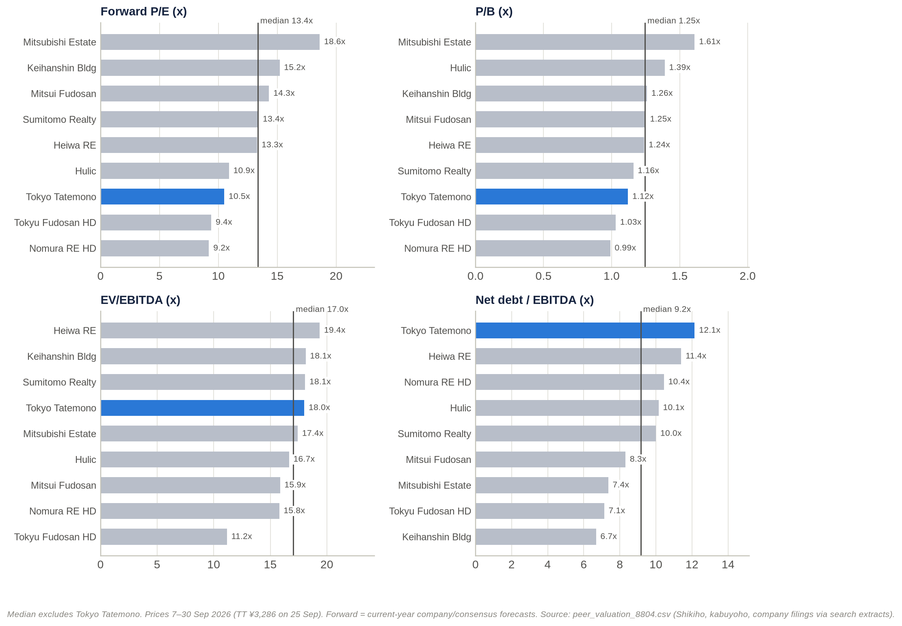

**Cash-flow metrics are Tokyo Tatemono's weakest point.** Operating cash flow/EV is 1.5%, against a 4.1% peer median, and free cash flow was negative (−¥123bn in FY2024). The develop-to-sell model runs land and for-sale property through operating cash flow. On one-year revenue growth Tokyo Tatemono lags: +2.3% against a ≈9.4% peer median. On three-year growth it leads: 10.7% against 6.7%.

### Cheap, fair or expensive?

| Metric | Tokyo Tatemono | vs peers | vs own history | Screens |
|---|---|---|---|---|
| Forward P/E | 10.3x | −23% vs 13.35x | Above its 3-year band (7.0–9.9x); within the year-end range of 7.8–12.5x | **Cheap vs peers; full vs history** |
| P/B | 1.10x | −12% vs 1.245x | Upper half of 0.75–1.25x | Modestly cheap vs peers |
| P/NAV | 0.65x | In line with Mitsubishi Estate and Mitsui (0.64x); above Sumitomo (≈0.5x) | Above its FY2021–23 range of 0.41–0.51x | Fair |
| EV/Sales | 4.47x | In line (4.52x); on the regression line | Above its FY2021–25 range of 3.53–4.09x | **Fair; expensive vs history** |
| EV/EBITDA | 17.7x (15.6x on the Dec-2025 balance sheet) | +4% vs 17.0x | Above the 15.1–16.2x range on the June balance sheet; mid-range on December's | Fair to full |
| EV/EBIT | 22.2x | In line (22.0x) | Above 19.4–21.3x | Fair |
| Net debt/EBITDA | 12.0x | Highest in the group (median 9.2x) | Above the FY2025 level of 9.9x | **Risk flag** |
| EBIT / EBITDA margin | 20.2% / 25.3% | Below the 22.3% / 26.6% medians | Highest in five years | Mid-pack quality |
| Dividend yield | 3.9% | +0.7pt vs 3.25% | Mid-range (2.96–4.07%) | Attractive |
| Operating cash flow / EV | 1.5% | vs 4.1% | n/a | Weak |

**Overall verdict: fair.** The equity screens cheap only because the debt is large. Remove the leverage and Tokyo Tatemono is priced in line with its peers and above its own history.

### Net asset value: ≈¥4,937 per share, so the stock trades at 0.65x NAV

| NAV bridge | ¥bn | ¥ per share |
|---|---|---|
| Rental-property fair value (31 Dec 2025) | 1,658.0 | — |
| Rental-property book value | 1,058.1 | — |
| Unrealised gain, pre-tax | 599.9 | ≈2,891 |
| Deferred tax at 30.6% | (183.6) | (≈884) |
| Unrealised gain, after tax | 416.4 | ≈2,007 |
| Book value per share (30 Jun 2026) | — | 2,930 |
| **NAV per share** | — | **≈4,937** |
| P/NAV at ¥3,211 | — | **0.65x** |

Sources: fair and book values from [IR Bank](https://irbank.net/E03859/value) and the [FY2025 presentation](https://pdf.irpocket.com/C8804/doF3/FpJe/bqVe.pdf) ("unrealized gain remained at a high level of ¥599.9 billion"). The fair-value disclosure covers non-current assets leased to third parties or under development for lease. Per-share figures use ≈207.5m shares.

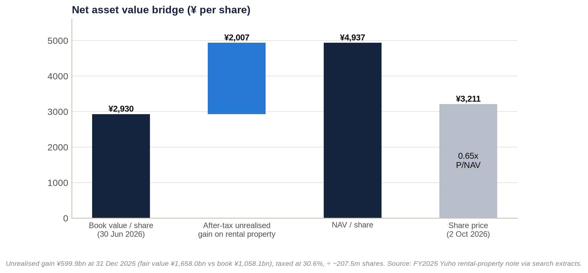

**Alternative NAV bases:**

- **FY2025 year-end** (BPS ¥2,846.85): NAV ≈¥4,853.
- **Pre-tax** (no deferred tax): ≈¥5,821, giving P/NAV of 0.55x.
- **Including the company's ">¥100bn stock of gains on sale"** after tax: ≈¥5,271, giving 0.61x. This risks double counting, because part of that stock sits in the fair-value note already.

**The stock of unrealised gains is growing slowly.** It was ¥514.6bn (FY2021), ¥526.4bn (FY2022), ¥529.4bn (FY2023) and ¥599.9bn (FY2025): only 3.9% a year. Gains are being realised through sales almost as fast as development creates them.

**Peer P/NAV.** On secondary-source estimates as of 2 October 2026 ([kabu.tagu-blog](https://kabu.tagu-blog.com/real-estate-stocks-7-rates-2026/); [tsubame104](https://tsubame104.com/archives/98973)):

- Mitsubishi Estate: ≈0.64x;
- Mitsui Fudosan: ≈0.64x;
- Sumitomo Realty: ≈0.47–0.51x.

**Tokyo Tatemono's own range.** In 2026, P/NAV has ranged from 0.62x (28 May low) to 0.90x (27 Feb high).

**What the price implies.** At ¥3,211 the market credits only about ¥58bn after tax (≈¥84bn pre-tax) of the ¥600bn gain. That implies a portfolio value of about ¥1,142bn, against the ¥1,658bn appraisal: a **31% haircut**, equivalent to roughly +136bp, +158bp or +181bp of cap-rate expansion from starting cap rates of 3.0%, 3.5% or 4.0%.

**Earnings power relative to NAV.** Tokyo Tatemono earns ≈6.3% on NAV (FY2026E EPS ÷ NAV), against ≈2.7–3.6% implied for the majors. That can be read either as efficiency or as faster conversion of NAV into reported profit through asset sales.

**NAV sensitivity to cap rates (NAV per share after the shock, from ¥4,937):**

| Starting cap rate (assumed) | +25bp | +50bp | +100bp |
|---|---|---|---|
| 3.5% | ¥4,567 (−¥370) | ¥4,243 (−¥693) | ¥3,704 (−¥1,232) |
| 4.0% | ¥4,610 (−¥326) | ¥4,320 (−¥616) | ¥3,827 (−¥1,109) |

**Cushion before book value is hit.** Aggregate fair value would have to fall about 36% (roughly +170–230bp of cap-rate expansion) before it reached book value. Individual assets could be impaired well before then. Because equity is thin, every ¥100bn of impairment equals about 17% of book equity, or ≈¥482 per share.

### Historical trading ranges and relative valuation

| Point in time | Price (¥) | P/E | P/B | P/NAV | EV/Sales | EV/EBITDA | Dividend yield |
|---|---|---|---|---|---|---|---|
| FY2021 year-end | 1,680 | 10.0x | 0.84x | 0.45x | 3.68x | 16.2x | 3.0% |
| FY2022 year-end | 1,599 | 7.8x | 0.75x | 0.41x | 3.58x | 15.1x | 4.1% |
| FY2023 year-end | 2,112 | 9.8x | 0.89x | 0.51x | 3.76x | 15.6x | 3.5% |
| FY2024 year-end | 2,607 | 8.3x | 1.02x | n/a | 3.53x | 16.0x | 3.6% |
| FY2025 year-end | 3,546 | 12.5x | 1.25x | 0.73x | 4.09x | 16.2x | 3.0% |
| 27 Feb 2026 (all-time high) | 4,374 | 14.4x (FY2026 guidance) | 1.54x | 0.90x | n/a | n/a | 2.8% |
| **2 Oct 2026** | **3,211** | **10.3x forward / 11.3x trailing** | **1.10x** | **0.65x** | **4.47x** | **17.7x** | **3.9%** |

How the history table was built:

- P/E is on actual EPS.
- P/B and P/NAV are derived from equity estimates that reproduce the reported BPS for FY2024 and FY2025, plus the reported unrealised gains, taxed at 30.6%.
- EV uses year-end net debt plus about ¥12bn of non-controlling interests.
- The FY2024 unrealised gain was not retrievable, so FY2024 P/NAV is blank.

**Relative history: the P/E discount has narrowed.** Using Shikiho's three-year P/E bands, Tokyo Tatemono traded at **7.0–9.9x against a peer median of 10.2–15.8x, a 31–37% discount** ([Shikiho](https://raw.githubusercontent.com/edamame384/stock_selection/HEAD/projects/shikiho_text_parser/data/raw/4Q-2/8804.txt)). The discount narrowed to −29% in March 2026 and is now −23%. The P/B discount moved from −7% in March 2026 to −12% now.

**Why the discount narrowed.** Three reasons:

1. faster growth (three-year revenue CAGR of 10.7%, against 6.7% for peers);
2. the 40% payout target;
3. a smaller sell-off in 2026: −13% from 13 March to late September, against −17% to −33% for Mitsui, Mitsubishi Estate and Sumitomo.

**Own history offers no upside.** Applying Tokyo Tatemono's own three-year P/E band to FY2026 EPS gives only **¥2,190–3,090**. Any re-rating case must rest on the peer discount narrowing further, not on mean reversion.

### Regression: EV/Sales vs EBIT margin

**Model.** Ordinary least squares across the eight listed developers and landlords, with Tokyo Tatemono excluded from the fit. Last fiscal-year data; prices from 7 August to 30 September 2026.

> **EV/Sales = −1.974 + 0.3208 × EBIT margin (%)**
>
> R² = 0.856; adjusted R² = 0.832; n = 8; slope t-statistic = 5.97 (p = 0.001); residual standard error 0.99x.

Regression data:

| Company | Ticker | EBIT margin | EV ¥bn | Revenue ¥bn | Actual EV/Sales | Fitted EV/Sales | Residual |
|---|---|---|---|---|---|---|---|
| Mitsui Fudosan | 8801 | 14.7% | 8,529.3 | 2,709.7 | 3.15x | 2.74x | +0.41x |
| Mitsubishi Estate | 8802 | 18.9% | 7,608.8 | 1,746.1 | 4.36x | 4.08x | +0.27x |
| Sumitomo Realty | 8830 | 28.3% | 6,760.9 | 1,057.8 | 6.39x | 7.10x | −0.71x |
| Tokyu Fudosan HD | 3289 | 13.4% | 2,614.3 | 1,246.0 | 2.10x | 2.32x | −0.22x |
| Nomura RE HD | 3231 | 14.7% | 2,510.7 | 942.5 | 2.66x | 2.73x | −0.07x |
| Hulic | 3003 | 25.7% | 3,408.1 | 727.4 | 4.68x | 6.26x | −1.58x |
| Heiwa Real Estate | 8803 | 29.7% | 400.9 | 50.9 | 7.88x | 7.56x | +0.33x |
| Keihanshin Building | 8818 | 27.9% | 172.8 | 20.3 | 8.53x | 6.97x | +1.56x |
| **Tokyo Tatemono (not in fit)** | **8804** | **20.2%** | **2,138.1 at ¥3,286 / 2,122.5 at ¥3,211** | **474.6** | **4.51x / 4.47x** | **4.50x** | **+0.01x / −0.03x** |

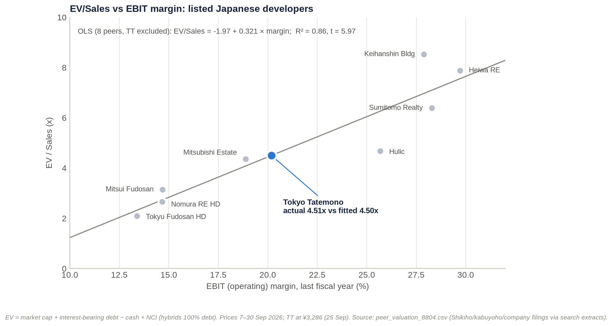

**Fitted vs actual and implied value.** At Tokyo Tatemono's 20.18% EBIT margin, the fitted EV/Sales is **4.50x**, against an actual **4.47x** at ¥3,211. Translating this into a share price:

- Implied EV: ¥2,135bn.
- Less net debt (¥1,442.4bn) and non-controlling interests (¥12.3bn): implied equity of ¥680bn.
- Per share: **¥3,271, or +1.9% vs ¥3,211.**

**Precision.** The 95% confidence interval for the fitted mean is 3.62–5.37x, i.e. ¥1,273–5,269 per share. Every 0.1x of EV/Sales is worth ¥47.5bn of EV, or about ¥228 per share. This is because equity is only about 31% of Tokyo Tatemono's EV.

**Robustness checks:**

| Variant | n | Slope | R² | Tokyo Tatemono fitted | Tokyo Tatemono actual | Implied ¥ per share |
|---|---|---|---|---|---|---|
| Base (8 peers, last fiscal year, Jun-2026 balance sheet) | 8 | 0.321 | 0.86 | 4.50x | 4.51x | 3,271 |
| Tokyo Tatemono on LTM (revenue ¥460.2bn, margin 22.1%) | 8 | 0.321 | 0.86 | 5.11x | 4.65x | 4,305 |
| Tokyo Tatemono on Dec-2025 balance sheet (net debt ¥1,191.6bn) | 8 | 0.321 | 0.86 | 4.50x | 3.98x | 4,477 |
| Excluding Keihanshin | 7 | 0.283 | 0.90 | 4.30x | 4.51x | 2,812 |
| Large caps only (excluding Heiwa and Keihanshin) | 6 | 0.236 | 0.90 | 4.11x | 4.51x | 2,376 |
| Extended: plus Sekisui House, Daito Trust, Open House | 11 | 0.318 | 0.92 | 4.49x | 4.51x | 3,250 |
| Forward basis (company guidance) | 8 | 0.279 | 0.73 | 4.30x | 4.08x | 3,833 |
| Monte Carlo on uncertain peer inputs (20,000 draws) | 8 | 0.323–0.338 | 0.84–0.87 | — | — | P5–P95: 3,439–3,642 |
| Supplementary: P/B vs ROE (11 companies) | 11 | 0.036 | 0.30 | 1.27x P/B | 1.12x P/B | 3,713 |

In this table, Tokyo Tatemono's "actual" multiples are at ¥3,286 (25 Sep), the price used when the regressions were run. At ¥3,211 the base-case actual EV/Sales is 4.47x. Implied values per share do not depend on Tokyo Tatemono's own price, because it is excluded from the fits.

**What the regression shows.**

- **Margin drives EV/Sales.** EBIT margin, which mostly measures how much of a company is leasing rather than develop-to-sell, explains about 86% of the variation in peers' EV/Sales.
- **Tokyo Tatemono sits on the line.** Its equity discounts reflect leverage, not a mispriced enterprise.
- **The upside cases depend on two assumptions:**
  - that the June 2026 debt peak unwinds (the Dec-2025 balance-sheet variant implies +36% to +39%);
  - that Tokyo Tatemono's above-peer profit growth is capitalised (the forward and LTM variants imply +19% to +34%).

  These are exactly the two questions that the second-half delivery will answer.
- **ROE does not explain P/B among developers** (R² 0.04 in the core set). The market prices asset quality and NAV, not accounting returns.

### Value-trap test

| Test | Evidence | Verdict |
|---|---|---|
| Is the discount persistent? | P/B below 1x at the FY2021–23 year-ends; a 31–37% P/E discount over the three years to Mar 2026; P/NAV 0.41–0.51x in 2021–23 | Yes, structural across the sector |
| Is the earnings base growing? | EPS CAGR of 14% (FY2021–25); FY2026E +11%; record operating profit | Yes, but the quality is mixed |
| Is book value compounding? | BPS ≈¥1,990 (FY2021) → ¥2,930 (Jun 2026), ≈9% a year | Yes |
| Is NAV being realised or eroded? | Gains realised through sales at "higher margins"; but the unrealised-gain stock grew only 3.9% a year | Being harvested, not compounded |
| Is capital returned? | Payout raised from 30% to 40%; total payout 42% in FY2025; buybacks tiny (¥3bn) | Partly |
| Is there a catalyst? | Plan targets met early → new capital policy expected Feb 2027; cross-shareholding sales; activism precedents at peers | Plausible |
| Is governance aligned? | Insiders own 0.08%; ex-banker chair; one-year director terms since 2025 | Weak to neutral |
| Could the balance sheet turn value into a trap? | Debt/equity 2.53x; net debt/EBITDA 12x; rates rising | **The key risk** |

**Conclusion: not a classic value trap.** Earnings and book value are compounding at 9–14% a year. But the discount is mostly structural (leverage plus a sector-wide NAV discount), and closing it requires a capital-policy catalyst: buybacks funded by asset sales.

> **Key takeaway:** At ¥3,211, Tokyo Tatemono is cheap only on equity multiples (10.3x P/E, 1.10x P/B, 0.65x NAV). It is fair on enterprise value (EV/Sales on the regression line; EV/EBITDA 17.7x against a 17.0x median) and expensive against its own EV history. The regression-implied value of ¥3,271 is close to our target.

## 11. M&A: a credible but unlikely target, with a takeout zone of ¥4,170–4,820

### Recent M&A in Japanese real estate

**There have been plenty of bids in 2021–2026, but only for small and mid-cap companies.** A scan of EDINET filings from November 2022 to October 2026 found **28 tender offers for listed real-estate companies and J-REITs**. They fall into three groups:

1. **Strategic consolidation of small developers and condo platforms.** For example: Open House→Pressance, Daito Trust→Ascot and The Global Sha, Haseko→Wood Friends, Sumitomo Forestry→LeTech, Seibu Real Estate→E-Grand, Hulic→Raysum, Keio→Sunwood, Toho→Tokyo Rakutenchi, and Tokyu Land→Renewable Japan.
2. **Financial-sponsor take-privates.** Samty, Sun Frontier (partial), JSB, JPMC and Leopalace21.
3. **Contested bids for J-REITs.** For example, two competing bids for Sankei Real Estate within nine months.

No integrated major has been bid for. The largest real-estate targets of 2023–26 had equity values of about ¥0.2–0.3tn: Leopalace21 at ≈¥270bn ([Kabutan](https://s.kabutan.jp/news/n202609150922)) and NTT UD REIT at ≈¥214bn market cap ([Shikiho](https://raw.githubusercontent.com/edamame384/stock_selection/HEAD/projects/shikiho_text_parser/data/raw/4Q-2/8956.txt)).

**Activists are already active in the sector:**

- Elliott holds 3.5% of Sumitomo Realty ([Shikiho](https://raw.githubusercontent.com/edamame384/stock_selection/HEAD/projects/shikiho_text_parser/data/raw/4Q-2/8830.txt)).
- An activist pressed Mitsui Fudosan in 2024 to sell its Oriental Land stake and buy back about US$6.7bn of shares ([Benzinga](https://benzinga.com/markets/asia/24/02/36946775/None)). Mitsui then moved to a total payout ratio of at least 50%.
- Ichigo Trust holds 12.6% of Open House, and Aya Nomura 5.3% of Heiwa Real Estate.

### Comparable transactions with disclosed terms

| Announced | Target | Acquirer | Structure | Price / premium | Deal value | Read-across for Tokyo Tatemono |
|---|---|---|---|---|---|---|
| 30 Nov 2021 | Daibiru (8806) | Mitsui O.S.K. Lines (owned 51.9%) | Minority buy-out | ¥2,200 per share | ¥121.3bn | Office-landlord squeeze-out ([sbbit](https://www.sbbit.jp/article/refers/75763)) |
| 10 Feb 2022 | 31 Prince hotel and leisure assets | GIC (from Seibu HD) | Asset sale with management retained | — | ≈¥150bn (gain ≈¥80bn, ≈2.1x seller's book value) | Sovereign appetite for hotels ([sbbit](https://www.sbbit.jp/article/refers/80837)) |
| 17 Mar 2022 | Mitsubishi Corp.-UBS Realty (J-REIT manager, ≈¥1.7tn AUM) | KKR | Company acquisition | — | ¥230bn (≈1.4% of AUM) | Value of REIT management platforms such as TRIM (Mitsubishi Corp. release no. 0000048879) |
| Oct 2024 | Samty HD (187A) | Hillhouse (Song Bidco) | Take-private tender offer | ¥3,300 per share | n/a | Sponsor take-private of a developer ([nihon-ma](https://www.nihon-ma.co.jp/news/20241127_187A-1)) |
| 2025 | Tokyo Garden Terrace Kioicho | Blackstone (from Seibu HD) | Asset deal | — | ≈¥400bn (≈2.9x seller's book of ¥139.6bn) | Largest foreign real-estate deal in Japan; supports NAV marks ([trafficnews](https://trafficnews.jp/post/494129)) |
| 6 Jan 2026 | Sankei Real Estate REIT (2972) | Tiger LPS (Tosei; GIC-funded) | First friendly J-REIT tender offer | ¥125,000 per unit; +20.9% | n/a | Failed in May 2026; rival City Index Fifth bid on 28 Sep 2026 |
| Feb 2026 | Sun Frontier Fudosan (8934) | Itochu (SI GK) | Partial tender offer plus share allotment | ¥2,800 tender; allotment at ¥2,438 | 20.05% stake (¥13.4bn allotment) | Trading-house capital entering developers ([nihon-ma](https://www.nihon-ma.co.jp/news/20260410_8001-227)) |
| 14 Sep 2026 | Leopalace21 (8848) | Hikari Tsushin with MBK Partners / NEC Capital (K891) | Take-private tender offer (to 30 Oct 2026) | ¥1,000 per share; ≈+45% | ≈¥270bn | Shares trade above the offer (¥1,060): the market expects a bump ([Kabutan](https://s.kabutan.jp/news/n202609150922)) |
| *Earlier landmark:* 16 Oct 2018 | NTT Urban Development | NTT | Minority buy-in | ¥1,680; +29.8% | ¥154.3bn | Delisted Jan 2019 ([MAonline](https://maonline.jp/db/tob/2018/42)) |
| *Earlier landmark:* Dec 2019 – Apr 2020 | Unizo HD | Chitosea (employee vehicle) / Lone Star | Contested employee buy-out | ¥6,000 after two raises | ¥177.7bn for 86.55% | Contests escalate prices ([MAonline](https://maonline.jp/news/20200403jp)) |
| *Earlier landmark:* 20 Nov 2020 | Kenedix | SMFL Mirai Partners (70%) + ARA/ESR (30%) | Take-private | ¥750; +26.5% | ≈¥165bn | Asset-management platform ([MAonline](https://maonline.jp/news/20201120d)) |
| *Earlier landmark:* 27 Nov 2020 | Tokyo Dome | Mitsui Fudosan (20% later to Yomiuri) | Take-private after the Oasis campaign | ¥1,300; +44.9% | ≈¥120bn | Activism led to the sale ([sbbit](https://www.sbbit.jp/article/refers/48043)) |

**Transaction multiples (EV/EBITDA, P/NAV) were not retrievable** for these deals. The usable benchmarks are:

- **premiums:** clustered at **+21% to +45%** to the undisturbed price;
- **asset deals:** at about **2–3x the seller's book value**.

### Should Tokyo Tatemono be considered a takeover target?

| Factor | For a bid | Against a bid |
|---|---|---|
| Valuation | 0.65x P/NAV, 1.10x P/B, forward P/E 23% below peers; private-market asset prices well above implied public values | On EV the stock is fairly priced (regression), so there is little arbitrage once debt is assumed |
| Assets | Scarce Tokyo Station land bank; the JPR sponsorship and its asset manager; ≈90,000 parking spaces; a ¥1.66tn rental portfolio at fair value | Office-heavy portfolio at a cyclical peak in rents |
| Register | No controlling or strategic holder. Fuyo-group insurers hold ≈4.3% (≈5.5% including Hulic's 1.22%), and that web is being unwound | Index holders tender only at a fair premium; the ≈30% held in domestic trust-bank accounts is largely index and pension money |
| Size | — | **Equity of ¥0.87–1.0tn at a 30–50% premium is 3–5x the largest recent Japanese real-estate target** (Leopalace21: ≈¥0.27tn deal value; ≈¥0.22tn pre-bid market cap); EV ≈¥2.3–2.5tn |
| Leverage | — | Net debt/EBITDA of 12x is the highest in the peer group, leaving little room for acquisition debt |
| Culture and relationships | Japan's pro-M&A governance climate; precedents at Tokyo Dome and Unizo | No precedent for a hostile bid among the Japanese majors; relationship banks (Mizuho, SMBC, MUFG); change-of-control terms unknown |

**Probability (our judgement):**

- **Whole-company bid: low**, perhaps 5% over three years.
- **Activist minority stake: more likely**, perhaps 20–30% over three years. An activist would push for buybacks funded by asset sales, faster recycling of assets into the REIT, and a total-payout target matching Mitsui's 50%.
- **Most plausible strategic combinations:**
  - a friendly share-exchange merger with Hulic (Fuyo lineage, the same Tokyo focus, existing cross-holdings);
  - Mitsubishi Estate or Mitsui Fudosan, which could finance a deal but are culturally unlikely bidders;
  - a global private-equity or sovereign club, for which the returns look marginal (below).

### Potential takeout multiples (premium to ¥3,211)

| Premium | Price per share | Equity ¥bn | EV ¥bn | P/B | P/NAV | P/E FY2026 (guidance) | EV/EBITDA FY2026E |
|---|---|---|---|---|---|---|---|
| 0% | 3,211 | 668 | 2,123 | 1.10x | 0.65x | 10.3x | 16.1x |
| 20% | 3,853 | 801 | 2,256 | 1.32x | 0.78x | 12.3x | 17.2x |
| **30%** | **4,174** | **868** | **2,323** | **1.42x** | **0.85x** | **13.3x** | **17.7x** |
| 40% | 4,495 | 935 | 2,390 | 1.53x | 0.91x | 14.4x | 18.2x |
| **50%** | **4,816** | **1,002** | **2,456** | **1.64x** | **0.98x** | **15.4x** | **18.7x** |
| 60% | 5,138 | 1,069 | 2,523 | 1.75x | 1.04x | 16.4x | 19.2x |

Inputs: FY2026E EBITDA = operating income guidance ¥105.5bn + D&A ≈¥26bn (estimate); EV/EBIT at a 30–50% premium = 22.0–23.3x.

**A takeout zone of ¥4,170–4,820 is consistent with four independent anchors:**

- the peer-median P/E (≈¥4,180);
- Mitsubishi Estate's P/B (≈¥4,720);
- NAV parity (≈¥4,940);
- the February 2026 high (¥4,374).

### LBO / take-private framework

At a 40% premium (¥4,495 per share), EV is about ¥2.39tn, or **18.2x FY2026E EBITDA**.

- **Debt.** Acquisition debt of 11x EBITDA (≈¥1.45tn) is no more than the company already owes. A sponsor would therefore need to write an **equity cheque of about ¥0.94tn (39% of EV)**.
- **Exit.** Exiting after five years at the entry multiple, with 3–5% annual EBITDA growth and no deleveraging (free cash flow is negative), gives **1.4–1.7x money and a 7–11% IRR**. That is well below typical private-equity hurdles of 15–20%.
- **NAV upside.** The NAV discount captured at entry would be thin: P/NAV ≈0.91x.

A financial buyer would have to underwrite cap-rate compression or large-scale asset sales. **A classic LBO does not work. Only a strategic buyer, or a buyer that intends to break up the portfolio, makes economic sense.**

### Tokyo Tatemono's own acquisitions and investments, 2016–2026

| Date | Target / investment | Type | Cost | Multiples / terms | Status |
|---|---|---|---|---|---|
| 1 Dec 2016 | Parking business (Nippon Parking, NPC24H) | Group reorganisation | n/a | n/a | ≈90,000 spaces today ([release](https://pdf.irpocket.com/C8804/HJXQ/ZXAr/cQ9X.pdf)) |
| Dec 2018 | PT Farpoint joint venture (Jakarta condos, "The Loggia") | Overseas joint venture | n/a (Indonesian programme ≈¥49bn total project cost) | n/a | Current status unverified ([Jakarta Post](https://www.thejakartapost.com/adv/2018/12/15/farpoint-tokyo-tatemono-set-up-joint-venture-company.html)) |
| 26 Apr 2023 | Sole sponsorship of JPR (co-sponsors exit TRIM) | Asset-management consolidation | n/a | n/a | TRIM now 100% owned ([NFM](https://nfm.nikkeibp.co.jp/atcl/news/21/00001/03381/)) |
| 12 Oct 2023 | Unidentified "specified subsidiary" | Subsidiary change (EDINET extraordinary report) | n/a | n/a | Not identified |
| Jun 2024 / Jan 2025 / Sep 2026 | Thailand: Tokyo Tatemono (Thailand); logistics, condo (Reference Ekkamai, Reference Kaset) and rental-factory joint ventures with SCX/SC Asset | Overseas joint ventures | n/a | n/a | 15 Thai projects in total ([company](https://tatemono.com/english/news/20250114.html)) |
| Oct 2024 / Dec 2025 | 899 Collins Street, Melbourne build-to-rent (499 units) with Lendlease and Nippon Steel Kowa | Minority joint venture | Project value A$500m (Tokyo Tatemono's share minority) | n/a | Completion due Jan 2027 ([company](https://tatemono.com/english/news/20251201.html)) |
| 1 Apr 2025 | Oyama Golf Club | Operating takeover | n/a | n/a | First new golf course in 17 years |
| Dec 2025 | Zeus OSA1 data centre (Osaka) with SC Zeus Data Centers | Development joint venture | n/a | n/a | Phase 1 (25MW) due 2028 |
| 23 Dec 2025 | 125 Shaftesbury Avenue, London | Office refurbishment | n/a | n/a | Launched ([company](https://tatemono.com/english/news/20251223.html)) |
| 2026 | Building near Hatchobori (from Blackstone); former Yellow Hat HQ, Iwamotocho | Building acquisitions | n/a | n/a | Contributed to the 1H debt build |
| 13 May / 2 Jun 2026 | **Star Mica HD (2975): 13.74%** | Capital and business alliance (new shares plus secondary sale) | **≈¥7.8bn (estimate)** | ≈1.9x P/B; ≈11x FY2026E P/E at the March-2026 price (estimate) | Strategic foothold in pre-owned condos ([MAonline](https://maonline.jp/kabuhoyu/sh-s100y6e2)) |

**Tokyo Tatemono is not a serial acquirer.** Its growth comes from land, redevelopment and building purchases, not from buying companies. The ¥191bn debt increase in 1H FY2026 alone dwarfs every corporate deal it has done.

**Disposals:**

- The Hulic stake was reduced in December 2024 ([EDINET](https://raw.githubusercontent.com/code4fukui/EDINET/HEAD/data/documents/2024-12-12.csv)).
- An Akihabara hotel was sold to APA Group (date and price not retrieved).

> **Key takeaway:** Japanese real-estate M&A is active but mid-cap. Tokyo Tatemono's size and leverage make a whole-company bid unlikely, and LBO maths does not work. The realistic upside is activist-driven capital-return pressure. A bid, if one came, would be pitched at ¥4,170–4,820 (about 1.4–1.6x book and 0.85–0.98x NAV).

## 12. Management: competent career insiders who delivered on plan, with little personal capital at stake

### Key executives

| Executive | Role | In role since | Background | Shares held (value at ¥3,211) |
|---|---|---|---|---|
| **Ozawa Katsuhito** (b. 1964) | Representative Director, President & CEO | 1 Jan 2025; director since 2017 | Joined 1987 (Keio). RM business; head of Corporate Planning (2012); Managing Executive Officer for PR/CSR, Finance, Accounting and Appraisal (2017); head of the Overseas Business HQ while also overseeing Finance and Accounting (2020); Representative Director and head of the Building Business (2023–24) | 26,850 (≈¥86m) |
| **Nomura Hitoshi** | Representative Director & Chairman | Chairman since Jan 2025; President 2016–2024 | Joined 1981; career in the Building (office) business | 44,925 (≈¥144m) |
| **Tanehashi Makio** (b. 1957) | Director, Chairman of the Board (non-executive) | Board chair since Jan 2025; previously Representative Chairman | Fuji Bank 1979; Mizuho Corporate Bank Executive Officer and head of internal audit (2006) | 34,125 (≈¥110m) |
| **Izumi Akira** (b. 1965) | Representative Director, Executive Vice President (Building business) | EVP since Jan 2025; Executive Officer since 2015 | Joined 1987; commercial facilities, urban development | 20,250 (≈¥65m) |
| **Akita Hideshi** (b. 1964) | Director, Senior Managing Executive Officer (Residential, per j-lic) | Executive Officer since 2016 | Joined 1987; RM, human resources | 17,450 (≈¥56m) |
| **Jinbo Takeshi** (b. 1965) | Director, Senior Managing Executive Officer | Executive Officer since 2018 | Joined 1988; residential development | 15,100 (≈¥48m) |
| **Kobayashi Shinjiro** | Director, Managing Executive Officer | n/a | n/a | n/a |
| **CFO** | Not publicly identified | — | The Integrated Report carries a "CFO message" ([company](https://tatemono.com/english/ir/library/integrated/cfo.html)), but the name was not retrieved. Head of accounting: Kimura Junichi. Ozawa oversaw finance and accounting from 2017 until he moved to head the Building business, shortly before becoming CEO | — |

Sources:

- Succession: [LOGI-TODAY](https://www.logi-today.com/684031); [Jutaku Shimpo](https://www.jutaku-s.com/newsp/id/0000061122).
- Career data and shareholdings: [j-lic](https://j-lic.com/companies/8804/directors); [irbank officers](https://irbank.net/E03859/officer).
- Shareholdings are from the FY2025 Yuho (filed 23 Mar 2026, EDINET S100XSKF) and include points under the stock-compensation trust (Board Benefit Trust).

### Track record

**Nomura (President 2016–2024) delivered every plan.**

- **2015–19 plan.** Operating income was ¥52.4bn against a ¥50bn target. ROE rose from 5.6% (2015) to 8.2% (2019) ([individual-investor briefing](https://tatemono.com/ir/individual/pdf/briefing_materials241010.pdf)).
- **2020–24 plan.** Through COVID, the plan reached FY2024 business profit of ¥80.5bn (old definition) against a ¥75bn target, and ROE of 12.8% against 8–10% ([FY2022 Yuho](https://raw.githubusercontent.com/yuukimiyo/stdata-jp/HEAD/8/88040/2023/BusinessPolicyEtc)). The ROE was flattered by one-off gains.
- **Projects and platforms.** Under him the company won the Yaesu 1-chome East rights conversion (2020) and built TOFROM YAESU. It also launched T-LOGI (2019) and became JPR's sole sponsor (2023).
- **The cost.** The balance sheet expanded, and overseas joint ventures later produced losses.

**Ozawa (CEO since January 2025) has a strong start on a short record.**

- **Results.** Record FY2025 operating income (+20.2%); guidance raised for both FY2025 (Nov 2025) and FY2026 (Aug 2026); dividend per share up from ¥95 to ¥126 in two years; a 40% payout one year early; the only buyback programme of the 2021–26 period (¥3bn), followed by cancellation of the repurchased shares.
- **Why the CFO-like background matters.** He has been at the centre of capital allocation for a decade. He oversaw finance from 2017 and the overseas business from 2020. The overseas investments behind the FY2025 equity-method loss of ¥6.9bn were therefore made largely under his remit. So was the 2025 redefinition of business profit to include gains on fixed-asset sales.

### Tenure and insider ownership

**Long tenure.** Every executive director is a career insider with 38–45 years at the company.

**Little skin in the game.** Directors together hold about 158,700 shares, **about 0.08% of the company, worth ≈¥510m**. The CEO's ≈¥86m is about twice the FY2025 average officer pay of ¥41.7m. That is well below Western ownership norms. Alignment relies on pay design: fixed pay, performance-linked pay and stock-based pay ([edinetdb](https://edinetdb.jp/company/E03859/compensation-text?fy=2025)). The stock-compensation trust holds 351,300 shares.

### Capital allocation and returns under this team

| Metric | FY2019 | FY2021 | FY2022 | FY2023 | FY2024 | FY2025 | FY2026E |
|---|---|---|---|---|---|---|---|
| ROE | 8.2% | ≈8.4% | 10.0% | 9.6% | 12.8% | ≈10.5% | ≈10.7% |
| ROIC (NOPAT ÷ book invested capital) | n/a | 3.1% | 3.3% | 3.3% | 3.4% | 3.7% | ≈3.8% |
| Payout ratio | n/a | 30.5% | 31.5% | 33.8% | 30.1% | 37.1% | ≈40% |

ROE was 5.6% in FY2015, before Nomura's first plan.

**What has worked:**

- Disciplined delivery against medium-term targets.
- The recycling model: sales to investors at "higher margins".
- A rising payout.
- An early start on selling cross-shareholdings. The Hulic stake was cut in December 2024, and the plan targets at least ¥130bn of policy-share and fixed-asset sales, taking policy holdings to ≤10% of net assets by end-2027 ([MTP](https://tatemono.com/company/pdf/plan2027_250116_ja.pdf)).

**What has not worked:**

- Overseas: the FY2025 equity-method loss, and a new London office project.
- The balance sheet grew faster than profits in 2023–24.
- ROIC of 3.1–3.7% on book capital is thin.
- Buybacks have been token: ¥3bn against roughly ¥1.5tn of debt and ¥600bn of equity.

**Overall:** **disciplined reinvestors, not value destroyers.** But capital has been allocated for growth in profit, not growth in NAV per share. No ROE or TSR measure was found in the pay formula.

### Red flags

**Banker pipeline and Mizuho entanglement.**

- The board chair (Tanehashi) and one "independent" director (Nishizawa, a former Mizuho FG Deputy President) are Fuji Bank/Mizuho alumni, as was former President Sakuma.
- Mizuho plays several roles at once. It is a main lender, the anchor tenant at Otemachi Tower, the former seller of the Otemachi site, and a partner on a trust product.
- This is a governance flag, not evidence of misconduct.

**Related-party channel.** Tokyo Tatemono sells assets into vehicles it sponsors. It owns 100% of JPR's manager (TRIM) and 3.03% of JPR's units, so it can earn a sale gain and ongoing fees from the same transaction. Pricing against appraisal and any retained exposure were not disclosed in the material we could access.

**Legacy overhang.** The company has three representative directors. The former CEO is Representative Chairman, and the former Representative Chairman chairs the board. This can dilute the new CEO's authority.

**Incentives.** Pay is modest: about ¥750m in total for 18 officers ([Nikkei](https://www.nikkei.com/nkd/company/gaiyo/?scode=8804)). But the last policy we found (2020) tied bonuses to ordinary profit and net income ([CSR 2020](https://tatemono.com/sustainability/pdf/2020csr019.pdf)). Combined with the 2025 redefinition of business profit, that rewards booking gains and growing the balance sheet.

**Guidance management.** In November 2025 a "partly revised sales policy" cut revenue guidance by ¥33bn while raising operating-profit guidance. That signals active management of which assets are sold, and when.

**Strategy pivots and promotion: none.** The strategy has been stable since the 2020 vision, and guidance has been conservative and then beaten.

**Not tested.** The related-party note, litigation, construction defects and auditor tenure (the auditor is EY ShinNihon) could not be reviewed.

### Founder vs professional manager

Tokyo Tatemono is a **founder-less, professionally managed keiretsu company**. It was founded in 1896, has no controlling family, and its leadership has alternated between career insiders and Fuji Bank/Mizuho alumni ([The Shashi](https://the-shashi.com/tse/8804/ceo/)). At this stage of the business, that brings:

- **Strengths:** continuity and orderly succession; conservative, lender-friendly finance; reliable delivery of plans.
- **Weaknesses:** low insider ownership; consensus decision-making; capital-return changes that respond to outside pressure (TSE, stewardship, activism) rather than lead it.

A balance-sheet-heavy developer at peak leverage benefits from the conservatism. A stock at 0.65x NAV, however, would benefit from an owner's urgency on buybacks.

### Recent changes in senior management

- **7 Nov 2024 (effective 1 Jan 2025): CEO succession.** Ozawa became President & CEO; Nomura became Representative Chairman; Tanehashi became Chairman of the Board; Izumi became EVP.
- **2 Dec 2024 and 1 Dec 2025:** organisational and personnel changes.
- **March 2025 AGM:** directors' terms cut to one year.
- **26 Mar 2026:** Yoshino Takashi appointed as a new full-time Audit & Supervisory Board member.
- **Executive-officer line-up from 1 May 2026:** Ozawa (CEO); Izumi (EVP); Akita and Jinbo (Senior Managing EOs); Kobayashi Shinjiro, Takahashi Hiroshi, Tajima Fumio, Sugaya Kenji, Onuma Yutaka, Uchida Yoshinari and Kawazoe Yuichi (Managing EOs) ([company overview](https://tatemono.com/english/company/pdf/company_overview.pdf)).

> **Key takeaway:** This is a capable, plan-driven insider team with a decade of delivery. The weaknesses are alignment (0.08% insider ownership), bank-linked governance, and incentives that reward profit growth over NAV per share.

## 13. Board of Directors: 12 members, 5 independent, chaired by a former banker

| Name | Position | Independent? | Tenure / first appointed | Professional background | Other affiliations |
|---|---|---|---|---|---|
| Tanehashi Makio | Director, Chairman of the Board | No (former Representative Chairman) | Long-serving; became chairman around 2016 (inferred); non-executive chair since Jan 2025 | Fuji Bank (1979); Mizuho Corporate Bank Executive Officer, internal audit (2006) | n/a |
| Nomura Hitoshi | Representative Director, Chairman | No | Director for 10+ years; President 2016–24 | Tokyo Tatemono since 1981; Building business | n/a |
| Ozawa Katsuhito | Representative Director, President & CEO | No | Director since 2017 (≈9 years) | Tokyo Tatemono since 1987; corporate planning, finance, overseas, Building | n/a |
| Izumi Akira | Representative Director, EVP | No | Executive Officer since 2015 | Tokyo Tatemono since 1987; commercial facilities, urban development | n/a |
| Akita Hideshi | Director, Senior Managing EO | No | Executive Officer since 2016 | Tokyo Tatemono since 1987; RM, HR, Residential | n/a |
| Jinbo Takeshi | Director, Senior Managing EO | No | Executive Officer since 2018 | Tokyo Tatemono since 1988; residential development | n/a |
| Kobayashi Shinjiro | Director, Managing EO | No | Director since at least 2023 | n/a | n/a |
| Onji Yoshimitsu (b. 1954) | Outside Director | Yes | Since at least 2021 | Daiei (1977; secretary to founder Nakauchi; head of corporate planning); RECOF (M&A advisory, 1998) | Former director of M&A Capital Partners (to 2017) ([srdb 2021](https://s.srdb.jp/8804/archives/2021/content-1-2.html)) |
| Hattori Shuichi (b. 1953) | Outside Director | Yes | ≈Mar 2019 (≈7 years) | Lawyer since 1984; founded Hattori Law Office (1988) | Hattori Sogo Law Office |
| Kinoshita Yumiko (b. 1961) | Outside Director | Yes | By Mar 2023 | Bank of Japan (1984) | n/a |
| Nishizawa Junichi (b. 1956) | Outside Director | Yes (company designation; former Mizuho) | Joined ≈Mar 2025 (inferred) | Fuji Bank (1980); Mizuho FG Director and Deputy President (2011); President, Mizuho Information & Research Institute (2013) | Outside director of azbil from Jun 2026 ([donburi](https://donburi.accountant/history/?ds=118794&do=10&cname=%E6%9D%B1%E4%BA%AC%E5%BB%BA%E7%89%A9%E6%A0%AA%E5%BC%8F%E4%BC%9A%E7%A4%BE)) |
| Tauchi Naoko (b. 1965) | Outside Director | Yes | Joined ≈Mar 2025 (inferred) | Ajinomoto (1989); McKinsey & Co. (1999) | Outside director of Sapporo Holdings |
| Yoshino Takashi | Full-time Audit & Supervisory Board member | No | 26 Mar 2026 (new) | n/a | n/a |
| (name not retrieved) | Full-time Audit & Supervisory Board member | No | n/a | n/a | n/a |
| Hieda Sayaka | Outside Audit & Supervisory Board member | Likely | n/a | Lawyer | n/a |
| Chikada Naohiro | Outside Audit & Supervisory Board member | Likely | n/a | n/a | n/a |

Sources: [208th AGM convocation notice](https://tatemono.com/ir/stock/pdf/208_sokaisyosyutsuchi_01.pdf); [srdb](https://s.srdb.jp/8804/content-1-2.html); [j-lic](https://j-lic.com/companies/8804/directors); [Integrated Report 2026, p.70](https://tatemono.com/ir/library/pdf/integrated_2026_70.pdf). Readings of some names are unconfirmed.

### Composition

- **Independence:** 5 of 12 directors (41.7%). That meets the TSE Prime one-third guideline but is not a majority. If Nishizawa is treated as affiliated because Mizuho is a main lender, "true" independence falls to 4 of 12 (33%).
- **Women:** 2 of 12 (16.7%).
- **Chair:** not independent.
- **Age:** outside directors average about 68.
- **Structure:** the company has an Audit & Supervisory Board (4 members, 2 from outside) and a Nomination & Compensation Advisory Committee, whose composition was not retrieved.
- **Voting:** support of about 93.0% for Nomura and 93.8% for Ozawa has been reported. That is below the 95%+ typical of uncontroversial large caps but well above the 80% concern level. The AGM year of these figures is uncertain.

### Board changes, 2021–2026

| Date | Change |
|---|---|
| Mar 2021 (203rd AGM) | 12 directors elected, including Tanehashi and Nomura; Hattori re-elected |
| Mar 2023 (205th AGM) | 12 directors elected: Tanehashi, Nomura, Ozawa, Izumi, Akita, Jinbo, Kobayashi, Tajima Fumio, Hattori, Onji, **Nakano Takeo** and Kinoshita (EDINET S100QJ5Q) |
| Mar 2024 (206th AGM) | No director election (two-year terms); 3 Audit & Supervisory Board members plus 1 substitute elected |
| 1 Jan 2025 | Leadership roles reshuffled (CEO succession) |
| Mar 2025 (207th AGM) | 12 directors elected; **terms shortened to one year** ([EDINET S100VIBB](https://disclosure2dl.edinet-fsa.go.jp/searchdocument/pdf/S100VIBB.pdf)). Inferred from the 2023 and 2026 slates: Nakano Takeo and Tajima Fumio left the board; **Nishizawa Junichi and Tauchi Naoko joined** |
| Mar 2026 (208th AGM) | All 12 directors re-elected; no joiners or leavers; Yoshino Takashi became a full-time Audit & Supervisory Board member |

> **Key takeaway:** The board is compliant but not shareholder-led. It has a non-independent ex-banker chair, five independent directors (one a former Mizuho executive) and three representative directors. The move to one-year terms (2025) is the main investor-friendly change of the period.

## 14. Shareholders, activism and short interest: a passive register with no blocking holder

### Top 10 shareholders (30 June 2026)

| Rank | Shareholder | % | Type |
|---|---|---|---|
| 1 | The Master Trust Bank of Japan (trust account) | 18.02 | Domestic trust-bank custody (index, pension and investment trusts) |
| 2 | Custody Bank of Japan (trust account) | 12.01 | Domestic trust-bank custody |
| 3 | Meiji Yasuda Life Insurance | 2.27 | Life insurer; Fuyo-group stable holder |
| 4 | Japan Securities Finance | 2.17 | Margin-trading and stock-lending collateral (not a short position) |
| 5 | State Street Bank and Trust Co. 505001 | 2.16 | Foreign custodian |
| 6 | Sompo Japan Insurance | 2.00 | Non-life insurer; Fuyo group; **cut from 2.28% at Dec 2025** |
| 7 | JPMorgan Chase Bank 380055 | 1.80 | Foreign custodian |
| 8 | State Street Bank and Trust Co. 505301 | 1.40 | Foreign custodian |
| 9 | JPMorgan Chase Bank 385781 | 1.36 | Foreign custodian |
| 10 | State Street Bank and Trust Co. 505103 | 1.23 | Foreign custodian |

Sources: [Yahoo! Finance Japan](https://finance.yahoo.co.jp/quote/8804.T/profile); [irbank](https://irbank.net/E03859/holder).

**Concentration.** The top 10 hold about 44%. Of that, domestic custody accounts hold about 30% and foreign custodians about 8%.

**Foreign and stable holders.** Foreign ownership was 33.2% and "specified/stable" holders 46.6% at June 2025 ([Shikiho](https://raw.githubusercontent.com/edamame384/stock_selection/HEAD/projects/shikiho_text_parser/data/raw/4Q-2/8804.txt)).

**Other notable holders.**

- Hulic, a cross-holder, owns 1.22% (2.64m shares) ([Buffett Code](https://www.buffett-code.com/shareholder/1f2c707ea4a457a113d417a837a2265a)).
- Insiders hold about 0.08%.
- The stock-compensation trust holds 351,300 shares (0.17%).

**Large-shareholding filers are all passive or institutional:**

- **BlackRock Japan and joint holders:** 6.42%, down from 7.28% (change report filed 3 Dec 2025) ([Kabutan](https://kabutan.jp/news/marketnews/?b=n202512030954)).
- **Sumitomo Mitsui Trust Asset Management:** 5.07% (21 Apr 2026). It crossed 5% at 5.10% on 8 May 2025 ([Kabutan](https://kabutan.jp/news/marketnews/?b=n202604210334)).
- **Nomura Asset Management:** several change reports; percentages unverified ([MAonline](https://maonline.jp/kabuhoyu/sh-s100pdt6)).
- **Broker and bank group reports:** MUFG (1.95% as a joint group, reporting date 26 Aug 2024); SMBC Nikko (change report No.10, July 2024) ([MAonline](https://maonline.jp/kabuhoyu/sh-s100pxi6)); Société Générale Securities and Fidelity (dates not visible). These reflect trading books or asset management, not strategic stakes.

### Activism

**No activist campaign, stake, letter or shareholder proposal at Tokyo Tatemono was found for 2018–2026.** Two caveats: this is a negative finding from limited searches, not exhaustive proof, and it means there are no activist demands or outcomes to break down.

**Activism is rising across Japan.** A record 50 Japanese companies received activist shareholder proposals by mid-2025 ([Nikkei Asia](https://asia.nikkei.com/business/business-trends/record-50-japanese-firms-hit-with-activist-shareholder-proposals)).

**Peers have already been targeted:**

- Mitsui Fudosan (2024): pressed to sell its Oriental Land stake and buy back shares. It responded with a total-payout target of at least 50%.
- Sumitomo Realty: Elliott holds 3.5%.
- Tokyo Dome (2020): the Oasis campaign ended in a sale to Mitsui Fudosan.

**Tokyo Tatemono fits the template on four counts:**

1. a 0.65x P/NAV;
2. a return policy that lags Mitsui's (40% payout plus token buybacks, against a ≥50% total payout);
3. cross-shareholdings still being unwound;
4. bank-linked governance, a thin stable-shareholder base (≈4.3%, and falling) and passive-dominated ownership.

**Pre-emptive steps blunt the typical demands:** the 40% payout, one-year director terms and the ≥¥130bn sales target.

**Watch-points:**

- any new ≥5% filing by a non-index manager;
- shareholder proposals in the AGM notice (published about eight weeks before the late-March AGM);
- support for the CEO or chairman falling below about 85%.

### Short interest and key short sellers

**Reportable short positions.** Under JPX/EDINET short-position rules, **Goldman Sachs International held a reportable net short of up to about 1.1% of shares in 2025**. It fell below the 0.5% reporting threshold in April 2025 ([irbank short data](https://irbank.net/8804/short?f=3)). No other holder at or above 0.5% was found, so there is currently **no disclosed large short position**.

**Margin positions are negligible.** For the week of 24 July 2026, margin sales were 45,800 shares against margin purchases of 129,000, a margin ratio of 2.82x ([Kabutan](https://kabutan.jp/stock/?code=8804)). Both are tiny against 208m shares outstanding.

**Japan Securities Finance's 2.17% stake reflects margin collateral, not short interest.** The stock is a 貸借銘柄, i.e. it can be shorted on margin. No short-seller report on Tokyo Tatemono was found.

> **Key takeaway:** The register is passive (≈44% custodians), Fuyo-group support is thin and shrinking, and there is no activist or meaningful short position. That makes Tokyo Tatemono an open door for an activist, but there is no live campaign to price.

## 15. Strategic initiatives 2016–2026: plans delivered, the overseas business the weak link

| Initiative | Period | Target / intent | Outcome | Verdict |
|---|---|---|---|---|
| 2015–19 medium-term plan | FY2015–19 | Operating income ¥50bn; debt/equity ≈3x; debt/EBITDA ≈13x | Operating income ¥52.4bn; debt/equity 2.5x; debt/EBITDA 12.6x; ROE 5.6% → 8.2% ([plan PDF](https://pdf.irpocket.com/C8804/nKx5/jOqo/DdBC.pdf)) | **Success** |
| Long-term vision 「次世代デベロッパーへ」 and 2020–24 plan | FY2020–24 | Business profit ¥75bn; ROE 8–10%; debt/equity ≈2.4x; ≈¥1.4tn gross investment ([Kensetsu Tsushin](https://www.constnews.com/?p=77656)) | Business profit ¥80.5bn (old definition); ROE 12.8%; debt/equity ≈2.2x | **Success**, flattered by FY2024 one-offs |
| 2025–27 plan | FY2025–27 | Business profit ¥95bn; ROE 10%; 40% payout; ≈¥200bn of redevelopment; ≥¥130bn of asset and policy-share sales | FY2026 guidance (business profit ≈¥102–105bn) beats the FY2027 target; targets "one year early" ([logmi](https://finance.logmi.jp/articles/385621)) | **Ahead of plan** |
| 2030 vision | To ≈2030 | Business profit ≈¥120bn | Needs only ≈4% a year from FY2026 guidance | **On track** if the cycle holds |
| TOFROM YAESU (Yaesu 1-chome East) | Rights conversion 2020 → completion 2026 | Flagship 250m tower, bus terminal, medical, theatre; ≈¥210.4bn project | Tower completed 28 Feb 2026 (vs a 31 Jul 2025 schedule); THE FRONT 15 Jul 2026; retail opened 10 Sep 2026 | **Delivered, about seven months late;** leasing outcome undisclosed |
| Kyobashi 3-chome East | Promoted since 2017; completion FY2029 | ≈166,800 m² of offices, hotel and retail | Redevelopment association formed Apr 2024; construction from FY2025 ([Nikkei xTECH](https://xtech.nikkei.com/atcl/nxt/column/18/00110/00348/)) | **Ongoing** |
| Asset turnover (investor sales) | Strategic priority since 2020; accelerated from 2025 | Recycle capital; raise ROE | Drove FY2025–26 profit growth; record FY2026 programme | **Success so far;** sustainability is the question ([Nikkei Veritas](https://www.nikkei.com/prime/veritas/article/DGXZQOUC055XX0V00C26A2000000)) |
| T-LOGI logistics | Since 2019 | New asset class for develop-to-sell | Projects in Saitama, Chiba, Fukuoka, Kyoto, Aichi; Sendai completed Jun 2026 | **Established** |
| Data centres | Since 2025 | New asset class | Zeus OSA1 (25MW, 2028) | **Early** |
| REIT and fund platform | JPR (since 2001); private REIT (2015); sole JPR sponsor (2023) | Exit channel and fee income | JPR ≈¥534bn of assets; private REIT ¥16bn → ¥47bn by 2018 | **Stable**; depends on capital markets |
| Parking (NPC24H) | Reorganised 2016 | Grow through management contracts | 75,618 spaces → ≈90,000 | **Steady success** |
| Overseas | China (since the early 1900s); Indonesia 2018; US 2023; Thailand; Australia; London 2025 | Diversify growth | FY2025 equity-method loss of −¥6.9bn; guidance cut again in Aug 2026; Thailand expanding | **Mixed; partial failure** |
| Cross-shareholding reduction | FY2025–27 | ≤10% of net assets; ≥¥130bn of sales (with fixed assets) | Hulic stake cut Dec 2024; FY2024 gains on securities sales; progress figures not disclosed | **Ongoing** |
| Shareholder returns | 2025– | Payout from ≥30% to 40% | Payout 30% → 37% → ≈40%; dividend ¥95 → ¥126; ¥3bn buyback | **Ahead of plan** |
| ESG | 2020s | SBT-certified targets; RE100; CO2 −40% by 2030; net zero by 2050 | SOMPO Sustainability Index constituent (2024) | **On track (limited data)** |
| Star Mica alliance | 2026 | Enter pre-owned condo renovation and resale | 13.74% stake | **Too early** |

> **Key takeaway:** Tokyo Tatemono reliably hits its domestic plans and has built a credible asset-turnover platform. Overseas is the persistent disappointment. The next plan (due by early 2028, possibly earlier because targets are being met early) is the main strategic catalyst.

## 16. Stakes in other companies: a ≈¥56–61bn listed portfolio, mostly relationship holdings

| Holding | Stake | Estimated value | Strategic relevance | Financial relevance |
|---|---|---|---|---|
| Japan Prime Realty Investment Corp (8955) | 122,700 units, 3.03% ([JPR governance report](https://www.jpr-reit.co.jp/file/ir_library_other_file-e1fd4de66a9a0b87bc1127d8cbab0e2741bf0bb7.pdf)) | ≈¥9.8–13.5bn (illustrative: ¥80,000–110,000 per unit) | **High.** Sponsor commitment; the main exit channel for completed assets; fees through 100%-owned TRIM | Low (≈1.5–2% of market cap) |
| Hulic (3003) | 20,374,433 shares, 2.65% ([Kabutan](https://kabutan.jp/stock/holder?code=3003)) | ≈¥35.3bn at ¥1,734 | Fuyo/Yasuda relationship; reciprocal holding (Hulic owns 1.22% of Tokyo Tatemono) | **Material:** ≈5% of market cap; prime candidate for the ≥¥130bn sale programme |
| Yasuda Logistics (9324) | 1.60m shares, 5.53% ([Kabutan](https://kabutan.jp/stock/holder?code=9324)) | ≈¥3.9bn (estimate) | Relationship; possible logistics partner | Small |
| Star Mica HD (2975) | 13.74% (filed 2 Jun 2026) | ≈¥7–8bn (estimate) | **Strategic:** pre-owned condo renovation, linking Brillia to brokerage | Small |
| Other listed holdings | Tokyo Tatemono is a major holder in eight listed securities in total; five are unidentified ([Kabutan](https://kabutan.jp/holder/lists/?holdername=%E6%9D%B1%E4%BA%AC%E5%BB%BA%E7%89%A9&market=1)) | n/a | Policy holdings being reduced | n/a |
| Equity-method affiliates | 22 at FY2022, including Chinese condo affiliates (Yangzhou Wanyi and six others), MTC Japan Investment, Yangon Museum Development, PT Dharma Tatemono Property/Residences and Kasumigaseki Development TMK ([FY2022 Yuho](https://raw.githubusercontent.com/yuukimiyo/stdata-jp/HEAD/8/88040/2023/DescriptionOfBusiness)) | Not disclosed | Overseas growth; SPC-based development | **Negative recently:** −¥6.9bn in FY2025 |
| Overseas joint ventures | SC Asset/SCX (Thailand); WHA–KW (Bangkok offices); Lendlease and Nippon Steel Kowa (Melbourne); Charter Hall/UBS (Australian industrial); PT Farpoint (Indonesia); US rental and logistics projects; London | Not disclosed | Diversification | Loss-making in aggregate in FY2025 |
| Data-centre joint venture | Zeus OSA1 with SC Zeus Data Centers | Not disclosed | New asset class | Not yet earning |

**Listed stakes total about ¥56–61bn, or about 8–9% of Tokyo Tatemono's market cap.**

- **Only JPR is truly strategic.** It is the exit valve for the asset-turnover model.
- **Hulic is the main financial lever.** Selling it would fund roughly ¥35bn of buybacks or debt reduction and help dismantle the Fuyo cross-holding web.
- **The equity-method book is a source of risk rather than value.** Its losses have flowed straight to net income.
- **The ≥¥130bn sale target implies a larger total pool.** The target covers policy shares plus fixed assets, so the full investment-securities balance is larger than the listed stakes identified here.

> **Key takeaway:** Stakes add about ¥270–290 per share of liquid value (mostly Hulic and JPR). They are better read as a funding source for capital returns than as a hidden-value story.

## 17. Dividends, buybacks and treasury shares, FY2021–FY2026E

| FY | Interim DPS | Year-end DPS | Annual DPS | Payout (total payout) | Buyback | Shares cancelled | Treasury shares at period-end |
|---|---|---|---|---|---|---|---|
| FY2021 | ¥24 | ¥27 | **¥51** | 30.5% | None found | None found | n/a |
| FY2022 | ¥29 | ¥36 | **¥65** | 31.5% | None found | None found | n/a |
| FY2023 | ¥36 | ¥37 | **¥73** | 33.8% | None found | None found | n/a |
| FY2024 | ¥37 | ¥58 | **¥95** | 30.1% (30.6%) | ≈¥0.34bn (derived; odd-lot/minor purchases) | None | n/a |
| FY2025 | ¥48 | ¥57 | **¥105** | 37.1% (42.2%) | **¥3.0bn: 1,189,100 shares at an average ¥2,523** (13 Feb–31 Aug 2025) | **1,189,100 (Nov 2025)**; issued shares 209,167,674 → 207,978,574 | **839,526 (0.40%)** at 31 Dec 2025, plus 351,300 in the stock-compensation trust |
| FY2026E | ¥61 | ¥65 (raised from ¥61) | **¥126** (guidance; initially ¥122) | ≈40.2% | None announced as of Oct 2026 | — | n/a |

Sources: FY2021–23 DPS from coordinator extracts of dividend-history pages (kabuhai-db, strainer, finboard), tying to EPS-based payouts; FY2024–26 DPS from [f-p.jp](https://f-p.jp/media/?p=21023) and [Nikkei](https://www.nikkei.com/article/DGXZQOUB067LD0W6A800C2000000/); buyback from [FilingReader](https://filingreader.com/news-wire/tokyo/2025-04-01/tokyo-tatemono-executes-share-buyback-program-acquires-176400-shares) and [convocation notice](https://s.srdb.jp/8804/content-1-1.html); share counts from [j-lic](https://j-lic.com/companies/8804); total payout from [Monex](https://scouter.monex.co.jp/report/dps/8804).

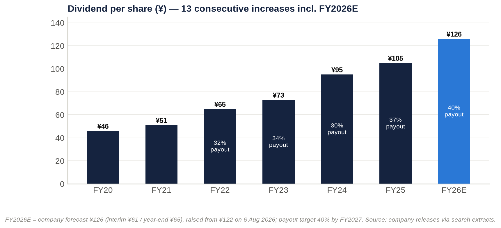

**Dividends.** DPS has risen for **12 consecutive years** through FY2025, and is up **147% from FY2021 to FY2026E** (¥51 → ¥126). The payout ratio moved from about 30% to 40% under the 2025–27 plan, one year ahead of schedule ([Tokyo Tatemono return policy](https://tatemono.com/ir/stock/returning.html)). Dividends were raised mid-year in both FY2025 and FY2026, alongside profit upgrades.

**Buybacks.** The only formal programme was 2025's ¥3.0bn, about 0.6% of market cap at the time. All 1,189,100 repurchased shares were cancelled in November 2025.

**Treasury shares.** The residual treasury holding is small (0.40%).

**No dilution.** No stock splits, equity issuance or convertibles were found over the period.

**Capital return is dividend-led.** Against a 0.65x P/NAV, the absence of a programmatic buyback is the most obvious gap in capital policy.

> **Key takeaway:** Dividends are the shareholder-return engine: DPS is up 2.5 times in five years at a 40% payout. Buybacks are token. A funded buyback, paid for from the ≥¥130bn sale programme, is the most likely catalyst in the next capital plan.

## 18. Adversarial deep-dive: rent growth against the cost of money

### Bull case: an inflation-linked landlord with a scarce land bank, valued at 0.65x NAV

**The moat is durable where it matters.** The Tokyo Station Yaesu–Kyobashi cluster took more than a decade of land assembly and statutory process to build. It cannot be replicated, and the next phase is already secured: Kyobashi 3-chome East, ≈166,800 m², completing in FY2029. Brillia's resale value (93.1% average appreciation) supports pricing on good sites.

**Growth levers are visible and partly locked in:**

- **Rents.** Central-Tokyo vacancy is 1.87% and asking rents are rising 12.5% a year. Short leases reprice towards market at each renewal, and management already reports "firm confidence" in inflation-driven rent growth.
- **TOFROM YAESU.** FY2027 is its first full year of operation, including retail opened in September 2026.
- **Hotels.** Commission-based hotel rents capture inbound tourism.
- **Condos.** The ≈7,600-unit landbank is being sold into record prices.
- **Fees.** Sales into JPR, which targets more than ¥600bn of assets, grow AUM and fees.
- **New asset classes.** Logistics and data centres add develop-to-sell options.

**Earnings surprise is a habit.**

- FY2025 operating income beat revised guidance by 3.5%.
- FY2026 guidance has already been raised once (in August, a quarter earlier than FY2025's upgrade), and first-half progress is ahead of last year's pace.
- Operating income of ¥107–110bn in FY2026 would be a further beat.

**Capital allocation is improving.** The payout reached 40% a year early, and the ≥¥130bn sale programme can fund buybacks. The Hulic stake alone (≈¥35bn) is worth about 5% of the market cap. Because the 2025–27 targets are already met, a capital-policy update with the FY2026 results (February 2027) or the next plan could add an ROE target above 10% and a buyback.

**Valuation offers support.** The shares trade at 0.65x NAV with a 3.9% yield, while private capital pays full prices for Tokyo assets. In the bull case, a 12.5x P/E on ¥347 FY2027E EPS gives **¥4,400 (+37%)**, roughly back to the February 2026 high.

### Bear case: a levered conveyor belt in a rising-rate world

**Three risks could permanently impair the business:**

1. **Closure of the exit channel.** Higher JGB yields keep J-REIT equity windows shut and widen cap rates. The record hotel-led sale programme, and the ">¥100bn stock of gains" behind it, would then stall just as debt reprices. The impairment becomes permanent if management must sell core assets, or issue equity, at around 0.5x NAV.
2. **A leverage ratchet.** Interest-bearing debt has grown faster than recurring EBITDA: +¥191bn in 1H FY2026, with debt/equity at 2.53x against a ≈2.4x guide. If the A rating comes under pressure, the cost of capital steps up and the asset-turnover model loses its spread.
3. **New supply meeting a cooling cycle.** New Yaesu office supply (the Yaesu 2-chome Central district, January 2029) and Tokyo Tatemono's own Kyobashi project will arrive in a market that has already re-priced rents by +12%. Construction costs keep rising (+5.1%).

**Margins can compress:**

- The condo gross margin is already down from 30.4% to 27.8%.
- Corporate costs are rising.
- Sale margins should normalise as cap rates move.

**Revenue is decelerating.** FY2025 revenue grew only 2.3%, 1H FY2026 revenue fell 6.9%, and full-year revenue guidance of ¥524bn needs a 24% higher second half.

**Expectations are already above guidance.**

- Consensus FY2026 net income is ¥66.5bn, against guidance of ¥65.0bn.
- The average target price of ¥3,985 assumes the P/E discount keeps narrowing.
- In the bear case, an 8.0x P/E on ¥280 FY2027E EPS gives **¥2,300 (−28%)**. That is 0.5x stressed NAV, in line with Sumitomo Realty's current discount.

### Pre-mortem: it is October 2027 and the shares are at ¥2,300. What went wrong?

1. **Second-half FY2026 sales slipped.** The hotel-led disposals slid into 2027 as J-REIT unit prices made public offerings uneconomic. FY2026 operating income landed near ¥98bn, the first miss in years, and year-end debt stayed above ¥1.5tn.
2. **February 2027 guidance disappointed.** FY2027 operating income was guided flat because sale gains normalised. Net income fell below ¥60bn as net non-operating cost jumped past ¥25bn.
3. **Rates kept rising.** The BOJ moved to 1.5–1.75% and the 10-year JGB rose above 3.25%. JREI's survey finally showed cap rates widening. NAV fell by about ¥600 per share, and the market applied a "Sumitomo discount" (0.5x NAV).
4. **The rating came under pressure.** Debt/equity rose above 2.6x, JCR moved the outlook to negative, and the equity credit on the hybrids came into question.
5. **Condos stalled.** Greater Tokyo contract rates fell below 60% and inventory built up. The condo gross margin fell below 25%, and the first write-downs appeared.
6. **Overseas losses recurred** from the London refurbishment and US joint ventures.
7. **Capital policy disappointed.** The new plan offered no buyback, and the P/E de-rated to the bottom of its three-year band (7–8x).

**Leading indicators to monitor:**

- 9M progress at the Q3 release (mid-November 2026), against FY2025's 52.8% of full-year operating income;
- year-end interest-bearing debt and equity ratio;
- the TSE REIT index and JPR equity issuance;
- the 10-year JGB;
- Miki Shoji's monthly vacancy data;
- REEI's monthly condo contract rate;
- the equity-method line.

### Are current multiples too high?

**Not on equity measures.** A 10.3x P/E and 0.65x NAV are not demanding.

**But they are not cheap once leverage and earnings quality are considered.**

- EV/EBITDA of 17.7x is above the stock's own 15.1–16.2x year-end range (15.6x on the December 2025 balance sheet).
- EV/Sales of 4.47x is above the own-history range of 3.53–4.09x.
- The forward P/E sits above the three-year band of 7.0–9.9x.
- **The 2025 re-rating has not fully unwound.**

**What the market price implies:**

- **Book value.** A 1.10x P/B with ROE of ≈10.7% implies near-zero long-run growth at a 9–10% cost of equity. The market is treating the 10% ROE target as roughly the ceiling.
- **NAV.** A 0.65x P/NAV implies a 31% haircut to appraised fair value. That is equivalent to roughly +136–181bp of cap-rate expansion, depending on the starting cap rate assumed (3.0–4.0%).

**Verdict: not too high, but no margin of safety.** The margin of safety lives in the NAV, and the NAV is only as good as the exit market.

### Contrarian view: the market is pricing a cap-rate shock that the private market is not delivering, and Tokyo Tatemono is the developer that can monetise the gap

**The public market** prices Tokyo Tatemono as if its ¥1.66tn rental portfolio were worth about 31% less than appraised. That implies roughly 140–180bp of cap-rate expansion.

**The private market is not marking anything like that.**

- JREI's prime cap rate has been unchanged at 3.2% for seven consecutive surveys.
- Blackstone paid about ¥400bn for Tokyo Garden Terrace in 2025, roughly 2.9x the seller's book value.
- Leopalace21 is being taken private at a 45% premium, and Sankei REIT has attracted competing bids.
- Tokyo Tatemono itself booked "higher margins" on investor sales in FY2025 and is executing its largest-ever programme in FY2026.

**What the market refuses to see.** Tokyo Tatemono's high earnings yield on NAV (≈6.3%, against ≈2.7–3.6% implied for the majors) is not low-quality "liquidation" income. It is a public-private valuation arbitrage being harvested for shareholders. Every sale crystallises appraisal-level values into book equity, which the market values at 1.1x, and into dividends paid at a 40% payout.

**What would prove it.** If second-half FY2026 sales close at margin, management could recycle part of the proceeds into buybacks at 0.65x NAV. The NAV discount should then compress towards 0.8x, which implies more than ¥4,000.

**What would disprove it.** The contrarian view fails if private markets are simply lagging and the public market is right. The second-half sale closings, and the margins achieved, are the test. **This view is why we skew our Hold positively and set explicit upgrade triggers, rather than recommending Sell.**

> **Key takeaway:** The bull and bear cases share a single hinge: whether the private market keeps clearing Tokyo assets at about a 3.2% cap rate while rates rise. Watch for second-half sales and year-end debt to decide the argument.

## 19. Scenario analysis: ¥2,300 to ¥4,400, probability-weighted at ¥3,400

| Assumption | Bear (25%) | Base (50%) | Bull (25%) |
|---|---|---|---|
| Macro | 10-year JGB above 3.25%; BOJ at 1.75% or higher; prime cap rates +50bp; J-REIT equity window shut | 10-year JGB around 3%; BOJ 1.25–1.5%; cap rates stable at ≈3.2% | 10-year JGB below 2.75%; strong private bid; cap rates stable or tighter |
| Growth drivers vs base | Investor-sale profit −¥8bn; residential −¥3bn; second-half FY2026 sales slip | Leasing +¥5.5bn (FY2027E); sale profit normalises (−¥4bn); residential recovers to ¥27bn | Investor sales +¥4bn; residential +¥2bn; rent reversion faster than 3% a year |
| Margins | Condo gross margin ≈24%; group operating margin below 20% | Condo gross margin 25–27%; operating margin ≈20–21% | Condo gross margin ≈28%; operating margin ≈22% |
| FY2027E operating income | ¥102bn | ¥113bn | ¥119bn |
| FY2027E net non-operating cost | ¥26bn | ¥24bn | ¥23bn |
| FY2027E / FY2028E EPS | ¥280 / ¥286 | ¥323 / ¥330 | ¥347 / ¥354 |
| End-2027 balance sheet | Debt/equity above 2.6x; rating outlook at risk | Debt/equity ≈2.4–2.5x | Debt/equity ≈2.3x; buyback funded from sales |
| Valuation basis | 8.0x FY2027E EPS (¥2,240); 0.5x stressed NAV (¥2,294) | 10.5x FY2027E EPS (¥3,396); 0.65x end-2027E NAV (¥3,405); 1.10x end-2027E book (¥3,555); 10.5x FY2028E EPS (¥3,464) | 12.5x FY2027E EPS (¥4,338); 12.5x FY2028E EPS (¥4,425); 0.85x NAV (¥4,453) |
| **Value per share** | **¥2,300** | **¥3,450** | **¥4,400** |
| **vs ¥3,211** | **−28%** | **+7%** | **+37%** |

Notes:

- End-2027E book value per share (≈¥3,232) and NAV (≈¥5,239) roll forward forecast earnings, less dividends and ≈¥3bn a year of buybacks, and hold the after-tax unrealised gain at ¥2,007 per share.
- The stressed NAV deducts ≈¥650 per share for +50bp on cap rates.

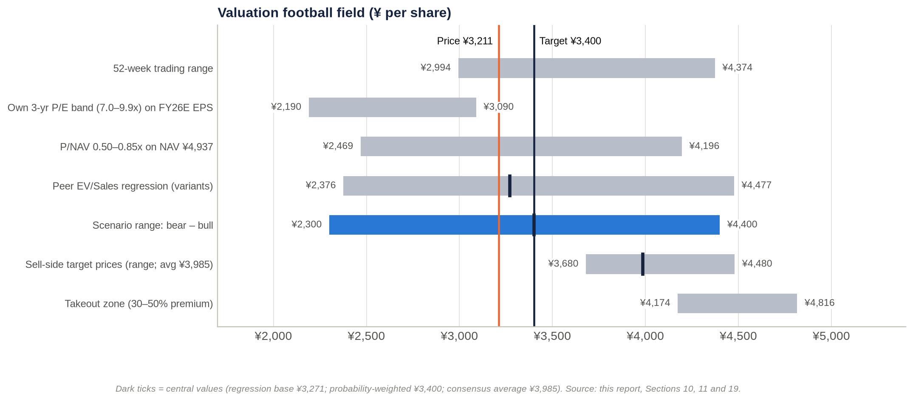

**Probability-weighted value: ¥3,400 (+5.9%).** Adding about ¥130 of dividends over 12 months gives an expected total return of about +10%.

**The implied valuation range is ¥2,300–4,400.** Other reference points:

- the regression-implied value (¥3,271);
- the consensus target (¥3,985);
- the takeout zone (¥4,170–4,820).

**The distribution is skewed mildly positive.** Upside of +37% sits against downside of −28%. But the bear case is the more probable direction of travel for rates, so we keep equal 25% tails rather than tilting towards the bull case.

> **Key takeaway:** The expected value of ¥3,400 sits only modestly above the price. The skew is positive but depends on rates. This is a Hold with an upgrade trigger, not a Buy.

## 20. Fifteen questions for the CEO and Chairman, ranked by information value

1. Of the FY2026 operating-income guidance of ¥105.5bn, how much is gains on investor and fixed-asset sales, and how much is recurring leasing and fee profit? What recurring run-rate would you underwrite for FY2027 if the sale market closed for a year?
2. What is the maturity ladder, average remaining tenor and fixed/floating mix of the ¥1.54tn of interest-bearing debt? What is today's all-in marginal cost of 10-year funding compared with the portfolio average? At what JGB yield does the asset-turnover model stop creating value?
3. Debt/equity was about 2.5x at June against a ≈2.4x guide. What interest-bearing debt and equity ratio do you expect at December 2026 once second-half sales close? Is the JCR "A" rating a binding constraint on growth and on returns?
4. What share of 2025–26 disposals went to vehicles you sponsor (JPR, the private REIT, funds)? At what premium to appraisal were they priced? Do you keep any exposure through master leases, rent guarantees or co-investment?
5. The 2025–27 targets were reached a year early. Will the next plan set an ROE target above 10%, a total-payout or buyback commitment, and a NAV-per-share objective? When will it be announced?
6. The shares trade at about 0.65x NAV. Why not sell more mature assets, or the Hulic stake (≈¥35bn), and buy back shares at this discount? What cost of equity does the board use?
7. What is your economic ownership of TOFROM YAESU, its office occupancy and achieved rents against underwriting, and its stabilised yield on cost? How will the new Yaesu 2-chome supply in 2029 affect it?
8. What share of office leases renews each year, and what uplift are you achieving on renewals compared with the roughly +12% rise in market asking rents?
9. What is the contract ratio for FY2026–27 condo handovers? How are landbank margins holding up against construction inflation of about 5%? What is your exposure to central-ward resale or foreign-buyer restrictions?
10. What caused the FY2025 overseas equity-method loss of ¥6.9bn? How much capital is invested overseas (US, Thailand, Australia, London)? What return hurdle and exit plan apply, and why a London office refurbishment?
11. How far have you progressed against the cross-shareholding target (≤10% of net assets, ≥¥130bn sold)? Do you expect Fuyo-linked holders such as Sompo and Meiji Yasuda to sell their Tokyo Tatemono shares?
12. What hurdle rate do you apply to redevelopment compared with buying back your own shares? How was the 13.74% Star Mica stake priced, and what return do you expect?
13. Why keep three representative directors, with the former CEO as Representative Chairman and a non-independent board chair? Would you consider an independent chair or an independent majority, given Mizuho's roles as lender, tenant and former board pipeline?
14. Which KPIs drive the bonus and the stock-compensation trust (business profit, ROE, TSR)? Why was business profit redefined in 2025 to include gains on fixed-asset sales?
15. How exposed are your projects to construction-capacity limits? TOFROM YAESU completed in February 2026 against a 2025 schedule. What contingency is built into Kyobashi 3-chome East (FY2029)? And how prepared is the board for an unsolicited approach or activist campaign, given that no shareholder can block one?

## 21. Short-seller's case: what the bulls are missing

### What could structurally break the earnings model

**The model is a conveyor belt.** Land and buildings are bought with debt, built or repositioned, leased up, and sold to investors (often a vehicle the company sponsors). Proceeds and gains are then recycled into new land.

**It needs three conditions at once:**

- cheap debt;
- a buyer pool with access to cheap capital;
- rising asset values.

**All three are now under pressure:**

- **Debt.** The BOJ policy rate is 1.25%, the highest since 1995, after hikes in December 2025, June 2026 and September 2026.
- **Buyers.** The REIT index hit year-to-date lows in May–June 2026 ([Nikkei](https://www.nikkei.com/article/DGXZQOUB184UQ0Y6A510C2000000/)).
- **Asset values.** The prime cap rate (3.2%) is only 20–30bp above the 10-year JGB.

**Profit growth is already being eaten below the operating line.** From FY2024 to FY2026E, operating income rises ¥25.8bn but ordinary income only ¥11.8bn, so **54% of the gain is absorbed**. The net non-operating drag nearly triples, from ¥7.9bn to ¥22.0bn. That is the cleanest quantitative bear signal in the data.

### Where revenue and profit are concentrated

**By segment.** Building delivered 62% of FY2025 segment operating profit, and **101% of group operating profit in 1H FY2026**.

**By activity.** Within Building, FY2026's growth is more than fully explained by investor-sale profit: in our build, +¥14bn of sales against +¥11bn of total operating-income growth.

**By asset class and geography.**

- The FY2026 sale programme is concentrated in **hotels**. That asset class is exposed to inbound tourism and is being sold at what may be a cyclical peak.
- The rental base is overwhelmingly central-Tokyo offices.

**If the concentration shifts.** If investor demand migrates away from Tokyo hotels and offices, the "growth" disappears. What remains is a rental business growing a few percent a year, carrying ¥1.5tn of debt that reprices upwards.

### Why the moat is weaker than bulls think

**Scarcity does not stop rents falling.** The Yaesu land is scarce, but scarcity protects occupancy, not rents. Tokyo leases are short, so the +12% rent tailwind reverses just as fast in a downturn.

**The district is about to get more crowded.** Yaesu's own new supply (Yaesu 2-chome Central, 2029) and Tokyo Tatemono's Kyobashi tower will compete for the same tenants.

**Brand barely matters.** Brillia is a mid-volume brand (#19 nationally). In this cycle, condo prices are set by land and location, not by brand.

**Cash conversion is poor.** Operating cash flow was ¥32bn on ¥96bn of operating income in FY2025, and free cash flow was −¥123bn in FY2024. A business that needs fresh debt every year to stand still does not have a cash-flow moat.

### The most dangerous competitor: Mitsubishi Estate

Mitsubishi Estate's Marunouchi and Otemachi holdings surround Tokyo Tatemono's core around Tokyo Station. It holds about nine times the unrealised gains (≈¥5.6tn against ≈¥0.6tn), runs at lower leverage (net debt/EBITDA 7.4x against 12.0x), and depends far less on asset sales to fund growth ([kabu.tagu-blog](https://kabu.tagu-blog.com/real-estate-stocks-7-rates-2026/)).

In a tenant market that turns, Mitsubishi Estate can outspend on incentives and amenities. Mitsui Fudosan, with Nihonbashi and Yaesu, is a close second.

**Bulls underestimate this rivalry** because 2024–26 demand has been strong enough for everyone. The contest only becomes visible when vacancy rises.

### The worst capital-allocation decisions

1. **Overseas.** Chinese condo affiliates and South-East Asian joint ventures preceded a ¥6.9bn equity-method loss in FY2025, and guidance was cut again in August 2026. Since then the company has launched a London office refurbishment (125 Shaftesbury Avenue, December 2025), taking a leveraged Japanese developer into a weak foreign office market.
2. **Growing the balance sheet at the top of the cycle.** In 1H FY2026, debt rose ¥191bn, including buildings bought from Blackstone and Yellow Hat, while the BOJ was hiking.
3. **Paying dividends in place of buybacks.** The payout rose to 40%, but only ¥3bn of buybacks was done at 0.65x NAV. Dividends are effectively financed by asset sales and debt.

### Related parties, accounting and incentives

**Sponsor conflicts.** Tokyo Tatemono sells assets into JPR and its private REIT, owns 100% of JPR's asset manager and 3.03% of its units, and can therefore book a gain *and* earn ongoing fees. The plan explicitly aims to grow AUM "through sales to REITs and other management firms" ([MTP](https://tatemono.com/english/company/pdf/plan2027_250116_en.pdf)). Sale prices are anchored to appraisals that the seller influences.

**Moving goalposts on the headline KPI.** In 2025 "business profit" was redefined to include gains on fixed-asset sales.

**Earnings management levers:**

- Net income is supported by extraordinary gains: an estimated ¥20–25bn in FY2024, and ≈¥10.9bn implied in FY2026 guidance.
- The November 2025 "sales-policy revision" shows management chooses which assets to sell, and when, to shape reported profit.

**Incentives.** Bonuses were last linked to ordinary profit and net income, with no ROE or TSR measure found. That rewards balance-sheet growth and gain-taking.

### What must hold for ¥3,211 to be justified

1. Second-half FY2026 operating income of about ¥65.7bn is delivered, which requires the record sale programme to close.
2. EPS stays at or above ¥300 through FY2027–28 as financing costs rise.
3. Appraised fair values fall by no more than the 31% already implied.
4. Debt/equity returns to ≤2.4–2.5x without equity issuance.
5. The payout and dividend progression continue.

All five are plausible, but none is guaranteed. The price offers no margin of safety if two of them fail together.

### If growth disappoints by 20–30%

| Case | FY2026–27 net income | EPS | Value at 10.3x P/E | Value at 8.0x P/E | Implied P/NAV at 10.3x |
|---|---|---|---|---|---|
| Guidance delivered | ¥65.0bn | ¥313 | ¥3,225 | ¥2,505 | 0.65x |
| 20% shortfall | ¥52.0bn | ¥250 | ¥2,580 | ¥2,005 | 0.52x |
| 30% shortfall | ¥45.5bn | ¥219 | ¥2,260 | ¥1,755 | 0.46x |

**A 20–30% net-income shortfall** (¥13–20bn after tax, or ¥19–28bn pre-tax) needs only a one-year deferral of part of the sale programme. It would cut fair value to **¥2,260–2,580 (−20% to −30%)** at an unchanged multiple. With a de-rating to 8x, the value falls to ¥1,750–2,000. ROE would fall to about 7.5–8.6%, below the plausible cost of equity, which implies 0.8–0.9x book (¥2,340–2,640).

**If "growth" instead means the path to the 2030 business-profit vision of ¥120bn,** a 20–30% shortfall in the *increment* leaves 2030 profit only 2.5–3.75% below the vision. The valuation impact would be small. **For Tokyo Tatemono, the risk lies in the level of profit, not the growth rate.**

### The single scenario that would permanently impair the business

**A rate-driven closure of the exit channel.** The sequence would run:

1. 10-year JGB yields rise further and prime cap rates widen by 100bp or more.
2. J-REIT and private buyers step back.
3. The record sale programme stalls just as ≈¥1.5tn of debt reprices and redevelopment capex peaks.
4. Earnings fall at least 30% and NAV falls 20–25%. Debt/equity moves well above 2.6x and the rating comes under pressure.
5. Management then sells core assets at cyclical lows, or raises equity at about 0.5x NAV.

The *permanent* loss is the dilution or forced sale at the bottom, not the cyclical earnings dip.

**Plausibility: low to moderate**, roughly 10–15% over three years in our judgement.

- **For:** the early signs already exist: sector and REIT indices at 2026 lows, and the non-operating drag nearly tripling.
- **Against:** much of this is already discounted (0.65x NAV); rents are rising; occupancy is high; and the company can hold rather than sell, within its leverage limits.

### Forensic red-flag checklist

| Area | Observation | Severity | What to check (FY2025 Yuho, EDINET S100XSKF) |
|---|---|---|---|
| Revenue recognition | Condos recognised at handover; investor sales at closing. Fixed assets reclassified to inventory (保有目的の変更) can move sale proceeds into revenue and operating cash flow. In 2025 business profit was redefined to include fixed-asset gains | Medium–high | Reclassification note; gains on sale by year; counterparties; volume sold to related parties |
| Earnings quality | FY2024 net income was 92% of ordinary income (one-offs of ≈¥20–25bn); FY2026 guidance embeds ≈¥10.9bn of extraordinary gains | Medium | Extraordinary items by type; cross-shareholding sale schedule |
| Equity method / off-balance-sheet | −¥6.9bn equity-method loss in FY2025; 22 affiliates (FY2022); SPC/TMK debt off balance sheet; guidance cut in Aug 2026 | Medium | Affiliate list; guarantees of SPC debt; the joint ventures behind the losses |
| Segment reporting | Segments changed in FY2020, FY2021 and FY2022; FY2024 comparatives restated; Building mixes rent and sales; hotels sit inside Commercial Properties; "Other" absorbs overseas results; corporate costs rising | Medium | Request a leasing vs sale-gain split; segment assets |
| Related parties | Sales to JPR and the private REIT; TRIM fees; Mizuho as lender, tenant, former seller and source of directors | Medium | Related-party note; sale prices vs appraisal; master leases or rent guarantees |
| Leases | Master-lease and sublease commitments not retrieved. ASBJ's new lease standard (reported as effective for fiscal years beginning on or after 1 Apr 2027; to be verified) would bring operating leases onto the balance sheet | Low–medium | Operating-lease commitment note |
| Contingencies | Condo defects, guarantees of SPC debt and of buyers' mortgages: not retrieved | Unknown | Contingent-liabilities note; litigation |
| Interest capitalisation | Practice on large developments (TOFROM YAESU, Kyobashi) not disclosed in the materials reviewed | Medium | Fixed-asset note; capitalised interest |
| Stock-based compensation | Stock-compensation trust holds 351,300 shares; points-based; immaterial cost | Low | Trust KPIs and vesting conditions |
| Goodwill and intangibles | Not material (the company is not an acquirer) | Low | — |
| Impairments | ¥0.2–0.9bn a year (FY2020–24), tiny against a ¥1.06tn rental book and ¥0.6tn of unrealised gains. Risk sits in overseas, hotels and London | Low–medium | FY2025 impairment line; held-for-sale write-downs |
| Cash flow | Operating cash flow of ¥19–32bn against operating income of ¥80–96bn; free cash flow −¥123bn in FY2024; dividends effectively funded by debt and sales | **High (structural)** | Inventory change; capex vs D&A; proceeds from fixed-asset sales |
| How leverage is presented | Hybrids (BBB+) may receive equity credit in company metrics; the mid-year debt peak is seasonal | Medium | Hybrid amount; company-defined debt/equity |

> **Key takeaway:** The short case is not fraud. It is leverage plus timing. The company manufactures growth by recycling assets into a buyer pool whose cost of capital is rising, while funding the recycling with debt that is repricing. The forensic flags (business-profit redefinition, extraordinary gains, sponsor sales, poor cash conversion) are yellow, not red. They mean the earnings deserve a discount.

## 22. Timeline and catalyst calendar

### Key past events

| Date | Event | Significance |
|---|---|---|
| 1 Oct 1896 | Founded (Yasuda/Fuyo lineage); listed May 1949 | Oldest listed Japanese developer |
| Nov 2001 / 14 Jun 2002 | Founding investor in JPR; JPR listed | REIT exit channel created |
| 2012–2014 | Nakano Central Park South (2012), Tokyo Square Garden (Mar 2013), Otemachi Tower (Apr 2014) | Core office portfolio built |
| 2015 | 2015–19 plan; private REIT launched (¥16bn) | Asset-turnover platform |
| 2016 | Nomura becomes President; parking business reorganised (1 Dec) | Era of delivery against plans |
| Dec 2018 | PT Farpoint joint venture (Indonesia) | Overseas push |
| 2019 | T-LOGI launched; FY2019 operating income ¥52.4bn beats the ¥50bn target | Plan delivered |
| 2 Mar 2020 | Vision 「次世代デベロッパーへ」 and 2020–24 plan (business profit ¥75bn; ≈¥1.4tn investment) | 2030 target of ¥120bn |
| 2020 | Yaesu 1-chome East rights conversion approved | TOFROM YAESU locked in |
| 26 Apr 2023 | Becomes JPR's sole sponsor | Exit channel consolidated |
| Apr 2024 | Kyobashi 3-chome East redevelopment association formed | Next flagship (FY2029) |
| Jun 2024 | Tokyo Tatemono (Thailand) established | Thai joint ventures |
| 7 Nov 2024 | CEO succession announced (Ozawa from 1 Jan 2025) | Continuity |
| Dec 2024 | Hulic stake reduced; two material-event reports; large Q4 gains | FY2024 net income record (¥65.9bn) |
| 16 Jan 2025 | 2025–27 plan (40% payout, ROE 10%, business profit ¥95bn); shares fall ("underwhelming") | Capital-policy reset |
| 13 Feb – 31 Aug 2025 | ¥3.0bn buyback (1,189,100 shares) | Shares cancelled in Nov 2025 |
| 26 Mar 2025 | AGM: one-year director terms | Governance step |
| 30 May 2025 | JCR rates hybrid bonds BBB+ (issuer A, upgraded from A−) | Hybrid capital |
| 13 Nov 2025 | Q3 upgrade; shares +10.4% the next day | Largest single-day move |
| Dec 2025 | BOJ to 0.75%; London 125 Shaftesbury Avenue; Zeus OSA1 under way; Melbourne build-to-rent announced | Rate cycle turns; diversification |
| 12 Feb 2026 | FY2025 record operating income; FY2026 guidance above consensus; dividend ¥122 guided | +20.5% in February |
| 27–28 Feb 2026 | All-time high ¥4,374; TOFROM YAESU TOWER completed | Peak |
| Mar 2026 | JGB spike; shares −21% from peak; AGM (26 Mar) re-elects all 12 directors | Sector de-rating |
| 13 May 2026 | Q1: net income −60%; Star Mica alliance announced (13.74% filed 2 Jun) | 2026 low of ¥3,083 on 28 May |
| Jun 2026 | BOJ to 1.00%; T-LOGI Sendai completed | — |
| 6–10 Aug 2026 | 1H: guidance raised (operating income ¥105.5bn, net income ¥65.0bn, dividend ¥126); plan targets one year early | Most positive tone of the period |
| 17 Aug 2026 | New shelf registration | Funding capacity |
| 10 Sep 2026 | TOFROM YAESU retail opens (55 stores) | Lease-up |
| 18 Sep 2026 | BOJ to 1.25% (highest since 1995) | Shares break their rising-low support |
| 25 Sep 2026 | Thai rental-factory joint venture (SCX Logistics Laemchabang 2) | Overseas income assets |

### Upcoming catalysts

| Expected date | Event | What to watch | Likely impact |
|---|---|---|---|
| Early Oct and early Nov 2026 | Miki Shoji Tokyo office data (Sep and Oct) | Whether vacancy stays below 2% and rent growth stays above 10% | Rent-reversion narrative |
| Late Oct and Dec 2026 (dates to confirm) | BOJ policy meetings | Pace beyond 1.25%; 10-year JGB above or below 3% | Main macro swing factor |
| By 30 Oct 2026 | Leopalace21 tender offer closes (shares trading above the offer); Sankei REIT contest continues | Sector M&A premiums | Read-across for NAV support |
| ≈Mid-Nov 2026 (13 Nov 2025 precedent) | **Q3 FY2026 results** | 9M progress vs 52.8% last year; sale closings; condo handovers; debt | **Key test of the second-half thesis** |
| Winter 2026 | Remaining 13 TOFROM YAESU stores open | Footfall and turnover rents | Minor |
| Late Dec 2026 | FY2026 year-end dividend record date (¥65) | — | Yield support |
| Jan 2027 | 899 Collins Street (Melbourne) completion | Lease-up | Minor |
| ≈Mid-Feb 2027 (12 Feb 2026 precedent) | **FY2026 results; FY2027 guidance; possible new capital policy or plan update** | Year-end debt and equity ratio; FY2027 operating income vs our ¥113bn; buyback; ROE target above 10% | **Largest re-rating catalyst** |
| Late Mar 2027 (26 Mar 2026 precedent) | 209th AGM | Support for the CEO and chairman; any shareholder proposals | Governance and activism signal |
| FY2027 | Final year of the 2025–27 plan; next plan expected by about Jan–Feb 2028 (16 Jan 2025 precedent), possibly earlier | Targets for the 2030 vision (business profit ≈¥120bn) | Strategic |
| 2028 | Zeus OSA1 phase 1 (25MW) starts; new lease accounting (to be verified) | Data-centre lease-up | Minor |
| Jan 2029 | Yaesu 2-chome Central completion (competing supply) | Pressure on Yaesu rents | Negative for TOFROM YAESU |
| FY2029 | Kyobashi 3-chome East completion | New rent roll or sale candidate | Positive |
| ≈2030 | Long-term vision: business profit ≈¥120bn | — | — |

> **Key takeaway:** The next five months contain the two decisive data points: Q3 in mid-November and the FY2026 results and capital policy in mid-February. Rates (BOJ, JGB) are the background variable that decides how much those results are worth.

## IC decision and conclusion

**IC decision: HOLD. 12-month target price ¥3,400, equal to the probability-weighted value. Reference price ¥3,211 (2 Oct 2026). Expected total return ≈+10%.**

**Do not initiate at the current price.** Accumulate on either of two triggers:

- **Price:** weakness below about ¥3,000. That is roughly 0.6x NAV, 9.3x FY2027E EPS and under the 2026 low.
- **Evidence:** the Q3 release shows 9M operating-income progress ahead of FY2025's 52.8%, and the FY2026 results show interest-bearing debt back near ¥1.40tn with a funded buyback in the new capital policy.

**Downgrade to Sell** if any of these occurs:

- the 10-year JGB holds above 3.25%;
- the FY2026 sale programme slips into 2027;
- year-end debt/equity exceeds 2.6x;
- overseas equity-method losses recur at the FY2025 scale.

**The story has changed.** What this research changes is the nature of the Tokyo Tatemono story. For five years it was a cheap NAV compounder: EPS +14% a year, P/NAV re-rating from about 0.4x to 0.7x, TSR of about 24% a year. It is now a race between two inflations:

- the rents it can reprice on short leases;
- the cost of the debt and investor capital it needs to keep recycling assets.

**Earnings growth alone cannot close the discount.** Our numbers suggest FY2027–28 EPS grows only 2–3% a year once financing costs are included. That cannot re-rate a stock already above its own historical multiples. The lever that can is capital policy: converting part of the ≈¥600bn of embedded gains and the ≈¥35bn Hulic stake into buybacks at 0.65x NAV, rather than into more balance-sheet growth.

**Two signals will settle the case.** Tokyo Tatemono's relative resilience in 2026 reflects its lower starting multiple, not lower risk. As the most levered developer in its peer group, it is the purest listed test of whether Tokyo's private real-estate market keeps clearing at a 3.2% cap rate as Japanese rates normalise. The answer will show up first in December's debt figure and February's capital plan. That is where an IC should focus, not on the forward P/E.
